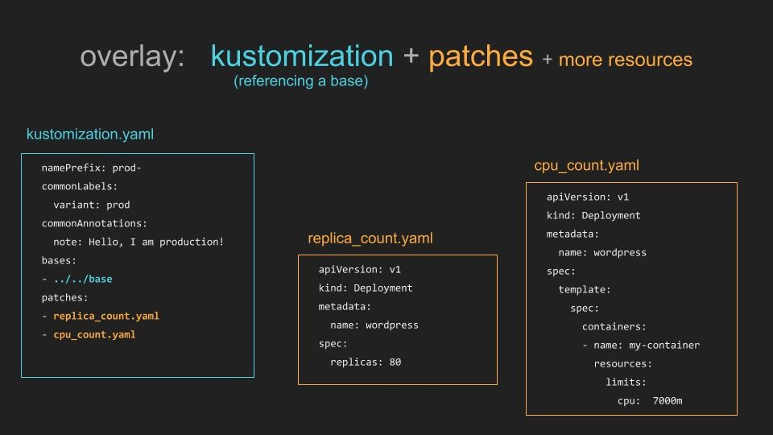

记录为什么最终没有采用 helm 而是选择了 kustomize 作为 kubernetes 应用的部署工具。

前一阵子参加了在上海举行的 KubeCon，听了很多 session 收获还是挺多。（此处应再有一篇 blog 做做总结，不过介于最近半年来的 blog 效率实在不敢立任何 flag。）尤其是 habor 项目以及 helm 项目的介绍戳中的我的痛点。虽然这些项目我都听说过，也知道他们是做什么的，一个做 registry，一个做 kubernetes 包管理。但是因为没人在旁边不停的说，所以优先级一直被自己排的很低，这也是参加这种会议的意义之一吧：让你和你正在关注的技术的同行在一起聊聊，稍微的点拨和帮助可能就会解开你对某个东西的疑惑或顾虑。helm 的出镜率实在太高了，再加上我们本身有很多项目需要以一种更好的方式去部署到 kubernets，所以回来之后就决定去尝试一下。

## 使用各种项目管理之前的情况

首先说说之前的痛点。我们虽然不是个大公司，可是这代码也是越敲越多，服务也是越做越全。零零总总也有十几个项目要管理了。然后我们同样有多套部署环境：内网环境，预生产环境，生产环境。那么针对每一个环境几乎都要有一套 kubernetes 的 yaml 文件，但是各个仅仅是稍有不同。

然后我们自己的 ci 是将构建好的 docker 镜像放到 registry 里面。

那么，每次更新的镜像之后就是通过人手工去部署一下，绝大多数情况就是修改一下镜像的 tag，但是由于每个环境的 yaml 略有区别，那么如果我需要在不同环境切换的时候就需要来回修改这些 yaml 文件，一不小心写错了就只能怪自己手残。然而这种部署方式虽然在 kubernetes 之下就是改改 yaml 就好了，但是依然感觉很是原始。

## 希望有什么改善

仔细想想，自己的需求就是这么几个：

1. 有一个统一的模板可以管理一个项目的 kubernetes 部署结构
2. 有某种方式可以管理不同环境之间微小的差异
3. 每次更新基本就是修改镜像的标签然后部署，那么有没有什么简单的办法实现之，而不是让我每次都去修改 yaml 文件

## 针对 helm 的调研

既然都说 helm 是 kubernetes 的包管理工具，那么我就先去尝试了一下 helm。

> helm 诞生于一个名为 deis 的团队。早年在 mesos 大行其道之前有过自己的一个开源 paas 方案 deis，我当时在 tw 也做类似的事情，受其影响颇深。后来 kubernetes 崛起，deis 彻底放弃之前的项目，该做了一个基于 k8s 的 paas，并开源了 helm。然后 deis 团队最终被 ms 收购了并放弃了原来的 deis 项目。

简单的看了看，helm 给我一种大而无当的感觉：它真的是一个做包管理工具的，复杂的 go template 体系以及需要单独存放的 charts 让我感觉其更适合对标 ubuntu 的 apt 或者 macos 的 brew。它更像是对外提供一个复杂的可以依据各种配置信息生成适合于不同环境的软件发布包，而不是用于我们这种轻量级的部署配置管理的。所以我就放弃使用 helm 了。

## 针对 kustomize 的调研

在这个时候我想起来了在之前 github trending 看到的另外一个用户做 kubernetes 配置的工具 kustomize。简单的说，它就是一个简化 kubernetes yaml 编写的工具。它提供了两个重要的功能恰好满足了我的需求。

### 继承和 patch

kustomize 可以设置如下的层次：

```
├── base
│   ├── deployment.yaml
│   ├── kustomization.yaml
│   └── service.yaml
└── overlays
    └── stg
        ├── ingress.yaml
        └── kustomization.yaml
```

其中 base 里保存各个环境所公有的配置:

`base/kustomization.yaml:`

```yaml
resources:
- deployment.yaml
- service.yaml
```

然后在 overlays 中可以定义子环境：

`overlays/stg/kustomization.yaml:`

```yaml
bases:
- ../../base

resources:
- ingress.yaml
```

可以看到 stg 下继承了 base 的配置，并且添加了 ingress.yaml 配置。同时，kustomize 不仅仅支持文件级别的 patch，还支持对一个文件某些字段的 patch 如下所示，`replica_count.yaml` 只包含了有关 `replicas` 的部分即可，在执行 `kustomize build` 之后就可以将这部分覆盖默认的配置。



### edit 命令

kustomize 提供了一个命令行方法对镜像 tag 进行修改：

```
kustomize edit set imagetag xxx:94c269ec
```

如果图省事，可以这么做

```
export NEWTAG=94c269ec
kustomize edit set imagetag xxx:$NEWTAG
```

那么每次都去 ctrl-r 修改这个 export 然后再  ctrl-r 找到第二条命令执行一下就好了。虽然它还是修改了 kustomization.yaml 但是我觉得比打开编辑器改要舒服一些。

## kustomize 额外加分项

### 轻量级

相对 helm，kustomize 依然保留了对 `kubectl apply -f` 命令的支持，仅仅作为一个命令行工具；不像 helm 还需要在 k8s 里面部署一个 tiller 可谓是非常的轻量级了。

### 对 secret 和 configmap 的支持

分别举例说明：

```yaml
bases:
- ../../base

configMapGenerator:
- literals:
  - STORAGE.DATASETUPLOADURL=https://xxx/files/datasets
  - STORAGE.CODEUPLOADURL=https://xxx/files/codes
  - LIVELOG_PREFIX=https://xxx/jobs
  name: storage-server

resources:
- ingress.yaml

imageTags:
- name: xxx
  newTag: dc12c4d7
```

```yaml
resources:
- deployment.yaml

secretGenerator:
- name: notification-service
  commands:
    SHORT_MESSAGE_API_KEY: "bash -c 'echo -n $SHORT_MESSAGE_API_KEY'"
    MG_API_KEY: "bash -c 'echo -n $MG_API_KEY'"
  type: Opaque

generatorOptions:
  disableNameSuffixHash: true
```

`secretGenerator` 和 `configMapGenerator` 可以以更灵活的方式生成 configmap 和 secret，相对来说更方便吧。然后注意看我 `configMapGenerator` 的例子，`echo -n $xxx` 是会有问题的，一定要使用 `"bash -c 'echo -n $SHORT_MESSAGE_API_KEY'"` 的命令哦。

## 参考

1. [kustomize](https://github.com/kubernetes-sigs/kustomize)
2. [helm](https://helm.sh/)

