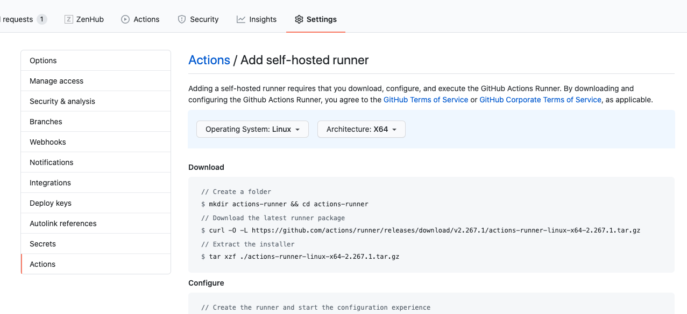
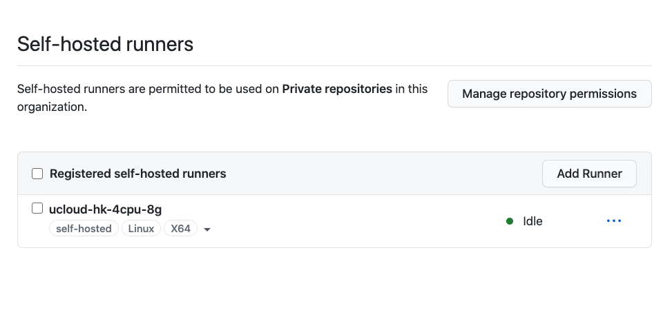

多次尝试补上多年不写的博客，这次一定要成功...这里介绍刚刚切换到 github action 的原因以及最开始遇到的一些问题和解决方案。后面如果有什么新的进展就补充一篇进阶吧。

## 为啥尝试 github actions

先讲讲我使用 CI 的一些历史，看看为啥一路走来走到了这里。

最最初什么都没有的时候自然就是 [gocd](https://www.gocd.org/) 和 [jenkins](https://www.jenkins.io/) 的统治时期，那个时候我基本就是用 CI 自己基本没配置过。那个时候的 CI 特别难用，没有现在的一些重要功能。每次跑 CI 都像是在重新 provision 一个环境似的，由于我自己没什么经验就带过吧。

之后（17年）尝试过 [drone ci](https://drone.io/) 在 [文章](http://aisensiy.github.io/2017/08/04/drone-best-ci/) 中做了介绍，提到了 `pipeline as code`、`原生支持 docker` 以及 `简单易用的插件扩展` 这些功能，不过当时 droneci 并不是一个类似于 saas 的产品，而是需要自己部署的，不是那么开箱即用，但我也觉得很方便了。几年之后越来越多的 CI 在这些方面都支持的越来越好了。在 [openbayes](https://openbayes.com) 项目之初（18年初），出于集中力量办正事的考虑，就直接使用了 [circleci](https://circleci.com/)（之前在 [travisci](https://travis-ci.org/) 和它之间做过纠结，但考虑到其 `pipelineascode` 更友好就采用它了）。可能这不是一个最优的策略，但既然都 `pipeline as code` 了，其实切换成本并不大，处于有问题立即跑路的想法就这么用了。后续来看问题不大，

我们背后的技术栈还是比较散的，按照语言区分的话基本有这么几个：

- golang
- python
- java 
- ruby
- js / typescript

cicleci 支持 docker 环境构建，其实很容易的就覆盖了。然后几乎所有的项目的产出物都是 docker 镜像，只要和 [hub.docker.com](https://hub.docker.com) 的访问速度不错一切都好说。可惜后面出现了两个事情叠加起来让我们不得不考虑更换 CI 了。

首先是在 19 年 10 月份 CircleCI 的计价策略发生了一些变化，见 [Plans for optimal performance: why CircleCI is changing our pricing model](https://circleci.com/blog/plans-for-optimal-performance-why-circleci-is-changing-our-pricing-model/)，其实现在回想起来我都不记得之前老的计价策略是什么了。这个新的计价策略基本就是人头数 + 运行时长。

如果是单纯的这个变化也感觉可以接受，可后面我们就发现 CircleCI 跑的速度大幅下降了...甚至会时不时的卡死在那里...这就让人比较烦躁了...让人觉得只是在变相的多收取费用呀...而且动不动就卡一个小时这多影响开发效率呀。那个时候 github actions 也已经存在了一阵子了，11 月份我们就开始尝试把最频繁提交的项目做迁移了。

当然其实还有另外一个想法吧，众所周知，GitLab 项目是自带 CI/CD 的，把代码仓库和 CI/CD 的流水线放在一起还算是挺自然的一个想法吧。毕竟在这个场景下，代码才算是核心资产，CI/CD 作为附属品保证了代码的可用性/可信性，算是 GitOps 的一个环节，放在同一个 vendor 下进行管理也算是自然吧。

同样是 `Pipeline as code` 切换成本基本就是一个会配置 CI 的同学半个小时的工作量。但在切换后发现了一个问题：github 的环境访问国内的一些镜像仓库的访问速度比较慢。一个大的仓库 1500+ TestCase 跑下来只用了 5 分钟，提交个镜像却花了 15 分钟。做了些研究之后发现 Github 下支持了 [self hosted runners](https://docs.github.com/en/actions/hosting-your-own-runners/about-self-hosted-runners) ，研究了下，感觉是非常好的思路。

## 使用 Self Hosted

顾名思义，self hosted runners 就是支持用户用自己的环境（而不是 github 的自己的机器）去跑 ci 的任务。总结一下它的好处有这么几点，特别解决我们的痛点。

### 自由配置网络和硬件

前面提到，我们 CI/CD 的产出物基本就是 docker 镜像，考虑到容错和各地网络访问速度，我们会将同一份镜像提交到多个镜像仓库。比如我们至少会在 ucloud 和 hub.docker 两个地方存放镜像。那么，CI/CD 的环境最好可以同时对这两个环境的网络访问速度还算可以。我就选择了一个香港节点，直接测试后发现两边提交镜像的速度都可以接受，就把它作为 self hosted runner 了。并且由于自己的机器就那么一到两台，docker build 的缓存还可以自然的使用起来，CI 跑起来更快了。

在国内的同学都了解目前 hub.docker 几乎要不可用了...多个镜像仓库来回倒腾不知道花了多少时间了。甚至连 Github 的访问如果不开个什么代理都举步维艰。对网络环境的考量确实是个很无聊但是又非常务实的需求。

效果自然是还不错，从原来的十几分钟降到了几分钟，快了不少。

### 方便的安装和配置

Github 的这个功能跑起来非常容易，开一个虚拟机然后按照 Github 上面的提示直接跑下面的脚本就行了。

安装好之后就能看到这个 runner 了：

多说一句，在最开始 Github 只支持单个仓库的 self-hosted runner 感觉比较浪费，不过我们使用的时候（就是发现 Github 自己的 CI 环境网络越来越不合适的时候）已经支持在组织级别增加了，可以在[这里](https://docs.github.com/en/actions/hosting-your-own-runners/adding-self-hosted-runners#adding-a-self-hosted-runner-to-an-organization)看到。

### 其他优点

其他的就是如下了：

1. 免费，除了 host 本身的云计算费用外其他就不花钱了
2. 单个任务的执行上限更长，具体见[这里](https://docs.github.com/en/actions/getting-started-with-github-actions/about-github-actions#usage-limits)的解释，这个限制对大部分场景来说意义不大，不过我们自己的一些场景还是挺需要解除这个限制的

吹完它之后说它的一些问题。

## Self Hosted 遇到的一些问题

### Provision 的坑

上文提到从 circleci 往 github hosted github action 迁移很快的，但是从 Github Hosted 往 self-hosted 迁移后会发现有各种诡异的依赖报错，原因很简单，就是人家的机器上有的东西你没有装好。

那人家咋装的呢？在 [virtual-environments](https://github.com/actions/virtual-environments) 有详细的安装脚本。所以如果想要自己的 self-hosted 和 github hosted 跑的一样就需要用这里面的脚本全部跑一遍才行...听起来有点麻烦，不过其实也可以自己灵活点...既然自己的 pipeline 自己都知道有啥依赖，不如缺啥补啥...比如我发现前端的 CI 报错没有 node 那就跑个 [nodejs](https://github.com/actions/virtual-environments/blob/main/images/linux/scripts/installers/nodejs.sh)，然后发现没有 [phantomjs](https://github.com/actions/virtual-environments/blob/main/images/linux/scripts/installers/phantomjs.sh) 都就跑一下这个脚本。

### Job 的限制

前面说了解除限制方面的有点，但是也有副作用，在 [https://github.community/t/do-jobs-in-self-hosted-runners-run-in-parallel/17776/2](https://github.community/t/do-jobs-in-self-hosted-runners-run-in-parallel/17776/2) 有一个解释。我直接贴在这里吧，因为这个问题挺是个问题的。

> Jobs should run in parallel for both hosted runner and self-hosted runner.
> But for self-hosted runner, there are some comments:
> - One self-hosted runner can only run one job at a time, when no available runners are idle, the subsequent jobs will be in queueing until available runners are idle.
> - If have enough available self-hosted runners for a workflow run, each job will be assigned a self-hosted runner, and the jobs will run in parallel.
> - When multiple workflows are running, if the workflows are more than the available self-hosted runners, each workflow will be assigned only one self-hosted runner.
Thanks.

总结起来就是你要是只有一个 self-hosted 的节点，那抱歉什么都是按顺序来。如果有多个节点，那么什么都好说。
