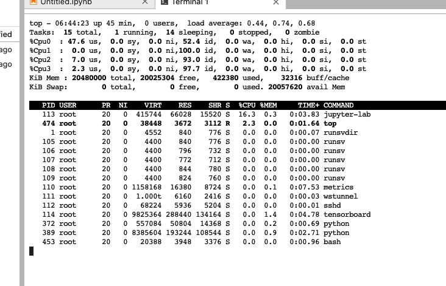

在 k8s 中启动的 pod 下的 container 虽然在资源上做了隔离，但是这种隔离对用户通常是不可见的，具体的表现就是使用 `top` `cat /proc/cpuinfo` 或者 `free -m` 等这样的命令的时候看到的依然是宿主机的资源。这种行为在 openbayes 这种为外部用户分配资源的场景会有很强的迷惑性，用户不知道自己到底有多少资源，因为从里面看到的资源和在外面的声明的是不一样的。为了达到容器内外的一致性，我们引入了 lxcfs。

## 工作原理

在 [lxcfs 官方](https://linuxcontainers.org/lxcfs/introduction/)的定义里提到它是一个用户空间的文件系统。它主要提供了一系列文件可以覆盖 `/proc` 用以覆盖系统的这些目录。也就是说，如果想要让容器里看到的资源是已经做了隔离之后的资源，其实就是将系统默认的一些文件通过 mount 的方式进行覆盖。当容器中进程读取相应文件内容时，lxcfs 会从容器对应的 cgroup 中读取正确的资源限制。

## lxcfs 的方案调研

目前通过搜索引擎可以找到一篇[文章](https://developer.aliyun.com/article/566208)介绍了如何在 k8s 中通过 daemonset 安装 lxcfs 以及如何通过 k8s 的 [admission-webhook](https://kubernetes.io/docs/reference/access-authn-authz/extensible-admission-controllers/#admission-webhooks) 为 k8s 里的容器默认做这个隔离的绑定，介绍的很清楚，但有一些小问题：

1. 其使用的 lxcfs 有点老了（3.0.4），直接拿过来用会发现其实 `/cpu/online` 这个没有解决，会导致在 python 下 `os.cpu_count()` 依然是错误的，需要升级 lxcfs 才能解决这个[问题](https://github.com/lxc/lxcfs/issues/401)。
2. 通过 hooks 的方式有点像是 meta programming 太随意的修改了 k8s 容器的流程，这可能在后期带来维护的问题，并且我们只有对用户的容器才有做隔离的需求，所以不如就是在容器启动的时候直接处理就好

因此最终的方案如下：

1. 依然使用 daemonset 方式安装和启动 lxcfs，但是对其脚本做了升级改造
2. 在模板中增加绑定即可，不实用 hook 的方式

## 安装

对 [https://github.com/denverdino/lxcfs-admission-webhook/tree/master/lxcfs-image](https://github.com/denverdino/lxcfs-admission-webhook/tree/master/lxcfs-image) 的两个文件做了修改：

`Dockerfile:`

```
FROM ubuntu:18.04
RUN apt update -y
RUN apt-get --purge remove lxcfs
RUN apt install -y wget git libtool m4 autotools-dev automake pkg-config build-essential libfuse-dev libcurl4-openssl-dev libxml2-dev mime-support
ENV LXCFS_VERSION 4.0.5

RUN wget https://github.com/lxc/lxcfs/archive/lxcfs-$LXCFS_VERSION.tar.gz && \
    mkdir /lxcfs && tar xzvf lxcfs-$LXCFS_VERSION.tar.gz -C /lxcfs --strip-components=1 && \
    cd /lxcfs  && ./bootstrap.sh && ./configure && make

COPY start.sh /
CMD ["/start.sh"]
```

主要修改了以下几个方面：

1. 基础镜像用了 `ubuntu` 当然相应的依赖也做了对应的修改
2. 从 github 下载了 4.0.5 版本的 lxcfs 并按照新的编译流程生成执行文件和库，其中在 `make` 之后会在目录下生成 `src/lxcfs` `src/.libs/liblxcfs.so` `src/liblxcfs.la` 三个文件
3. 没做 build 阶段，因为产出的镜像并不是很大，就算了...要求更高的同学可以继续修改哦

`start.sh:`

```bash
#!/bin/bash

# Cleanup
nsenter -m/proc/1/ns/mnt fusermount -u /var/lib/lxcfs 2> /dev/null || true
nsenter -m/proc/1/ns/mnt [ -L /etc/mtab ] || \
        sed -i "/^lxcfs \/var\/lib\/lxcfs fuse.lxcfs/d" /etc/mtab

# Prepare
mkdir -p /usr/local/lib/lxcfs /var/lib/lxcfs

# Update lxcfs
cp -f /lxcfs/src/lxcfs /usr/local/bin/lxcfs
cp -f /lxcfs/src/.libs/liblxcfs.so /usr/local/lib/lxcfs/liblxcfs.so
cp -f /lxcfs/src/liblxcfs.la /usr/local/lib/lxcfs/liblxcfs.la


# Mount
exec nsenter -m/proc/1/ns/mnt /usr/local/bin/lxcfs /var/lib/lxcfs/ --enable-cfs -l
```

主要修改如下：

1. `src/lxcfs` `src/.libs/liblxcfs.so` `src/liblxcfs.la` 这三个输出文件，按照编辑的目标文件做对应的修改 
2. 启动的之后增加了两个参数 `--enable-cfs -l` 不然 `cpu/online` 依然不起作用

Daemonset 就没做什么修改了，仅仅是更改了镜像而已。

## 绑定

绑定这里提到了是在 openbayes 的构建流程中做了修改：

```
volumes:
  - name: lxcfs-proc-cpuinfo
    hostPath:
      path: /var/lib/lxcfs/proc/cpuinfo
      type: File
  - name: system-cpu-online
    hostPath:
      path: /var/lib/lxcfs/sys/devices/system/cpu/online
      type: File
  - name: lxcfs-proc-diskstats
    hostPath:
      path: /var/lib/lxcfs/proc/diskstats
      type: File
  - name: lxcfs-proc-meminfo
    hostPath:
      path: /var/lib/lxcfs/proc/meminfo
      type: File 
  - name: lxcfs-proc-stat
    hostPath:
      path: /var/lib/lxcfs/proc/stat
      type: File    
  - name: lxcfs-proc-swaps
    hostPath:
      path: /var/lib/lxcfs/proc/swaps
      type: File
  - name: lxcfs-proc-uptime
    hostPath:
      path: /var/lib/lxcfs/proc/uptime
      type: File
  ...
```

## 测试

如下所示，在一个分配了 4 个 cpu 20g 内存的容器里以下命令已经可以显示实际分配的资源数目了：

### 1. top



### 2. free


### 3. os.cpu_count


