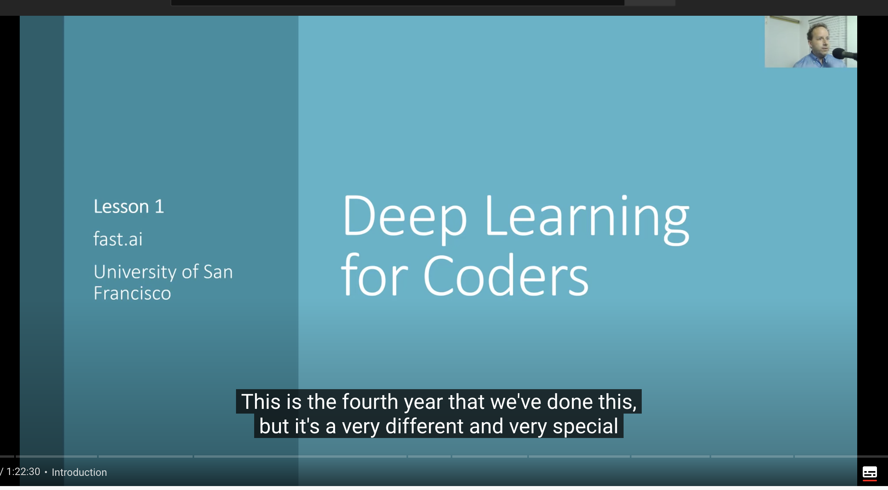

众所周知，在国内 youtube 是不能使用的，但 youtube 目前已经成为了一个视频 host 的存在了，其内容是非常丰富的，丰富到各种各样的学习资源也都放在这里。对个人来说，通过一些手段勉强还能看到一些内容，但如果想要投屏、或者分享，这就需要做一些搬运的工作了。目前来看 [youtude-dl](https://ytdl-org.github.io/youtube-dl/index.html) 是最强的 youtube 资源下载工具，没有之一。这里结合场景记录一下最近使用它的一些技巧，方便后续查阅。

目前来看，bilibili 的性质非常像 youtube 如果需要将一些资源投屏或者分享给其他人，比较简单的办法就是将 youtube 资源直接搬运到 bilibili。这种场景通常有以下需求：

1. 需要下载最好的画质
2. 需要考虑下载声音和视频，当然有些时候可能只下载声音就够了
3. 需要下载字幕

下面以一个 fastai 的搬运为例，来看看怎么用 youtube-dl 实现上述功能。



这个是最新的 fastai 的视频讲解的第一节，其 url 为 https://www.youtube.com/watch?v=_QUEXsHfsA0&t=4s 。

如果有最简单的命令如下：

```
youtube-dl https://www.youtube.com/watch\?v\=_QUEXsHfsA0\&t\=4s
```

其生成日志如下：

```
[youtube] _QUEXsHfsA0: Downloading webpage
WARNING: Requested formats are incompatible for merge and will be merged into mkv.
[download] Destination: Lesson 1 - Deep Learning for Coders (2020)-_QUEXsHfsA0.f137.mp4
[download] 100% of 178.27MiB in 02:17
[download] Destination: Lesson 1 - Deep Learning for Coders (2020)-_QUEXsHfsA0.f251.webm
[download] 100% of 75.84MiB in 01:16
[ffmpeg] Merging formats into "Lesson 1 - Deep Learning for Coders (2020)-_QUEXsHfsA0.mkv"
Deleting original file Lesson 1 - Deep Learning for Coders (2020)-_QUEXsHfsA0.f137.mp4 (pass -k to keep)
Deleting original file Lesson 1 - Deep Learning for Coders (2020)-_QUEXsHfsA0.f251.webm (pass -k to keep)
```

首先这样子生成的 `.mkv` 格式文件找个播放器就可以用了。自己拷贝到自己的设备上也可以看了，并且其默认下载的就是最优画质，这个甚至 bilibili 上传也没什么问题。但是有两个小缺点：

1. mkv 格式相对于 mp4 的兼容性会略差，也就是有些地方不一定可以播放，并且 bilbili 是更推荐上传 mp4 格式
2. 没有下载相应的字幕，算是个生肉

下一步为了解决以上两个问题，可以做下述的变化。

## 修改输出格式

首先是更换输出文件格式：

```
youtube-dl https://www.youtube.com/watch\?v\=_QUEXsHfsA0\&t\=4s --merge-output-format mp4
```

这样子输出的就是 `.mp4` 格式了。

## 下载字幕

在下载字幕之前首先需要确认下该视频到底支持哪些语言的字幕：

```
youtube-dl https://www.youtube.com/watch\?v\=_QUEXsHfsA0\&t\=4s --list-subs
```

会展示所有支持的字幕以及其格式，包括机器生成字幕以及人工提交字幕等内容：

```
[youtube] _QUEXsHfsA0: Downloading webpage
[youtube] _QUEXsHfsA0: Looking for automatic captions
Available automatic captions for _QUEXsHfsA0:
Language formats
my       vtt, ttml, srv3, srv2, srv1
ca       vtt, ttml, srv3, srv2, srv1
ceb      vtt, ttml, srv3, srv2, srv1
zh-Hans  vtt, ttml, srv3, srv2, srv1
zh-Hant  vtt, ttml, srv3, srv2, srv1
co       vtt, ttml, srv3, srv2, srv1
...
Available subtitles for _QUEXsHfsA0:
Language formats
ar       vtt, ttml, srv3, srv2, srv1
bg       vtt, ttml, srv3, srv2, srv1
zh-Hans  vtt, ttml, srv3, srv2, srv1
en       vtt, ttml, srv3, srv2, srv1
```

可以看到人工提交的字幕有 `zh-Hans` 不过其提供的字幕格式（vtt, ttml, srv3, srv2, srv1）很不常见的样子。在 bilibili 是需要提交 `srt` 格式的字幕。这里 `youtube-dl` 也给考虑到了，其 `    --convert-subs` 参数支持 `srt ass vtt lrc` 这些字幕格式的转换：

```
youtube-dl https://www.youtube.com/watch\?v\=_QUEXsHfsA0\&t\=4s --merge-output-format mp4 --write-sub --sub-lang zh-Hans --sub-format vtt --convert-subs srt
```

这样子对应的字幕以及格式转换也都搞定了：

```
[youtube] _QUEXsHfsA0: Downloading webpage
[info] Writing video subtitles to: Lesson 1 - Deep Learning for Coders (2020)-_QUEXsHfsA0.zh-Hans.vtt
[download] Lesson 1 - Deep Learning for Coders (2020)-_QUEXsHfsA0.mp4 has already been downloaded and merged
[ffmpeg] Converting subtitles
Deleting original file Lesson 1 - Deep Learning for Coders (2020)-_QUEXsHfsA0.zh-Hans.vtt (pass -k to keep)
```

## 自定义下载格式

如果需要自由选择下载视频的大小，可以按照以下方式操作：

首先通过参数罗列支持的格式：

```
youtube-dl https://www.youtube.com/watch\?v\=_QUEXsHfsA0\&t\=4s --list-formats
```

输出如下所示：

```
[youtube] _QUEXsHfsA0: Downloading webpage
[info] Available formats for _QUEXsHfsA0:
format code  extension  resolution note
249          webm       audio only tiny   54k , opus @ 50k (48000Hz), 27.19MiB
250          webm       audio only tiny   87k , opus @ 70k (48000Hz), 40.85MiB
140          m4a        audio only tiny  134k , m4a_dash container, mp4a.40.2@128k (44100Hz), 76.42MiB
251          webm       audio only tiny  164k , opus @160k (48000Hz), 75.84MiB
160          mp4        256x144    144p   71k , avc1.4d400c, 30fps, video only, 8.53MiB
278          webm       256x144    144p   87k , webm container, vp9, 30fps, video only, 19.13MiB
242          webm       426x240    240p  171k , vp9, 30fps, video only, 29.85MiB
133          mp4        426x240    240p  220k , avc1.4d4015, 30fps, video only, 15.86MiB
243          webm       640x360    360p  406k , vp9, 30fps, video only, 58.88MiB
134          mp4        640x360    360p  584k , avc1.4d401e, 30fps, video only, 28.04MiB
244          webm       854x480    480p  766k , vp9, 30fps, video only, 96.62MiB
135          mp4        854x480    480p 1157k , avc1.4d401f, 30fps, video only, 42.30MiB
247          webm       1280x720   720p 1622k , vp9, 30fps, video only, 180.75MiB
136          mp4        1280x720   720p 2102k , avc1.4d401f, 30fps, video only, 60.57MiB
248          webm       1920x1080  1080p 3132k , vp9, 30fps, video only, 324.32MiB
137          mp4        1920x1080  1080p 4356k , avc1.640028, 30fps, video only, 178.27MiB
22           mp4        1280x720   720p  231k , avc1.64001F, 30fps, mp4a.40.2@192k (44100Hz)
18           mp4        640x360    360p  297k , avc1.42001E, 30fps, mp4a.40.2@ 96k (44100Hz), 175.59MiB (best)
```

可以看到存在三种类型：

1. audio only
2. video only
3. video + audio

这个视频很显然其 video + audio 的格式 22 和 18 都不是最优解。默认是选取了 251 和 137（最好声音 + 最好画质）做了合并（也就是 `--merge-output-format` 的作用）。如果需要其他组合可以通过命令 `-f <video>+<audio>` 形式：

```
youtube-dl https://www.youtube.com/watch\?v\=_QUEXsHfsA0\&t\=4s -f 137+140 --merge-output-format mp4 --write-sub --sub-lang zh-Hans --sub-format vtt --convert-subs srt
```
