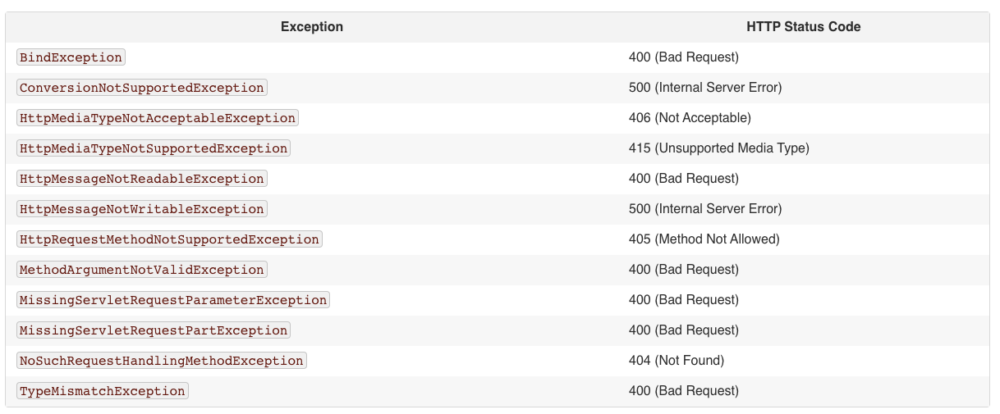

最近相对比较系统的看了 spring mvc / spring boot 有关异常处理的内容。这里做一个总结。相关的代码放到了 [springboot exception tutorial](https://github.com/aisensiy/springboot-exception-tutorial)。

之前确实没有比较系统的看 springmvc / springboot 有关异常处理的内容，这里直接记录一些我觉得比较有意义的知识片段以及具体的实践代码。

## spring mvc 的异常处理逻辑

```java
@SpringBootApplication
@RestController
@RequestMapping("/")
public class ExceptionApplication {

  public static void main(String[] args) {
    SpringApplication.run(ExceptionApplication.class, args);
  }
}
```

如上所示，这是一个最基础的 `SpringBootApplication` 我们首先提供一个直接报错的 Handler 看看发送请求之后的效果：

```java
@SpringBootApplication
@RestController
@RequestMapping("/")
public class ExceptionApplication {

  public static void main(String[] args) {
    SpringApplication.run(ExceptionApplication.class, args);
  }

  @GetMapping("hello")
  public String getHello() {
    throw new IllegalStateException();
  }
}
```

发送请求 `curl http://localhost:8080/hello` 会返回以下结果：

```
{
    "timestamp": "2020-12-07T16:34:17.488+00:00",
    "status": 500,
    "error": "Internal Server Error",
    "message": "",
    "path": "/hello"
}
```

后台会打出对应的报错 stack：

```
java.lang.IllegalStateException: null
	at com.example.exception.ExceptionApplication.getHello(ExceptionApplication.java:39) ~[main/:na]
	...
```

那么这个默认的报错处理是谁处理的呢？在[17.11.3 Handling Standard Spring MVC Exceptions](https://docs.spring.io/spring-framework/docs/3.2.x/spring-framework-reference/html/mvc.html#mvc-ann-rest-spring-mvc-exceptions)做了解释，`DefaultHandlerExceptionResolver` 会按照具体的 `Exception` 类型为请求结果报送默认的 StatusCode 具体的逻辑我贴出来以下，比较后面用的还是比较多的：



当然也可以去源代码里直接看。

不过文档里提到这个处理并不会返回 Body。那上面那个 JSON 的返回结果怎么来的呢？

在文档里，[17.11.5 Customizing the Default Servlet Container Error Page](https://docs.spring.io/spring-framework/docs/3.2.x/spring-framework-reference/html/mvc.html#mvc-ann-customer-servlet-container-error-page) 就做了解释：

> When the status of the response is set to an error status code and the body of the response is empty, Servlet containers commonly render an HTML formatted error page. 
> 当返回结果是错误码，但是返回的 body 为空的时候，servlet 通常会给返回一个错误页面。

而 springboot 则帮我们做了这个事情，给了一个 `BasicErrorController` 所以就有了上面的那个报错结果了。

知道了这个内容，我们就可以从两个地方入手去处理异常了。

## 覆盖默认的 BasicErrorController 的结果

比如在 sprinmvc 中我们常常在 `@RequestBody` 上使用 `@Valid` 注解，配合 BeanValidation 实现输入参数的校验，那么校验报错的时候会跑出异常 `MethodArgumentNotValidException` ，以下代码是我们什么都不处理的效果：

```java
@SpringBootApplication
@RestController
@RequestMapping("/")
public class ExceptionApplication {

  public static void main(String[] args) {
    SpringApplication.run(ExceptionApplication.class, args);
  }

  @GetMapping("hello")
  public String getHello() {
    throw new IllegalStateException();
  }

  @PostMapping("hello")
  public Hello postHello(@RequestBody @Valid Hello hello) {
    return hello;
  }
}

class Hello {

  @NotBlank
  private String name;
  private int value;

  public String getName() {
    return name;
  }

  public int getValue() {
    return value;
  }
}
```

发送请求：

```
$curl --location --request POST 'localhost:8080/hello' \
--header 'Content-Type: application/json' \
--data-raw '{
    "name": ""
}'
```

返回结果：

```
{
    "timestamp": "2020-12-07T17:16:23.153+00:00",
    "status": 400,
    "error": "Bad Request",
    "message": "",
    "path": "/hello"
}
```

可以看到，非常的没有意义，知道错了，但是不知道具体错在哪里。Springboot 提供了对 `DefaultErrorAttributes` 扩展的方法，可以修改上面那个 JSON 的结构：

```
@Component
class MyCustomErrorAttributes extends DefaultErrorAttributes {

  @Override
  public Map<String, Object> getErrorAttributes(
      WebRequest webRequest, ErrorAttributeOptions errorAttributeOptions) {
    errorAttributeOptions = errorAttributeOptions.including(Include.EXCEPTION,
        Include.BINDING_ERRORS);
    Map<String, Object> errorAttributes =
        super.getErrorAttributes(webRequest, errorAttributeOptions);
    return errorAttributes;
  }
}
```

在此发送一样的请求，会返回以下的结果：

```
{
    "timestamp": "2020-12-07T17:25:16.336+00:00",
    "status": 400,
    "error": "Bad Request",
    "exception": "org.springframework.web.bind.MethodArgumentNotValidException",
    "message": "",
    "errors": [
        {
            "codes": [
                "NotBlank.hello.name",
                "NotBlank.name",
                "NotBlank.java.lang.String",
                "NotBlank"
            ],
            "arguments": [
                {
                    "codes": [
                        "hello.name",
                        "name"
                    ],
                    "arguments": null,
                    "defaultMessage": "name",
                    "code": "name"
                }
            ],
            "defaultMessage": "不能为空",
            "objectName": "hello",
            "field": "name",
            "rejectedValue": "",
            "bindingFailure": false,
            "code": "NotBlank"
        }
    ],
    "path": "/hello"
}
```

增加了两个额外的字段 Include.EXCEPTION Include.BINDING_ERRORS 可以更清楚的知道具体是什么异常以及具体什么报错。

如果这样子还不满意，可以直接去继承 `BasicErrorController` 通常这么做是为了支持更多的返回类型（比如 XML）。

**注意** `MethodArgumentNotValidException` 还是蛮重要的，后续会经常出现。

## RestControllerAdvice

如果不想要默认的处理，那么就需要写一个 RestControllerAdvice 来处理所有的异常。我知道还有一些其他方式处理自定义异常，但是目前来看灵活性最高的就是这个了。

```java
@RestControllerAdvice
class MyExceptionHandler extends ResponseEntityExceptionHandler {

  @ExceptionHandler({IllegalStateException.class})
  protected ResponseEntity<Object> handleConflict(
      RuntimeException ex, WebRequest request) {
    return handleExceptionInternal(ex, "error",
        new HttpHeaders(), HttpStatus.CONFLICT, request);
  }
}
```

有了这部分代码，上文中的 `@GetMapping("hello") public String getHello() { throw new IllegalStateException(); }` 将会走 `handleConflict` 方法处理。注意这里 `ResponseEntityExceptionHandler` 是 Spring 推荐的 ControllerAdvice 的基类，它提供了大量 spring mvc 报的异常的处理方法，通过对这些方法做重载可以自定义具体的报错信息。这篇就先不讲了。后续补充。


## 参考

1. [Error Handling for REST with Spring](https://www.baeldung.com/exception-handling-for-rest-with-spring)
2. [spring lemon](https://github.com/naturalprogrammer/spring-lemon)
3. [ResponseEntityExceptionHandler](https://docs.spring.io/spring-framework/docs/3.2.4.RELEASE_to_4.0.0.M3/Spring%20Framework%203.2.4.RELEASE/org/springframework/web/servlet/mvc/method/annotation/ResponseEntityExceptionHandler.html)