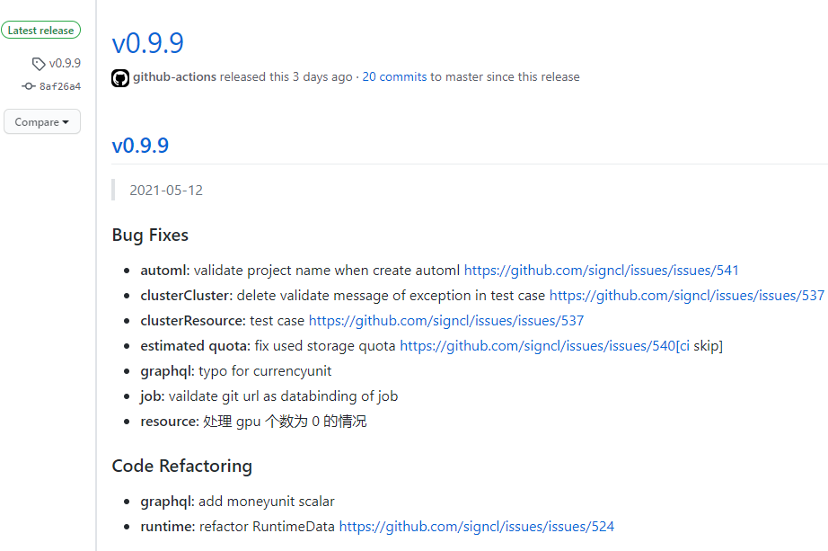
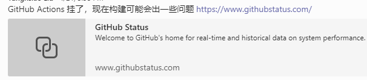

## 2021 年 7 月更新

> 随着最近又更深入的使用了 Github Actions 对其又有了一些新的认识。这里对原来的一些些观点做一些补充。

再之前的一篇 [文章](/github-actions) 对 github actions 做了一些简单的介绍，距离上次记录已经超过半年的时间了，在这段时间我们逐渐将大部分的 circleci 执行的 ci/cd 内容挪动到 github actions 了。这里在对目前的一些使用体会做一个记录。

## Good part

github actions 配合 github 自身的 api 可以玩出很多花样，把很多手工的工作都变成自动化的流程，确实节省了不少时间。其实每个东西都没什么复杂的，这里主要是罗列和记录吧。

### 依据标签自动发布 release

首先，我们通常都需要在打 tag 的时候搞出来一个发布。github actions 可以在 push tag 的时候触发相应的流程，实现这个功能。



```yaml
name: Java CI

on:
  push:
    branches:
      - '**'
    tags:
      - 'v*' # Push events to matching v*, i.e. v1.0, v20.15.10
  pull_request:
    branches:
      - '**'

jobs:
  build:

    runs-on: self-hosted
    if: "! contains(github.event.head_commit.message, '[ci skip]')"

    steps:
    - uses: actions/checkout@v1
    ...
    - name: Prepare release
      if: startsWith(github.ref, 'refs/tags/')
      env:
        CURRENT_TAG: ${{ steps.version_tag.outputs.VERSION }}
      run: |
        cp build/libs/openbayes-server-0.0.1-SNAPSHOT.jar app.jar
        docker run -v "$PWD":/workdir quay.io/git-chglog/git-chglog $CURRENT_TAG > CHANGELOG.md
    - name: Release
      uses: softprops/action-gh-release@v1
      if: startsWith(github.ref, 'refs/tags/')
      with:
        body_path: CHANGELOG.md
        files: app.jar
      env:
        GITHUB_TOKEN: ${{ secrets.GITHUB_TOKEN }}
```

如上所示，最后两个 step 分别是准备要发布的内容以及执行实际的发布：

1. 这是一个 java 的项目，我将 build 出来的 jar 作为一个 asset 重命名成 `app.jar` 。然后使用工具 [git-chglog](https://github.com/git-chglog/git-chglog) 生成当前 tag 的 changelog 保存到 `CHANGELOG.md` 中。
2. 使用一个第三方的 github action [softprops/action-gh-release](https://github.com/softprops/action-gh-release) 用来创建一个 release 其实就是调用了 github 的 api 创建了一个 release 罢了。具体怎么做看文档就好。

### goreleaser 与 ghr 的帮助

同样是在打 tag 的时候做一个发布，openbayes 的命令行工具要做的事情就会多不少：

1. 作为一个需要别人下载的东西，我们需要对国内提供比较好的访问速度
2. 作为一个私有仓库，我们需要同时将 release 放到另外的公有仓库里
3. 我们需要更新 homebrew 的源以保证用户通过 homebrew 安装的时候是最新的版本

由于这个项目是 golang 开发的，我们使用了一个名为 [goreleaser](https://github.com/goreleaser/goreleaser) 的工具。它能够帮助我们完成如下事情：

1. 构建针对不同操作系统的二进制文件并提供 checksum 文件
2. 更新对应的 homebrew 仓库
3. 将代码上传到一个国内访问速度比较快的对象存储上，见[Blobs](https://goreleaser.com/customization/blob/)

使用 goreleaser 的 [action](https://github.com/goreleaser/goreleaser-action) 就可以完成以上三个事情。但是除此之外，我们还需要发布到另外一个公开的仓库里。

本想继续采用上面的那个 `action-gh-release` 无奈这个东西有个 bug：虽然它允许指定另外一个仓库作为发布的仓库，但是在发布前它居然会检查自己以这个名字命名的 release 是否存在（而不是去检查要发布的仓库的 release 是否存在），所以我们就继续采用了 [ghr](https://github.com/tcnksm/ghr) 这个古老的东西。

**注意** 在将东西发布到其他仓库的时候，github action 所提供的默认的 GITHUB_TOKEN 是不够的：它不具备操纵其他仓库的权限。需要自己创建一个新的 token 并通过 env 传递过来。文档见 [Creating a personal access token
](https://docs.github.com/en/github/authenticating-to-github/creating-a-personal-access-token)。

```yaml
    - name: Release to other repository
      env:
        GITHUB_TOKEN: ${{ secrets.GH_PAT }} # 这里就是一个自己创建的 TOKEN 了
        CURRENT_TAG: ${{ steps.version_tag.outputs.VERSION }}
      run: |
        ...
        go get -u github.com/tcnksm/ghr
        ghr -u signcl -r bayes-releases -body="$(cat tmpDist/CHANGELOG.md)" $CURRENT_TAG dist
```

这里在吐槽一下 gitee 的 api。最开始我们是将命令行工具发布到 gitee 的一个仓库的，采用 github action 后也想通过 gitee 的 api 去创建相应的发布到 gitee 对应的仓库。无奈 gitee 的仓库居然只有创建一个空 release 的接口，**而没有向 release 里面提供额外 assets 的接口**，相当于这 api 就只做了一半而已，询问客服也没什么结果（不过起码有人回复），并且我们也不希望通过模拟表单提交的方式去做了，毕竟也不是非要发布到 gitee 上，最终还是采用了将二进制文件放到国内对象存储的方案。

### 同步到 gitee

由于 github 在国内的访问不是很稳定，但是我们有一些样例项目希望其他人可以 git clone 去尝试，那么就有这种将 github 的项目同步到 gitee 以提升可访问性的需求：

1. 去 gitee 创建一个 access token
2. 在 github 每次 push 的时候都触发一个 github action 将 commit 主动 push 到 gitee 那边的仓库就好了

这里我直接使用了 [https://github.com/wangchucheng/git-repo-sync](https://github.com/wangchucheng/git-repo-sync) 这个 action 看里面的代码也就是这么个流程。

```yaml

name: sync-gitee

on:
  push:
    branches:
      - '**'

jobs:
  sync:
    runs-on: ubuntu-latest
    name: Git Repo Sync
    steps:
    - uses: actions/checkout@v2
      with:
        fetch-depth: 0
    - uses: wangchucheng/git-repo-sync@v0.1.0
      with:
        target-url: ${{ secrets.REMOTE_GIT }}
        target-username: ${{ secrets.username }}
        target-token: ${{ secrets.ACCESS_TOKEN }}
```

## Bad part

github action 确实通过和 api 的集成帮我们生了不少事情，但是在使用的过程中也遇到了一些问题。槽点不是很多，目前也一定程度上可以接受吧。如果能够再稳定一些那就更好了。

### 不太稳定的服务

github action 这种模式其实本身是有点危险的：相当于把大量的用户代码在自己的系统里去跑，并且还有非常复杂的沟通与集成的工作。可能因为各种自身或者[用户的问题](https://www.infoq.cn/article/6bipjclk9anzvda4uecm)，服务确实有 down 过那么几次。



### 不太完善的封装

其次就是我们一直吐槽的 action 的写法问题了：很多 action 是那种不通过 docker 封装的版本，这势必会引入依赖不全的问题。尤其是对于我们这种 self-hosted 的用户，经常会出现因为依赖不齐全而导致 ci 挂掉。

> **更新** 目前并没有很系统的去了解撰写 github action 的方法，最近接触到的是 [JS Action](https://docs.github.com/en/actions/creating-actions/about-actions#javascript-actions) 的流程。其文档也提到
> 
>  "To ensure your JavaScript actions are compatible with all GitHub-hosted runners (Ubuntu, Windows, and macOS), the packaged JavaScript code you write should be pure JavaScript and not rely on other binaries. JavaScript actions run directly on the runner and use binaries that already exist in the virtual environment."
> 
> 也就是说其平台兼容性是建立在你自己的 nodejs 依赖是可以跨平台的前提下的。

