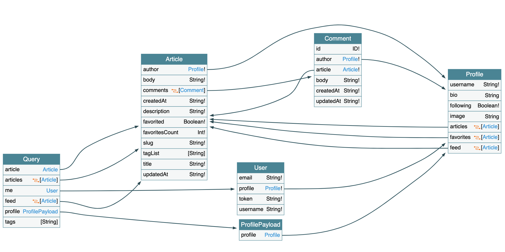
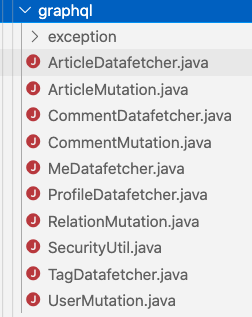

在很久之前的一篇 [文章](/real-world-spring-boot-and-mybatis) 介绍了我做的一个 [RealWorld 的 SpringBoot + MyBatis](https://github.com/gothinkster/spring-boot-realworld-example-app) 的实现。这个项目我也一直在维护，一方面是因为这是一个很好的 demo 项目，可以很好的体现一些设计思路 [文章](/real-world-spring-boot-and-mybatis) 也都说了不再重复。另一方面，我觉得也是一个新人练手不错的选择，可以让大家可以通过这个项目来入门。

最近在做 GraphQL 的调研和测试，我第一个想到的就是把这个项目添加上 GraphQL 的接口，一方面可以熟悉 GraphQL 的体系，另一方面也是个很好的机会去验证下是不是 REST 层是按照 [六边形架构](http://alistair.cockburn.us/Hexagonal+architecture) 或者说是 [洋葱架构](https://www.infoq.com/news/2014/10/ddd-onion-architecture) 那样子做成的是薄薄的一层，可以轻易的被替换掉。

## 对 api 层与 application 层做重构

当然，api 层和 application 层一点都不修改就能添加 GraphQL 是不可能的。主要是因为之前有不少的逻辑写在了 SpringBoot 的 Controller 里面了。那么这一部分的工作基本就是把大量放在 Controller 的代码挪动到 application 层。

## 确认 GraphQL 的 schema

然后就需要按照 REST api 提供一个对等的 GraphQL 的 schema 了。这里参考的是 https://github.com/thebergamo/realworld-graphql/blob/master/data/schema.graphql 这里。

> Real World 似乎对 GraphQL 这部分的工作不太伤心，这个东西已经挺久的了，但是官方并没有很好的支持。

不过它这个 schema 明显有两个问题：

1. 少了 `unfavoriteArticle` 的 `Mutation`
2. `deleteArticle` 返回了错误的结果，明明应该是 `DeletionStatus`

用 https://apis.guru/graphql-voyager/ 做展示基本就是这个样子：



schema 在 https://github.com/gothinkster/spring-boot-realworld-example-app/blob/master/src/main/resources/schema/schema.graphqls 可以看到。

可以看到 GraphQL 的 schema 是一张图，有点像是数据库的 [ER Diagram](https://www.guru99.com/er-diagram-tutorial-dbms.html)。不过很显然，GraphQL 的关系肯定不是数据库级别的 CRUD 而是一个业务层级的关联图：

1. `User` 的 `Profile` 下可以有很多 `Article` 的视图 `favorites` `feed`；
2. `Article` 则有其自己的全量属性：`author` `comments`；
3. `Comment` 也有自己的 `article` `author`；

这部分让我想起来 DDD 书中提到的 Domain Model 对象之间的关联关系（第五章 A Model Expressed in Software）。和 REST 相比，通过 GraphQL 所组织的 schema 有更好的整体性和一致性。当然，这也有可能是它的缺点：它缺少了 REST 的那种随便搞个接口的灵活性。

## 增加 GraphQL 的代码

这里的实现采用了 [Netflix DGS](https://netflix.github.io/dgs/) 这个框架，很符合 SpringBoot 的设计逻辑，并且最近也一直在密集的更新中。



从文件组织上看，每个 Entity 或者是 EntityList 可以组织一个 Datafetcher 提供给具体某一个 `Query` 下的特定 type 的查询。而针对某个 Entity 的 Mutation 可以放到一起？这部分不太确定，可能还是刚刚开始做，感受不是很明显。

### 对于 nested query 的处理

既然是一张图，那么查询就可以是一个树，比如可以有这么一个查询：

```graphql
query {
  me {
    profile {
      articles {
        edges {
          node {
            comments {
              edges {
                node {
                  body
                }
              }
            }
          }
        }
      }
    }
  }
}
```

获取当前用户的 `articles` 并且包含它的 `comment` 的 `body`。类似的问题在 [Nested data fetchers](https://netflix.github.io/dgs/advanced/context-passing/) 有做一些阐述。而我这个例子就是遇到了 https://netflix.github.io/dgs/advanced/context-passing/#no-showid-use-local-context 这部分阐述的情况，需要自己创建一个 Map 并放到 localContext 中做传递。具体的代码如下：

`ArticleDatafetcher.java`:

```java
package io.spring.graphql;

...

@DgsComponent
public class ArticleDatafetcher {

  ...

  @DgsData(parentType = PROFILE.TYPE_NAME, field = PROFILE.Articles)
  public DataFetcherResult<ArticlesConnection> userArticles(
      ...
      DgsDataFetchingEnvironment dfe) {

    User current = SecurityUtil.getCurrentUser().orElse(null);
    Profile profile = dfe.getSource();

    CursorPager<ArticleData> articles;

    ...

    graphql.relay.PageInfo pageInfo = buildArticlePageInfo(articles);
    ArticlesConnection articlesConnection =
        ArticlesConnection.newBuilder()
            .pageInfo(pageInfo)
            .edges(
                articles.getData().stream()
                    .map(
                        a ->
                            ArticleEdge.newBuilder()
                                .cursor(a.getCursor().toString())
                                .node(buildArticleResult(a))
                                .build())
                    .collect(Collectors.toList()))
            .build();
    return DataFetcherResult.<ArticlesConnection>newResult()
        .data(articlesConnection)
        .localContext( // 这里将 slug : article 的 map 传递到下一个层级了
            articles.getData().stream().collect(Collectors.toMap(ArticleData::getSlug, a -> a)))
        .build();
  }

  ...
}

```

`CommentDatafetcher.java`:

```java
package io.spring.graphql;

...

@DgsComponent
public class CommentDatafetcher {
  ...

  @DgsData(parentType = ARTICLE.TYPE_NAME, field = ARTICLE.Comments)
  public DataFetcherResult<CommentsConnection> articleComments(
      ...
      DgsDataFetchingEnvironment dfe) {

    if (first == null && last == null) {
      throw new IllegalArgumentException("first 和 last 必须只存在一个");
    }

    User current = SecurityUtil.getCurrentUser().orElse(null);
    Article article = dfe.getSource();
    Map<String, ArticleData> map = dfe.getLocalContext(); // 获取 map
    ArticleData articleData = map.get(article.getSlug()); // 使用 slug 获取具体的 ArticleData

    CursorPager<CommentData> comments;
    
    ...

    graphql.relay.PageInfo pageInfo = buildCommentPageInfo(comments);
    CommentsConnection result =
        CommentsConnection.newBuilder()
            .pageInfo(pageInfo)
            .edges(
                comments.getData().stream()
                    .map(
                        a ->
                            CommentEdge.newBuilder()
                                .cursor(a.getCursor().toString())
                                .node(buildCommentResult(a))
                                .build())
                    .collect(Collectors.toList()))
            .build();
    return DataFetcherResult.<CommentsConnection>newResult()
        .data(result)
        .localContext(
            comments.getData().stream().collect(Collectors.toMap(CommentData::getId, c -> c))) // 这里同样传递了一个 id : comment 的 map 到下一个层级
        .build();
  }

  ...
}

```

这种传递 map 的方式也算是官方指定的最佳实践了吧，并且基本不可或缺。因为很多时候 `Source` 和实际从 `Application` 层传递的 DTO 的类型就是不一样的，可能缺了不少数据。

## 效果

只要 Application 层保证重用并且捋清楚了 DataFetcher 之间的数据传递关系，后面做起来感觉就一马平川了，毕竟这也不是一个什么很大很复杂的项目。

完成之后感觉这种网状关系的调用体验还是很好的，感觉对 API 的调用方来说，一旦熟悉了这种模式就可以更容易的组合各种比较复杂的视图，而不会像 REST 那样担心大量的手工数据组合。

## 开发过程中的一些小问题

1. Intellij 对 GraphQL 本身的支持还不够好
2. Dgs 是个比较新的框架，加上国内似乎很少有做类似东西的人，资料很少
3. RealWorld 本身对 GraphQL 的推进也很慢，后续我应该会增加英文版本的 ReadME 介绍 GraphQL 这部分的工作，并且希望可以有前端做支持