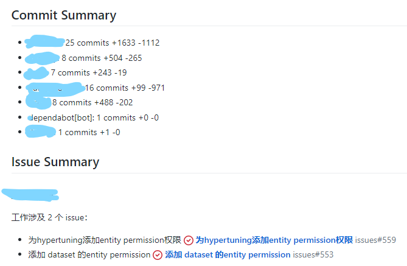
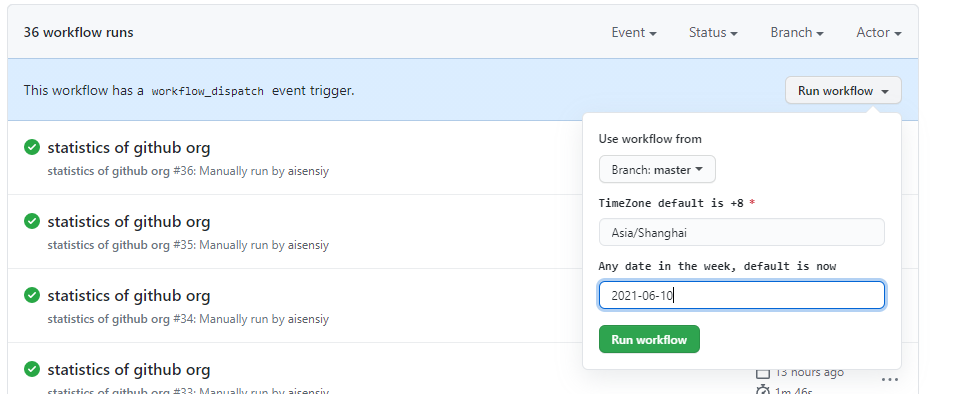
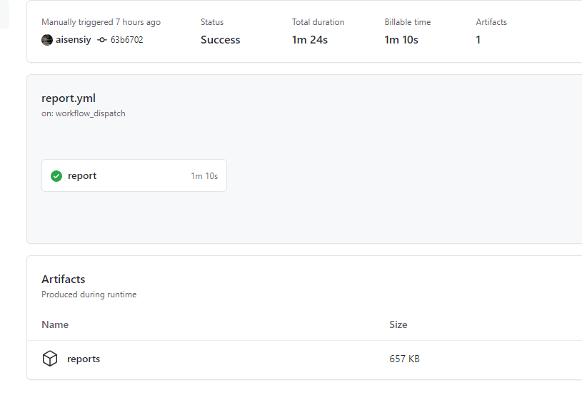

最近又用 Github Actions 玩出了花样。这里记录一下通过 Github Api 和 Github Actions 怎么去做组织内的 commits 统计。

## 为啥要自己做统计

之前一直有一个想法，能不能通过 github 的 api 去将组织内的工作量做成报表以方便查看每个人工作的进度以及各个 issue 的进展。做了简单的调研，发现现有的东西都不太能满足具体的需求：

1. 我希望统计 org 下所有仓库的数据，而不是单个仓库（目前所在组织里有 100+ 个仓库）
2. 目前 org 内以 issue 作为工作的一个最小单位，希望提交的 commit 都与 issue 做关联，那么势必需要统计每个周期内 issue 的进展以及关联的 commit 做统计，显然现有的 [insights](https://docs.github.com/en/github/visualizing-repository-data-with-graphs/accessing-basic-repository-data/viewing-a-summary-of-repository-activity) 也是不太够的

然后就去评估了下自己做统计的工作量。github 早已经发布了 GraphQL 的 API 并且通过 [explorer](https://docs.github.com/en/graphql/overview/explorer) 去测试和使用其 API 的体验是相当好于是就心动了，决定自己做这个统计。

## 先看看最终效果

报表数据主要包括每个人的活跃数据以及每个人所涉及的 issue。



## 具体怎么做

### 用到的 GraphQL API

首先，我集成的是 Github 的 GraphQL API 主要用到了以下几个接口：

#### 1. 获取组织内的 repositories

```graphql
query Repositories($username: String!, $cursor: String) {
  organization(login: $username) {
    repositories(
      first: 100
      isLocked: false
      orderBy: { field: PUSHED_AT, direction: DESC }
      after: $cursor
    ) {
      pageInfo {
        hasNextPage
        endCursor
      }
      edges {
        node {
          pushedAt
          name
        }
      }
    }
  }
}
```

#### 2. 获取 repository 下的 commits

```graphql
query Commits($owner: String!, $name: String!, $cursor: String) {
  repository(owner: $owner, name: $name) {
    defaultBranchRef {
      target {
        ... on Commit {
          history(first: 30, after: $cursor) {
            pageInfo {
              hasNextPage
              endCursor
            }
            edges {
              node {
                author {
                  user {
                    name
                    login
                  }
                }
                commitUrl
                abbreviatedOid
                pushedDate
                additions
                deletions
                message
              }
            }
          }
        }
      }
    }
  }
}
```


#### 3. 获取 issue

```graphql
query Issue($owner: String!, $name: String!, $number: Int!) {
  repository(owner: $owner, name: $name) {
    issue(number: $number) {
      title
      url
    }
  }
}
```

使用的 Client 就是 Apollo GraphQL Client。

### 对每个人的活动量做细节处理

原始的 Commit 包含行的增加和删减，但这里有个问题：

1. 很多代码其实是自动生成的，这部分并不能算是个人的工作量，并且这种生成代码的规模对于不同编程语言也有很大差异，希望在统计时忽略这些自动生成的代码
2. 有一些 Merge commit 其实也不能算是个人工作量，也应该剔除
3. 不同编程语言的工作规模有差异，比如前端 js 通常生产出来的代码规模就比写 python 的要大不少，纯粹按照行数统计没有可比性

这里我处理了前两个，第三个感觉有点复杂，并且我也觉得没必要如此仔细的量化。

#### 通过 `node-ignore` 去过滤掉那些生成代码

[node-ignore](https://github.com/kaelzhang/node-ignore) 是一个很不错的库，实现了 gitignore 的标准，用这个我们就可以将每个 commit 的每个文件扫一遍，过滤掉那些模板的文件后重新统计删减就好了。

这里吐槽 Github GraphQL API 发现其并没有实现具体一个 commit 下文件修改的接口，还需要我去调用 REST 的接口。

#### 通过 commit message 过滤掉 Merge 的 commit

这里似乎有点不太严谨，但是似乎问题不大吧...

### 用 ejs 做模板生成 markdown

自从用了 react 似乎很少和各种模板引擎打交道了。上次使用类似的东西还是用 freemarker 做简单的文本内容模板。这次我也做了简单的调研，看了 mustache handlebars 和 ejs 最后还是觉得 ejs 这种可以直接写 js 的比较舒服。尤其是我在尝试 mustache 的时候没找到去迭代 Object 的方法...

写出来就是这个样子，实在是好久没写 nodejs 以及对 ejs 也是现学现用...

```
## Commit Summary

<% Object.keys(userCommitSummary).forEach(function(username) { -%>
- <%= username %>: <%= userCommitSummary[username].commitCount %> commits +<%= userCommitSummary[username].additions %> -<%= userCommitSummary[username].deletions %>
<% }); -%>

## Issue Summary

<% Object.keys(userIssueSummary).forEach(function(username) { -%>
### <%= username %>

工作涉及 <%= userIssueSummary[username].issueCount %> 个 issue：
<% userIssueSummary[username].issues.forEach(function(issue) { %>
- <%= issue -%>
<% }); %>

<% }); -%>

## Commit Details

<% Object.keys(userRepositoryCommitsDetails).forEach(function(username) { -%>
### <%= username %>
  <% Object.keys(userRepositoryCommitsDetails[username]).forEach(function(repo) { %>
####  <%= repo %>

    <%_ userRepositoryCommitsDetails[username][repo].forEach(function(commit) { -%>
- <%= commit.url %> - <%= commit.message %> <<%= commit.pushedDate %>>
    <%_ }); -%>
  <% }); -%>

<% }); -%>
```

### 用 github actions 去跑任务做周期性统计

```yaml
name: statistics of github org

on:
  workflow_dispatch:
    inputs:
      timezone:
        description: "TimeZone default is +8"
        required: true
        default: "Asia/Shanghai"
      date:
        description: "Any date in the week, default is now"
        required: false
  schedule:
    # https://crontab.guru
    - cron: 0 18 * * *

jobs:
  report:
    runs-on: ubuntu-latest
    steps:
      - uses: actions/checkout@v2
      - name: Setup node
        uses: actions/setup-node@v2
        with:
          node-version: "14"
          check-latest: true
      - run: yarn
      - name: generate report
        env:
          GITHUB_TOKEN: ${{ secrets.GH_PAT }}
        run: TZ=${{github.event.inputs.timezone}} DATE=${{github.event.inputs.date}} node main.js
      - name: Upload results
        uses: actions/upload-artifact@v2
        with:
          name: reports
          path: |
            rawdata.json
            report.md
      - name: Prepare Issue Title
        id: issue_title
        run: |
          export TZ=${{github.event.inputs.timezone}}
          export DATE=${{github.event.inputs.date}}
          echo ::set-output name=ISSUE_TITLE::$(node week.js)
      - name: Create Issue From File
        uses: aisensiy/create-issue-from-file@af97df85a971093700b62d1bde8339c4fabb35ff
        with:
          title: Weekly Statistics ${{steps.issue_title.outputs.ISSUE_TITLE}}
          token: ${{ secrets.GH_PAT }}
          update-existing: true
          content-filepath: ./report.md
          labels: |
            report

```

首先，这里使用了两个 github workflow 的 trigger：

- schedule 也就是 cron 用于周期性跑任务
- workflow_dispatch 可以提供个简单的表单，用来主动去创建一个 workflow



然后，这里在完成统计后（就是 generate report 这个步骤）将所有的数据做成了 artifact 保存了下来，方便后续的数据的追溯。



最后，通过一个 create-issue-from-file 的 github action 将 report 的内容创建成一个 issue 展示出来，展示出来就是上文的截图的效果了。

> 这里我为了避免每次执行都创建重复性的内容还特意把原来的 action 做了修改，提交了 PR https://github.com/aisensiy/create-issue-from-file 。

## 总结

- GraphQL 的 API 相对于 REST 更容易上手
- 了解了 Github Actions 除了 CI/CD 的功能外还能做很多奇奇怪怪的东西，甚至让我觉得它是一个 serverless 平台，这里还看到另外一个新奇的使用方式 https://github.blog/2020-06-17-using-github-actions-for-mlops-data-science/
- 自己撰写 Github Actions 似乎挺简单的，文档还算是比较清楚，不过那个 [outputs](https://docs.github.com/en/actions/reference/workflow-syntax-for-github-actions#jobsjob_idoutputs) 确实是花了些时间