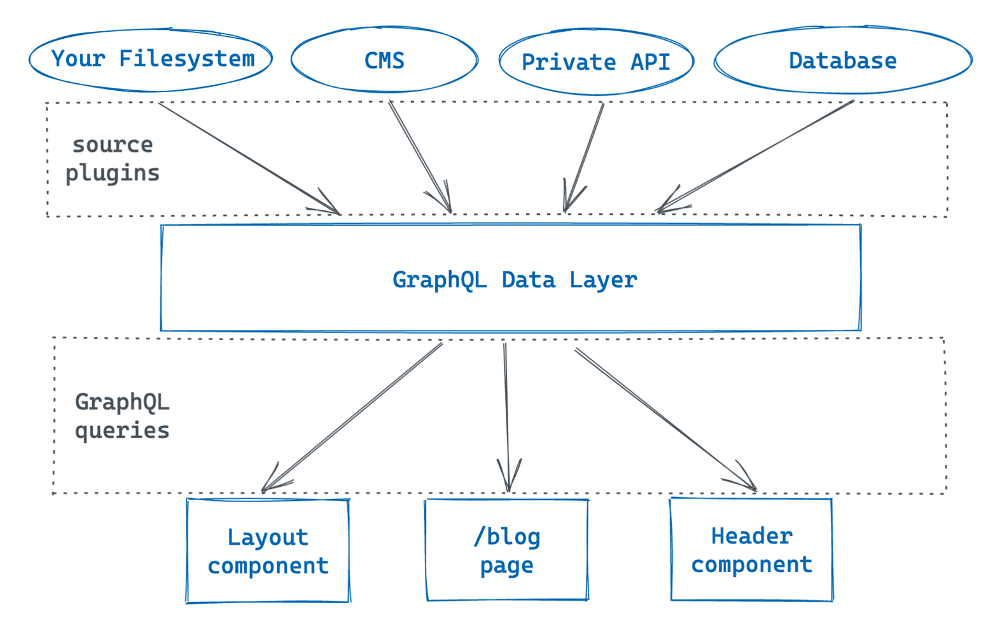
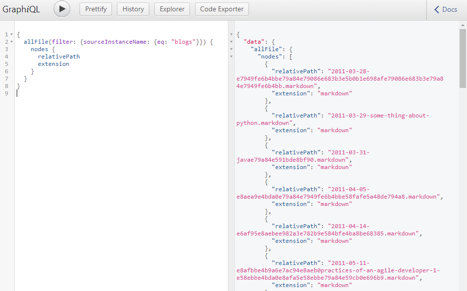

考虑到自己的前端技能有一阵子没有更新了，同时看到刘老师用 [docusaurus](https://docusaurus.io) 把 openbayes docs 切换之后访问速度和使用体验都提升了不少，于是也想自己尝试一下 [gatsby](https://www.gatsbyjs.org/)（与 docusaurus 技术栈类似但适用范围又大大增加）。这里先拿自己的小博客开刀，把原来的 jekyll 技术栈切换过来。

本来打算一小步一小步迁移过来并做比较细致的记录，结果一不小心步子迈的有点大，甚至把 tailwindcss 的部分也一口气引入到了技术栈之中。不过考虑到篇幅，这里还是会分多篇文章做介绍。首先是介绍把 jekyll 迁移到 gatsby 的部分。

另，以下部分是相对比较容易通过搜索获取到的内容，对应的官方网站都有非常详尽的介绍，这里就不再赘述。

1. gatsby 的基本安装
2. graphql 的知识

## Gatsby 的思路

虽然 gatsby 官方把 static 划掉了加上了 dynamic，但以我目前的了解，它依然是一个 static site generator，只是在生成的路由的方面有了 *动态* 的感觉。


翻看 gatsby 官方的信息后，这里为 gatsby 总结出如下几个特点：

1. gatsby 使用的模板引擎为 react（jekyll 用的就是 ruby 的 erb），相比于其他的后端模板引擎，它本身就是前端框架，使用 react 相当于具备了创建完整前端技术栈的能力。
2. gatsby 也有自己的一套静态路由，以及最近也有了 *动态* 路由。这部分似乎没有特别多的新意，毕竟路由原本就是传统后端框架的必要组成部分。但是 gatsby 的动态路由是通过带参数形式的文件名实现的（当然还有个更灵活的方式： [gatsby-node.js](https://www.gatsbyjs.com/docs/how-to/routing/creating-routes/#using-gatsby-nodejs)），这个思路感觉像是在原有的静态路由的延申，这似乎是一种把路由的使用门槛降低的好办法，还有另外一个框架 next.js 也使用了类似的方式。
3. gatsby 的 graphql data layer 可以通过一系列插件将多种形式的数据源以 graphql 的形式提供给处于 `develop mode` 的 gatsby server ，并很方便的填充到模板中。同时，数据源还可以使用插件做数据的扩展（添加字段，修改字段），在后面有关插件的部分我也会做一些介绍。



## 快速开始

在开始操作之前我自然是 google 了一番，发现想要把 jekyll 切到 gatsby 的人不在少数。并且官方网站里也有适配 markdown 作为数据源的内容。这里先罗列下从 jekyll 到 gatsby 迁移的几个必须步骤，并在下文一一介绍。

1. markdown 文件的整体迁移
1. 生成路由
1. 处理 blog 中的代码高亮
1. 优化 blog 中的 image
1. 部署

## markdown 文件的整体迁移

jekyll 出现的那个时代没有想现在这样如此多的外部数据源可以选择，其静态页面生成的数据源一定是文件。但 2021 年情况发生了变化，从 gatsby 的官方数据源插件来看，其中大量的数据源是 headless cms（比如 contentful 比如 wordpress），不过对我来说从 jekyll 迁移，我关心的也就是文件数据源。

这里用到了两个插件：

1. `gatsby-source-filesystem` 将特定目录作为数据源添加到 gatsby 的数据层
2. `gatsby-transformer-remark` 使用 [remark](https://remark.js.org/) 将 `markdown` 文件解析为 html 并为 markdown 提供了很多有用的字段（比如 frontmatter，比如目录）

gatsby 所有的插件都需要单独安装并在 `gatsby-config.js` 做配置，这里展示下上述两个插件的基本配置：

```javascript
module.exports = {
  siteMetadata: {
  },
  plugins: [
    {
      resolve: `gatsby-transformer-remark`,
      options: {
        // Plugins configs 这里后续做扩展，支持语法高亮、图片优化
        plugins: [
        ],
      },
    },
    {
      resolve: `gatsby-source-filesystem`,
      options: {
        name: `blogs`,
        path: `${__dirname}/src/blogs/`,
      },
    },
  ],
};
```

在 `gatsby-source-filesystem` 的配置部分可以看到，markdown 文件被放到了 `src/blogs` 目录下。在执行命令 `yarn run start` 之后，通过 `http://localhost:8000/__graphql` 构建如下 graphql 语句就能够获取到文件的信息了：

```graphql
{
  allFile(filter: {sourceInstanceName: {eq: "blogs"}}) {
    nodes {
      relativePath
      extension
    }
  }
}
```

可以看到对应的结果如下所示：



不过直接使用这个似乎数据也做不了什么，还需要 `gatsby-transformer-remark` 将 markdown 做解析，对应的数据通过另外一个 graphql 的接口获取：

```graphql
query {
  allMarkdownRemark {
    nodes {
      id
      html
      frontmatter {
        title
      }
    }
  }
}
```


顺便说一下 gatsby 提供的 graphiql 增加了 [graphql-explorer](https://github.com/OneGraph/graphiql-explorer) 可以通过点击的方式快速的拼接 graphql 语句。

## 生成路由

### 固定路由

有了数据源，下一步就是构建博客的基本的路由结构：

```
/ -- 首页，展示最新的 N 篇博客
/about -- 关于，一个独立的页面
/page/{page-number} -- 做分页，每页固定数量的博客，当然提供翻页功能
/{slug} -- 每篇博客的语义 url 用来展示每篇独立的博客
/archive -- 所有博客的总览页面，罗列了所有的博客标题
```

上文提了，gatsby 为了简化路由，为 `/src/pages` 目录下每个文件都提供了对应的 url 路径。比如 `src/pages/about.js` 的内容就对应了 `/about` 路由，再比如 `src/pages/projects/main.js` 对对应了 `/projects/main` 路由。也就是说对于固定路由来说，直接给个对应文件并且按 gatsby 的规约用 graphql 获取数据做渲染就好了。这里我以 `/archive` 的代码举个例子：

```javascript
export default function Archive({ data }) {
  const groupByYearResult = groupByYear(data.allMarkdownRemark.nodes);

  return (
    <Base>
      <div>
        <h1 className="text-4xl font-extrabold tracking-tight my-4 text-gray-800">Archive</h1>
        {groupByYearResult.map(({ key, value }) => (
          <div key={key}>
            <h2 className="text-3xl font-bold tracking-tight my-4 text-gray-800">{key}</h2>
            <YearItems blogs={value} />
          </div>
        ))}
      </div>
    </Base>
  );
}

function YearItems({ blogs }) {
  return (
    <div>省略了...</div>
  );
}

export const query = graphql`
  query QueryBlogTitles {
    allMarkdownRemark(sort: { fields: frontmatter___date, order: DESC }) {
      nodes {
        id
        frontmatter {
          title
          date(formatString: "MMMM-DD")
          year: date(formatString: "YYYY")
        }
        fields {
          slug_without_date
        }
      }
    }
  }
`;

function groupByYear(blogs) {
  // 省略了...
}

```

文件可以分为两个部分，一部分是 react 的模板，一部分是 graphql 数据的获取，简单明了，这里就不再赘述了。

### 从文件生成 slug 并使用 react 模板生成 blog 页面

相对于固定路由，动态路由不是说像 [/blog-migrate-from-jekyll-to-gatsby](/blog-migrate-from-jekyll-to-gatsby) 这样的页面是在用户请求的时候用 server 端临时拼装页面，而是指在 gatsby 部署的时候动态的生成一系列的静态页面。上文提到了，既然我可以从 graphql 里面罗列一系列的 markdown 内容了，那我自然可以通过遍历的方式去生成一个个页面并提供各自的路由。

具体在 gatsby 做的时候需要这么做：

#### 1. 准备单个 blog 的模板页面

```javascript

export default function BlogTemplate({ data }) {
  return (
    <Base>
      <Blog data={data.blog}/>
    </Base>
  )
}

export const pageQuery = graphql`
  query BlogPostQuery($id: String) {
    blog: markdownRemark(id: { eq: $id }) {
      id
      html
      tableOfContents
      frontmatter {
        title
        date(formatString: "MMMM DD, YYYY")
      }
    }
  }
`
```

这是 `src/templates/blog.js` 文件的内容，可以看到，在 `pageQuery` 引入了参数 `$id`，这部分在下文会介绍怎么填充这个字段。

#### 2. 在 gatsby-node.js 中创建页面

gatsby 在 build 的时候会执行 gatsby-node.js 文件，这个文件中可以调用 gatsby 的内部 api 以实现动态创建页面的目的。

```javascript
const { createFilePath } = require("gatsby-source-filesystem")

// 1. 为 markdown 增加额外的字段 slug 和 slug_without_date
exports.onCreateNode = ({ node, actions, getNode }) => {
  const { createNodeField } = actions
  if (node.internal.type === `MarkdownRemark`) {
    const filename = createFilePath({ node, getNode })
    // get the date and title from the file name
    const [, date, title] = filename.match(
      /^\/([\d]{4}-[\d]{2}-[\d]{2})-{1}(.+)\/$/
    );

    // create a new slug concatenating everything
    createNodeField({ node, name: `slug`, value: `/${date.replace(/\-/g, "/")}/${title}/` })
    createNodeField({ node, name: `slug_without_date`, value: `/${title}` })
  }
}

// 2. 获取所有的 markdown 数据
const path = require("path");
exports.createPages = async ({ graphql, actions, reporter }) => {
  // Destructure the createPage function from the actions object
  const { createPage } = actions
  const result = await graphql(`
    {
      allMarkdownRemark {
        nodes {
          id
          fields {
            slug
            slug_without_date
          }
        }
        pageInfo {
          totalCount
        }
      }
    }
  `)
  if (result.errors) {
    reporter.panicOnBuild('🚨  ERROR: Loading "createPages" query');
  }
  
  const posts = result.data.allMarkdownRemark.nodes;
  // 3. 调用 api createPage 创建
  posts.forEach((node, index) => {
    createPage({
      path: node.fields.slug, // 这里是路由
      component: path.resolve(`./src/templates/blog.js`), // 这里是模板的位置
      context: { id: node.id }, // 这里是传递给模板的参数
    })

    createPage({
      path: node.fields.slug_without_date, // 生成另外一个路由
      component: path.resolve(`./src/templates/blog.js`),
      context: { id: node.id },
    });
  })
}
```

首先，通过 `onCreateNode` 的 hook 通过文件名解析出来了 slug。举个例子，文件名是 `2021-07-17-blog-migrate-from-jekylly-to-gatsby.md` 那么就会解析出两个 slug：

- /2021/07/17/blog-migrate-from-jekylly-to-gatsby
- /blog-migrate-from-jekylly-to-gatsby

之后通过 `createNodeField` 方法把 slug 再次塞回 `MarkdownRemark` 类型的 `fields` 属性里，后面就可以通过 `fields.slug` 访问这些属性了。

之所以创建 /2021/07/17/xxx 的路由（而不仅仅有 /xxx 的路由）是因为这时 jekyll 的默认路由样式，算是做一个兼容保证原来的链接不会失效。

到目前为止，blog 的主要功能算是建立好了。

## 处理 blog 中的代码高亮

remark 这个插件自己也可以使用插件，使用 [prismjs](https://www.gatsbyjs.com/plugins/gatsby-remark-prismjs/) 就可以实现代码的高亮了。

简单罗列下配置：

```javascript
{
      resolve: `gatsby-transformer-remark`,
      options: {
        // Plugins configs
        plugins: [
          {
            resolve: `gatsby-remark-prismjs`,
            options: {
              aliases: { // 这里仅仅是多了两个语言的 alias
                sh: "bash",
                gql: "graphql"
              },
            },
          },
        ],
      },
    },
```

最后记得按照文档把 css 文件添加进来。

## 优化 blog 中的 image

这部分工作也算是 gatsby 的一个亮点。这个插件通过对 img 的 srcset 的支持可以实现在不同宽度的页面上去加载不同宽度的图片。并且这些不同宽度的图片也都由插件自动生成，称得上是开箱即用了。更多的信息去 [gatsby remark images](https://www.gatsbyjs.com/plugins/gatsby-remark-images/?=image#gatsby-remark-images) 一看就晓得了。

## 在 github pages 部署

这部分 gatsby 已经给准备好了，跟着 [How Gatsby Works with GitHub Pages](https://www.gatsbyjs.com/docs/how-to/previews-deploys-hosting/how-gatsby-works-with-github-pages/) 基本就能解决。最后通过一个 github action 实现了自动部署（而不是每次都自己 yarn run deploy）：

```yaml
name: build-and-deploy

on:
  push:
    branches:
      - '**'

jobs:
  build:
    runs-on: ubuntu-latest
    name: Git Repo Sync
    steps:
    - uses: actions/checkout@v2
    - uses: actions/setup-node@v2
      with:
        node-version: '14'
    - name: install deps
      run: yarn install --frozen-lockfile
    - name: build
      run: yarn run build
    - name: deploy
      uses: peaceiris/actions-gh-pages@v3
      with:
        github_token: ${{ secrets.GITHUB_TOKEN }}
        publish_branch: main
        publish_dir: ./public
```

这里我的主分支是 master 并采用 main 作为了发布分支，直接使用 action  `actions-gh-pages` 把 public 目录提交到 main 就可以了。

## 小结

gatsby 并不像 jekyll 那么开箱即用，但其功能确实强大不少，灵活性和扩展性不是一个数量级的了。不过这也要求使用者对前端的技术栈足够了解。

另一方面，gatsby 把 graphql 作为默认的数据查询语言，对于熟悉 graphql 的人来说自然是非常便利，但也一定程度上提升了使用门槛。


## 后续工作

1. 增加样式，目前是 plain html，只有代码块是花花绿绿的
2. SEO 优化
3. 首页，这部分在 jekyll 的时候是个分页，现在想要做类似的实现
4. tags 的展示和按照 tags 罗列文章，这也是之前 jekyll 的功能，也希望做成类似的样子

## 相关资源

把几个用到但是没有提及的链接放到这里：

- [From Jekyll to Gatsby: 7 Simple Steps](https://deborah-digges.github.io/2020/09/16/Jekyll-to-Gatsby/)
- [Adding Markdown Pages](https://www.gatsbyjs.com/docs/how-to/routing/adding-markdown-pages/)
- [Create routing](https://www.gatsbyjs.com/docs/reference/routing/creating-routes/#using-gatsby-nodejs)
