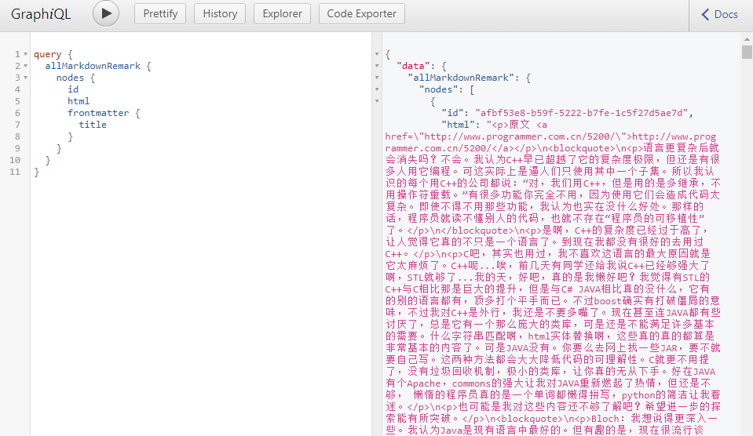

考虑到自己的前端技能有一阵子没有更新了，同时看到刘老师用 [docusaurus](https://docusaurus.io) 把 openbayes docs 切换之后的顺滑体验，于是就打算了解和折腾了一下和 docusaurus 技术栈类似但适用范围大大增加的 [gatsby](https://www.gatsbyjs.org/)。这里先那自己的小博客开刀，把原来的 jekyll 技术栈切换过来。

本来打算一小步一小步走过来，先不要管太多的细节，可结果依然是给自己加了码，甚至同时体验了 tailwindcss 的部分。这里还是会分开几篇做介绍吧。首先是介绍把 jekyll 迁移到 gatsby 的部分。

以及这里不会介绍如下内容：

1. gatsby 的安装
2. graphql 的知识

## Gatsby 的思路

虽然 gatsby 官方把 static 划掉了加上了 dynamic，但从我粗浅的体验来看，它依然是一个 static site generator。只是在具体生成的路由上玩出了不少的花，后续也会做介绍。


把 gatsby 的思路拆分为以下几个部分：

1. gatsby 使用的模板引擎是 react（jekyll 用的就是 ruby 的 erb），相比于其他的后端模板引擎，使用 react 相当于前端功能全开了，确实甩其他的模板引擎几条街。
2. 当然它自然也有自己的一套静态路由的生成体系。以及最近出现的动态路由可能就是他们说自己的 dynamic 的点？在我看来，这部分似乎没有特别多的新意，毕竟路由也是很多后端服务器一定会有的东西。唯一我看到的新意在于通过一个 php 式的文件结构去定义了路由，似乎是一种把路由的使用门槛降低的好办法，next.js 也使用了类似的方式。
3. 最后，它有一个 graphql data layer（好像有一些文章成为 data mesh）它可以通过一系列插件将各种各样的数据源做集成，并暴露出 graphql 的接口给处于 `develop mode` 的 gatsby server ，用来填充模板的数据。这部分内容不单单是说我可以集成多个数据源这么简单，其数据层甚至可以对每个数据源做增强，以达到非常多复杂的功能。在后面有关插件的部分我也会做一些介绍。


## 快速开始

有了上面的介绍，然后我简单 google 了下，发现和我一样把 jekyll 切到 gatsby 的人不在少数。官方网站里也有适配 markdown 作为数据源的相关资源。这里先罗列下从 jekyll 到 gatsby 迁移的几个必须的步骤，并在下文一一介绍。

1. markdown 文件的整体迁移
1. 生成路由
1. 处理 blog 中的代码高亮
1. 优化 blog 中的 image
1. 部署

## markdown 文件的整体迁移

jekyll 的时代假设其静态页面生成的数据源一定是文件，但这种假设在 2021 年看起来是被打破了。从 gatsby 的官方数据源插件来看，其中大量的数据源是 headless cms，比如 contentful 比如 wordpress。这个思路在国内似乎没有被很好的传播开来，以及对我来说从从 jekyll 迁移过来也就一定是文件。

这里我用到了两个插件：

1. `gatsby-source-filesystem` 将特定目录作为数据源添加到 gatsby 的数据层
2. `gatsby-transformer-remark` 使用 [remark](https://remark.js.org/) 将 `markdown` 文件解析为 html 并且它有强大的扩展功能实现 markdown 里面特定的解析功能

gatsby 所有的插件都需要单独安装并在 `gatsby-config.js` 做配置，这里就罗列下上述两个插件的基本配置：

```javascript
module.exports = {
  siteMetadata: {
  },
  plugins: [
    {
      resolve: `gatsby-transformer-remark`,
      options: {
        // Plugins configs 这里后续做扩展，支持语法高亮、图片优化
        plugins: [
        ],
      },
    },
    {
      resolve: `gatsby-source-filesystem`,
      options: {
        name: `blogs`,
        path: `${__dirname}/src/blogs/`,
      },
    },
  ],
};
```

`gatsby-source-filesystem` 的配置我把 markdown 文件全部放到了 `src/blogs` 目录下，在 `yarn run start` 之后，通过 `http://localhost:8000/__graphql` 构建如下 graphql 语句获取对应的文件内容：

```graphql
{
  allFile(filter: {sourceInstanceName: {eq: "blogs"}}) {
    nodes {
      relativePath
      extension
    }
  }
}
```

可以看到对应的结果如下所示：


不过直接使用这个似乎也做不了什么，在获取了这个数据之后我们需要自己写代码去解析每个文件的内容。幸好有 `gatsby-transformer-remark` 它会帮助我们做这个事情，并提供另外一个 graphql 的接口方便我们直接获取 markdown 的内容：

```graphql
query {
  allMarkdownRemark {
    nodes {
      id
      html
      frontmatter {
        title
      }
    }
  }
}
```



gatsby 提供的 graphiql 界面增加了 [graphql-explorer](https://github.com/OneGraph/graphiql-explorer) 用起来似乎更方便了一些。看着所提供的 graphql schema 如果具备基本的 graphql 知识，就应该明白如何从这个数据中间层获取想要的 markdown 数据了。

## 生成路由

### 固定路由

有了数据源之后，下一步就是构建博客的基本的路由结构了：

```
/ -- 首页，展示最新的 N 篇博客
/about -- 关于，一个独立的页面
/page/{page-number} -- 做分页，每页固定数量的博客，当然提供翻页功能
/{slug} -- 每篇博客的语义 url 用来展示每篇独立的博客
/archive -- 所有博客的总览页面，罗列了所有的博客标题
```

上文提了，gatsby 为了简化路由，为 `/src/pages` 每个文件和带文件夹的层级的文件都提供对应的目录。比如 `src/pages/about.js` 的内容就对应了 `/about` 路由。也就是说对于固定路由来说，直接给个对应文件并且按照 gatsby 的规约，用 graphql 获取数据做渲染就好了。这里我展示下 `/archive` 的代码做个说明：

```javascript
export default function Archive({ data }) {
  const groupByYearResult = groupByYear(data.allMarkdownRemark.nodes);

  return (
    <Base>
      <div>
        <h1 className="text-4xl font-extrabold tracking-tight my-4 text-gray-800">Archive</h1>
        {groupByYearResult.map(({ key, value }) => (
          <div key={key}>
            <h2 className="text-3xl font-bold tracking-tight my-4 text-gray-800">{key}</h2>
            <YearItems blogs={value} />
          </div>
        ))}
      </div>
    </Base>
  );
}

function YearItems({ blogs }) {
  return (
    <div>省略了...</div>
  );
}

export const query = graphql`
  query QueryBlogTitles {
    allMarkdownRemark(sort: { fields: frontmatter___date, order: DESC }) {
      nodes {
        id
        frontmatter {
          title
          date(formatString: "MMMM-DD")
          year: date(formatString: "YYYY")
        }
        fields {
          slug_without_date
        }
      }
    }
  }
`;

function groupByYear(blogs) {
  // 省略了...
}

```

文件会分两个部分一部分是 react 的渲染，一部分是 graphql 数据的获取，非常简单明了。这里就不再赘述了。

### 从文件生成 slug 并使用 react 模板生成 blog 页面

相对于固定路由，动态路由不是指 [/blog-migrate-from-jekyll-to-gatsby](/blog-migrate-from-jekyll-to-gatsby) 就是在用户请求的时候用 server 端临时拼装页面，而是说我可以在 gatsby 部署的时候动态的生成一系列的静态页面。这也是我觉得 gatsby 并不是 dynamic 的重要原因。

上文提到了，既然我可以从 graphql 里面罗列一系列的 markdown 内容了，那我自然可以通过遍历的方式去生成一个个页面并对应上相应的路由。具体在 gatsby 做的时候需要这么做：

#### 1. 准备单个 blog 的模板页面

```javascript

export default function BlogTemplate({ data }) {
  return (
    <Base>
      <Blog data={data.blog}/>
    </Base>
  )
}

export const pageQuery = graphql`
  query BlogPostQuery($id: String) {
    blog: markdownRemark(id: { eq: $id }) {
      id
      html
      tableOfContents
      frontmatter {
        title
        date(formatString: "MMMM DD, YYYY")
      }
    }
  }
`
```

这是 `src/templates/blog.js` 文件的内容，可以看到，这里在 `pageQuery`  里引入了参数 `$id` 马上我们就介绍怎么用这个东西。

#### 2. 在 gatsby-node.js 中创建页面

gatsby 在 build 的时候会执行 gatsby-node.js 文件，在这里可以调用 gatsby 的内部 api 做一系列小动作，以实现动态创建页面的目的。

```javascript
const { createFilePath } = require("gatsby-source-filesystem")

// 1. 为 markdown 增加额外的字段 slug 和 slug_without_date
exports.onCreateNode = ({ node, actions, getNode }) => {
  const { createNodeField } = actions
  if (node.internal.type === `MarkdownRemark`) {
    const filename = createFilePath({ node, getNode })
    // get the date and title from the file name
    const [, date, title] = filename.match(
      /^\/([\d]{4}-[\d]{2}-[\d]{2})-{1}(.+)\/$/
    );

    // create a new slug concatenating everything
    createNodeField({ node, name: `slug`, value: `/${date.replace(/\-/g, "/")}/${title}/` })
    createNodeField({ node, name: `slug_without_date`, value: `/${title}` })
  }
}

// 2. 获取所有的 markdown 数据
const path = require("path");
exports.createPages = async ({ graphql, actions, reporter }) => {
  // Destructure the createPage function from the actions object
  const { createPage } = actions
  const result = await graphql(`
    {
      allMarkdownRemark {
        nodes {
          id
          fields {
            slug
            slug_without_date
          }
        }
        pageInfo {
          totalCount
        }
      }
    }
  `)
  if (result.errors) {
    reporter.panicOnBuild('🚨  ERROR: Loading "createPages" query');
  }
  
  const posts = result.data.allMarkdownRemark.nodes;
  // 3. 调用 api createPage 创建
  posts.forEach((node, index) => {
    createPage({
      path: node.fields.slug, // 这里是路由
      component: path.resolve(`./src/templates/blog.js`), // 这里是模板的位置
      context: { id: node.id }, // 这里是传递给模板的参数
    })

    createPage({
      path: node.fields.slug_without_date, // 生成另外一个路由
      component: path.resolve(`./src/templates/blog.js`),
      context: { id: node.id },
    });
  })
}
```

首先，这里通过 `onCreateNode` 的 hook 通过文件名解析出来了 slug 比如文件名是 `2021-07-17-blog-migrate-from-jekylly-to-gatsby.md` 那么就会解析出两个 slug：

- /2021/07/17/blog-migrate-from-jekylly-to-gatsby
- /blog-migrate-from-jekylly-to-gatsby

然后通过 `createNodeField` 把 slug 就再次塞回了 `MarkdownRemark` 类型的 `fields` 属性里。后面就可以通过 `fields.slug` 使用了。

之所有有 /2021/07/17/xxx 这样子的路由是因为之前 jekyll 就是这样子的路由，算是做一个兼容吧。

到目前为止，blog 的主要功能算是建立好了。

## 处理 blog 中的代码高亮

remark 这个插件自己还有额外的插件，通过增加额外的 [prismjs](https://www.gatsbyjs.com/plugins/gatsby-remark-prismjs/) 的支持就可以实现代码的高亮了。

简单罗列下配置：

```javascript
{
      resolve: `gatsby-transformer-remark`,
      options: {
        // Plugins configs
        plugins: [
          {
            resolve: `gatsby-remark-prismjs`,
            options: {
              aliases: { // 这里仅仅是多了两个语言的 alias
                sh: "bash",
                gql: "graphql"
              },
            },
          },
        ],
      },
    },
```

然后记得按照文档把 css 文件添加进来。

## 优化 blog 中的 image

这部分算是 gatsby 相对于 jekyll 的另一个亮点吧，通过对 img 的 srcset 的支持，可以实现在不同宽度的页面上去加载不同宽度的图片。并且，这些不同宽度的图片全部由插件自动生成，基本上是开箱即用了。更多的信息去 [gatsby remark images](https://www.gatsbyjs.com/plugins/gatsby-remark-images/?=image#gatsby-remark-images) 一看就晓得了。

## 在 github pages 部署

这部分 gatsby 已经给准备好了，跟着 [How Gatsby Works with GitHub Pages](https://www.gatsbyjs.com/docs/how-to/previews-deploys-hosting/how-gatsby-works-with-github-pages/) 基本就能解决。唯一的不同在于我通过一个 github action 实现了自动部署（而不是每次都自己 yarn run deploy）：

```yaml
name: build-and-deploy

on:
  push:
    branches:
      - '**'

jobs:
  build:
    runs-on: ubuntu-latest
    name: Git Repo Sync
    steps:
    - uses: actions/checkout@v2
    - uses: actions/setup-node@v2
      with:
        node-version: '14'
    - name: install deps
      run: yarn install --frozen-lockfile
    - name: build
      run: yarn run build
    - name: deploy
      uses: peaceiris/actions-gh-pages@v3
      with:
        github_token: ${{ secrets.GITHUB_TOKEN }}
        publish_branch: main
        publish_dir: ./public
```

这里我的主分支是 master 然后采用 main 作为了发布分支，直接使用 action  `actions-gh-pages` 把 public 目录提交到 main 就可以了。

## 小结

gatsby 并不像 jekyll 那么开箱即用，但其功能相对来说确实强大不少。灵活性和扩展性确实不是一个数量级了。当然，这前提是你对前端的技术栈足够了解，不然可能就只能在 [gatsby starters](https://www.gatsbyjs.com/docs/starters/) 找找有没有合适的东西了。

后面还有一些工作要做的：

1. 样式...现在是 plain html 默认样式，只有代码块是花花绿绿的
2. 优化，标题，meta 应该还是需要花点点时间的
3. 首页，在路由的部分提及了，这部分在 jekyll 的时候是个分页，现在想要做类似的实现，应该不难
4. tags 的展示和按照 tags 罗列文章，这也是之前 jekyll 的功能，也希望做成类似的样子

## 相关资源

把几个用到但是没有提及的链接放到了这里。

- [From Jekyll to Gatsby: 7 Simple Steps](https://deborah-digges.github.io/2020/09/16/Jekyll-to-Gatsby/)
- [Adding Markdown Pages](https://www.gatsbyjs.com/docs/how-to/routing/adding-markdown-pages/)
- [Create routing](https://www.gatsbyjs.com/docs/reference/routing/creating-routes/#using-gatsby-nodejs)
