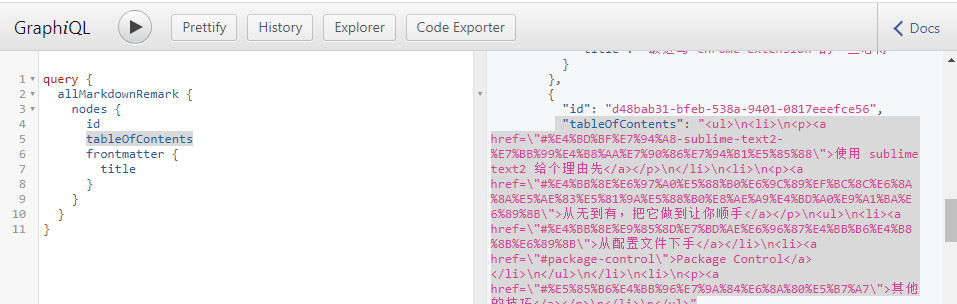
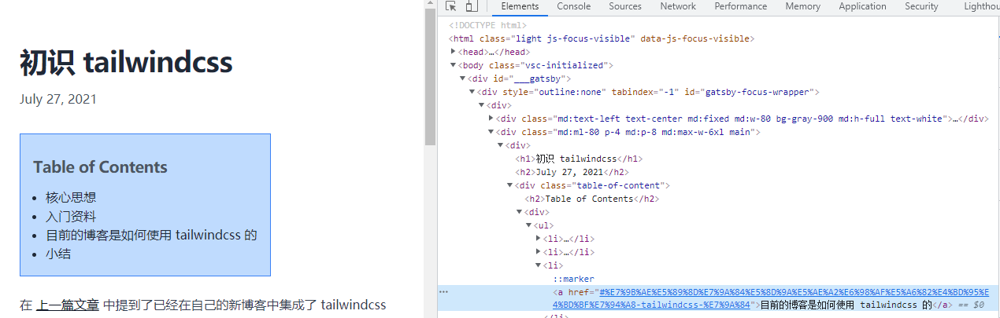

[上一篇文章](/blog-migrate-from-jekyll-to-gatsby) 介绍了 gatsby 迁移 blog 的主要内容，针对 markdown 渲染、路由生成 gatsby 都做了足够多的工作可以快速构建这么一个博客系统。这一部分介绍通过额外的插件提升 blog 体验。

## 目录 & 标题锚点

通过 remark 获取的 markdown 内容本身一个名为 `tableOfContents` 的部分，它已经从 markdown 中提取了标题并生成了目录。额外的工作就只剩下对目录的样式做一些修改，并且添加锚点链接。



锚点部分同样有另外一个插件 [gatsby-remark-autolink-headers
](https://www.gatsbyjs.com/plugins/gatsby-remark-autolink-headers/) 完成了相应的工作。它本身就是 `gatsby-transformer-remark` 的一个插件。通过做如下配置即可：

```javascript
{ 
    resolve: `gatsby-remark-autolink-headers`,
    options: {
        offsetY: `100`,
        icon: `<svg aria-hidden="true" height="20" version="1.1" viewBox="0 0 16 16" width="20"><path fill-rule="evenodd" d="M4 9h1v1H4c-1.5 0-3-1.69-3-3.5S2.55 3 4 3h4c1.45 0 3 1.69 3 3.5 0 1.41-.91 2.72-2 3.25V8.59c.58-.45 1-1.27 1-2.09C10 5.22 8.98 4 8 4H4c-.98 0-2 1.22-2 2.5S3 9 4 9zm9-3h-1v1h1c1 0 2 1.22 2 2.5S13.98 12 13 12H9c-.98 0-2-1.22-2-2.5 0-.83.42-1.64 1-2.09V6.25c-1.09.53-2 1.84-2 3.25C6 11.31 7.55 13 9 13h4c1.45 0 3-1.69 3-3.5S14.5 6 13 6z"></path></svg>`,
        className: `custom-class`,
        maintainCase: false,
        removeAccents: true,
        isIconAfterHeader: true,
    }
},
```

注意要把 `maintainCase` 设置为 `false` 否则会因为锚点的大小写问题导致链接失效，完整的配置在 [gatsby-config.js](https://github.com/aisensiy/aisensiy.github.com/blob/master/gatsby-config.js) 可以看到。

插件生效后目录以及 markdown 的标题（`#` 开始的内容）就会增加链接并支持从目录跳转了。



## SEO 优化

这部分在国内似乎略微鸡肋，毕竟整个体系是 Google 提供的，不过我相信这部分的工作还是有必要的，因为众所周知，靠谱的程序员还是会倾向于使用英语环境并使用 Google 搜索资料。还有一个让我很震惊的地方，就是 Google Analytics 其实并没有被墙，域名是可以访问的，只是查看的 dashboard 无法直接访问。

这部分基本就是照抄 [Add SEO Component](https://www.gatsbyjs.com/docs/add-seo-component/) 了，用到的插件就是 `gatsby-plugin-react-helmet`。组件的代码就直接贴在这里了：

```javascript
import React from "react";
import PropTypes from "prop-types";
import { Helmet } from "react-helmet";
import { useLocation } from "@reach/router";
import { useStaticQuery, graphql } from "gatsby";

const SEO = ({ title, description, image, article }) => {
  const { pathname } = useLocation();
  const { site } = useStaticQuery(query);
  const {
    defaultTitle,
    titleTemplate,
    defaultDescription,
    siteUrl,
    defaultImage,
    twitterUsername,
  } = site.siteMetadata;
  const seo = {
    title: title || defaultTitle,
    description: description || defaultDescription,
    image: `${siteUrl}${image || defaultImage}`,
    url: `${siteUrl}${pathname}`,
  };
  return (
    <Helmet title={seo.title} titleTemplate={titleTemplate}>
      <meta name="description" content={seo.description} />
      <meta name="image" content={seo.image} />
      {seo.url && <meta property="og:url" content={seo.url} />}
      {(article ? true : null) && <meta property="og:type" content="article" />}
      {seo.title && <meta property="og:title" content={seo.title} />}
      {seo.description && (
        <meta property="og:description" content={seo.description} />
      )}
      {seo.image && <meta property="og:image" content={seo.image} />}
      <meta name="twitter:card" content="summary_large_image" />
      {twitterUsername && (
        <meta name="twitter:creator" content={twitterUsername} />
      )}
      {seo.title && <meta name="twitter:title" content={seo.title} />}
      {seo.description && (
        <meta name="twitter:description" content={seo.description} />
      )}
      {seo.image && <meta name="twitter:image" content={seo.image} />}
    </Helmet>
  );
};

export default SEO;

SEO.propTypes = {
  title: PropTypes.string,
  description: PropTypes.string,
  image: PropTypes.string,
  article: PropTypes.bool,
};

SEO.defaultProps = {
  title: null,
  description: null,
  image: null,
  article: false,
};

const query = graphql`
  query SEO {
    site {
      siteMetadata {
        defaultTitle: title
        titleTemplate
        defaultDescription: description
        siteUrl: url
        defaultImage: image
        twitterUsername
      }
    }
  }
`
```

然后在 `blog` 的模板这里做一些修改：

```javascript{5,10}
import React from "react"
import { graphql } from "gatsby"
import Blog from "../components/Blog"
import Base from "../layouts/base"
import Seo from "../components/seo"

export default function BlogTemplate({ data }) {
  return (
    <Base>
      <Seo title={data.blog.frontmatter.title} article={true} description={data.blog.excerpt} />
      <Blog data={data.blog}/>
    </Base>
  )
}
```

这里使用了 `excerpt` 字段，当然在 graphql 里面也要增加相应的内容：

```graphql{11}
export const pageQuery = graphql`
  query BlogPostQuery($id: String) {
    blog: markdownRemark(id: { eq: $id }) {
      id
      html
      tableOfContents
      frontmatter {
        title
        date(formatString: "MMMM DD, YYYY")
      }
      excerpt(format: PLAIN, truncate: true, pruneLength: 50)
    }
  }
`
```
