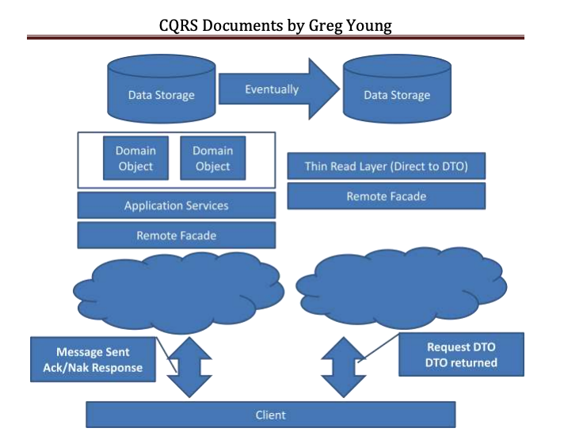

在 [some tips for ddd](/some-tips-for-ddd) 里讲明白了 DDD 是针对 `写模型` 的，而对于 `读模型` 则可以通过一层薄薄的 `Query Service` 直接从数据库拼装 `DTO` 实现，这样子的好处是：

1. 遵守了 DDD 中 `aggregate` 的访问原则 / 持久化原则，不会因为一个「展示包含用户头像的文章列表」而被轻易的破坏
2. 减少了在 `读模型` 里 `DTO` 从 DDD 的 `Repository` 里各种转换和拼接，也避免了在 `Repository` 里面提供分页之类的奇怪方法

在一个简单的项目 [Spring Boot + Spring MVC + MyBatis 版本的 Real World 实现](/real-world-spring-boot-and-mybatis) 里，这个思路也得到了充分的体现。并且在这个过程中没有遇到什么冲突的地方。

不过最近一两年做的 openbayes 项目里，我发现 cqrs 的原则依然遇到了一些和 DDD 相冲突的地方，这里我

1. 首先记录一些最近补充学习的一些与该主题相关的资料，一方面确认之前的理解没有严重的偏差，另一方面引入一些相关的讨论
2. 然后结合具体的业务去描述遇到的问题
3. 至于能否解决后面再说...

## 有关 ddd / cqrs 的一些资料更新

首先就是我最近看的一些内容。看了很多内容，包括 Martin Folwer 的一些链接，感觉最终将的比较清楚的还是 greg young 的内容。

CQRS 是由 greg young 提出的，他有一篇名为 [CQRS Documents by Greg Young](https://cqrs.files.wordpress.com/2010/11/cqrs_documents.pdf) 的资料比较详尽的探讨了 CQRS 和 event-sourcing 到底要解决什么样子的问题。开篇提出在我们所构建的系统不再是 CRUD 之后，可以引入 `Command` 的概念，描述 `Task Based User Interface`。而在处理这些 `Command` 的时候，会发现读和写流程处理会有非常大的区别，并且如果采用同一套 Domain Object 会引入如下问题：

1. Large numbers of read methods on repositories often also including paging or sorting information. 在 Repository 中有大量的读操作需要包含分页 / 排序相关的功能。
2. Getters exposing the internal state of domain objects in order to build DTOs. 为了组装 `DTO` 不得不暴露很多 `Domain Object` 的内部状态。
3. Use of prefetch paths on the read use cases as they require more data to be loaded by the ORM. 由于读模型需要更多的数据，所以需要在 ORM 中组织额外的数据加载。
4. Loading of multiple aggregates to build a DTO causes non-optimal querying to the data model. Alternatively aggregate boundaries can be confused because of the DTO building operations. 在组装 `DTO` 时，为了获取多个聚合会容易出现低效的查询语句。另外，组装聚合的边界也会因为 `DTO` 的组装而被打破。

可以看到要解决的痛点和我之前的理解没有什么偏差。

通过分别对读写构建独立的流程可以很好的缓解以上问题：



后续有关 event-sourcing 的内容就不再介绍了，我个人认为 event-sourcing 有关 data storage 的修改过于复杂，但其思想（比如采用反向的 Domain Event）确实已经被很好的采用了（openbayes 在子系统之间做数据同步也采用了类似的理念）。这部分以后单独讨论。

另外我看到了大神的 [如何落地业务建模](https://time.geekbang.org/column/intro/100082101) 虽然没有明确的指出 CQRS 的问题，但却在「跨越现实的障碍」章节提出了类似于 

```
user.getSubscriptions().subList(from, from + pageSize)
``` 

的思路，描述的是一种统一的模型，而不是读写分离的模型。这的确是一个非常好的思路，通过依赖注入一个 `Query Service` 到具体的 `Domain Object` 可以很好的解决读写用例放在一起不协调的问题。这也让我开始重新思考 CQRS 是不是有一些问题。

## CQRS 遇到的问题

首先，我觉得最大的问题就在于 CQRS 一定程度上让 `读模型` 成了二等公民。`写模型` 很重要，需要很仔细的遵循设计思路，而 `读模型` 就随便糊弄糊弄就完事了...

然后，其实 `读模型` 很多时候也不是纯粹的获取 `DTO` 做拼接就完事了。在涉及到权限的时候，DTO 也需要依据当前用户对数据做裁剪并依据对应的权限以及当前对象的状态补充对应的权限属性。

举一个例子，在 openbayes 里有一个 `Job` 的概念，它有自身的状态（`CREATED` `RUNNING` `CANCELLING` ...），并且对应着一个状态机。在 `GET /jobs/{jobid}` 时，不同的状态下会返回对应的 `links` 表明当前用户可以对该 `Job` 做什么样子的操作。比如处于 `RUNNING` 状态的 `Job` 对于有权限的用户应该有如下的 `links`:

```
{
  ...
  links: {
    "stop": "<link>",
    "create-snapshot": "<link>",
    "open": "<link>"
  }
}
```

这些 `links` 会为前端提供线索用于展示不同的交互 UI。

也就是说，从数据库里拿出来的 `DTO` 依然需要走一轮业务支持才能使用，没有想象中的那么傻瓜。并且有关状态机的逻辑已经在对应的 `Domain Object` 中写了一遍了，但是在返回对应的 JSON 数据的 REST 层依然存在大量的代码用于处理这些内容。

## 可能的解决方案

### 合并模型

第一个方案自然是不再做 CQRS 了，而应该统一模型，按照 [如何落地业务建模](https://time.geekbang.org/column/intro/100082101) 的思路将两个模型的内容引入到同一个模型中去。不过这似乎是一个工作量不小的事情，很少有人会下定决心这么去做的，以及目前没有很健全的例子，需要先做小规模尝试，最终一定会花更多的时间...

不过不得不说 GraphQL 的引入似乎是一个很好的契机。

GraphQL 强调整个暴露的 API 是一张大图，而具体的属性的获取是一个渐进的过程。还是用 Real World 项目举例：

```
{
  user(id: "eisenxu") {
    articles {
      id
      title
      content
      comments {
        id
        content
        author {
          id
          name
        }
      }
    }
  }
}
```

这里是一个比较复杂的查询，获取了一个用户的文章列表以及每一篇文章的下的评论，以及每一篇评论的作者。对应的代码大概会是这个样子：

```
class ArticleDatafetcher {
  public List<Article> fetchArticles(User user) {
    return user.getArticles();
  }
}

class CommentDatafetcher {
  public List<Comment> fetchComments(Article article) {
    return article.getComments();
  }
}

class UserDatafetcher {
  public User fetchUser(User user) {
    return user;
  }

  public User fetchCommentAuthor(Comment comment) {
    return comment.getAuthor();
  }
}
```

每一个 `Entity` 或者 `Entity` 集合属性的获取都会对应一个 `上文` 也就是它是从那里获取的：

- user(id: 'eisenxu'): `上文` 为默认的 `Query`
- articles: `上文` 为 `user`
- comments: `上文` 为 `article`
- author: `上文` 为 `comment`（当然也会有 `上文` 为 `article` 的 `author`）

如果同样是 REST 的接口，那么就需要把 `user` 和 `article` 全部返回，这样的话就需要把 `CommentDatafetcher` 和 `UserDatafetcher` 的工作全部放到 `QueryService` 中去。但是 GraphQL 则像是在按需获取：如果你要了 `comments` 就会调用 `CommentDatafetcher.fetchComments` 否则就不会执行。这样子就让上文中那种 `user.getSubscriptions().subList(from, from + pageSize)` 的方式变得更加的顺理成章了。

### 抽取公共逻辑

刚好最近 ddd/cqrs 的 google group 也在讨论这个主题 [Read model business logic duplication](https://groups.google.com/g/dddcqrs/c/d7aiKi6ha6g)。这里给出的方案也非常简单：

1. 如果这种权限展示逻辑只在 read model 里，那干脆就放 read model 好了，没什么大不了
2. 如果两边都出现了，那就抽取 Speicification 让两边共享
3. 对于一些场景，可以让 write model 直接去调用 read model 使用其内容

打补丁自然是简单不少，不过总感觉不是那么舒服...这部分我也就只能写到这里了，虽然写的不多，可却是花了不少时间去想这坨东西...现在回看目前 openbayes 的代码还是有不少的问题，后续再继续理一理吧。