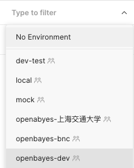
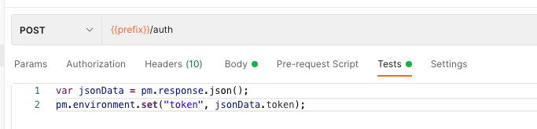
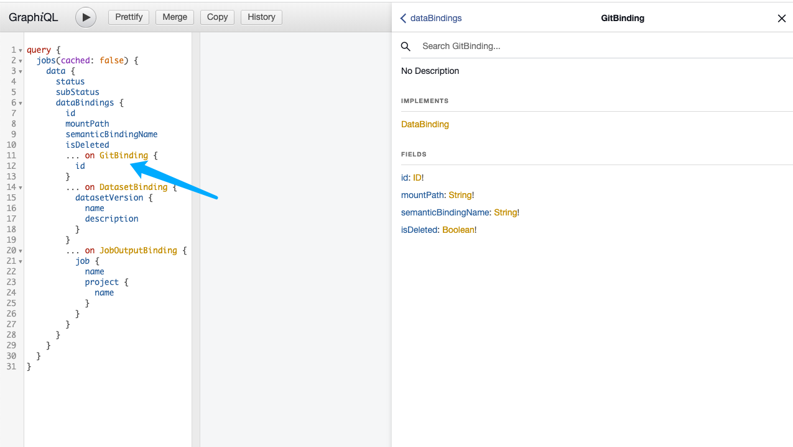
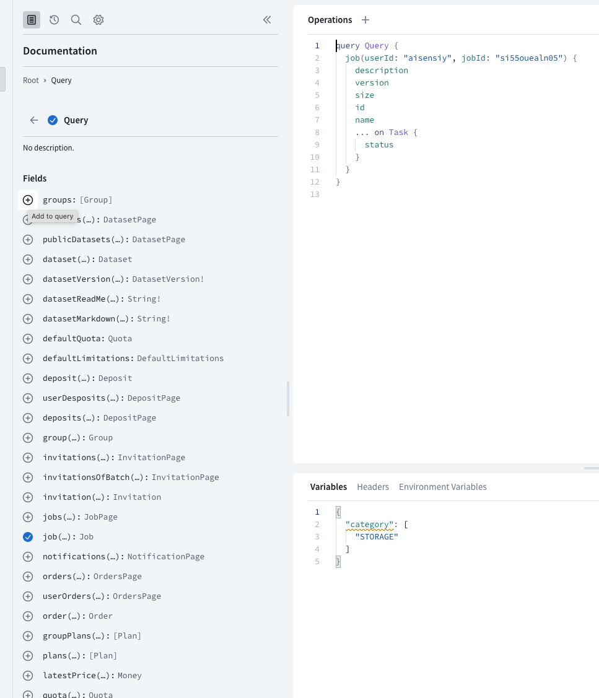
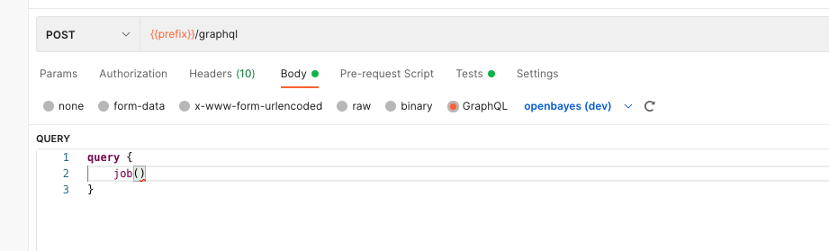
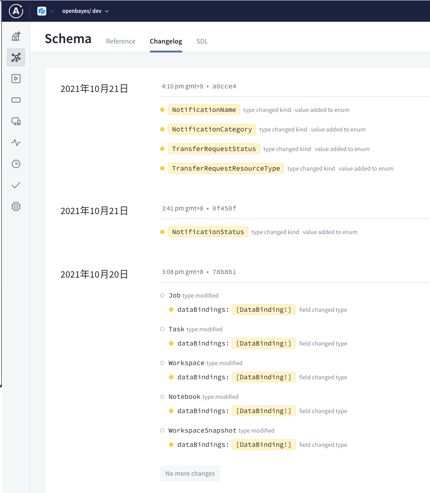

## 目前 POSTMAN 在我们团队的使用情况

这部分工作主要是对标之前在 REST 场景下使用 POSTMAN 测试的工作。在 REST 的场景下，POSTMAN 是一个很好的工具，简单介绍下我们使用到的一些功能：

1. Collections 可以将一系列的 Request 聚合在一起很好的规整起来，当需要测试某个接口的问题时，搜索 Collection 执行具体的 Request 即可。
2. Environments 维护一系列变量，点击切换可以测试不同的环境。



3. Tests 虽然可以做测试，但实际上就是在跑完一个 Request 之后可以执行一段 js 脚本，这个脚本不一定都是测试的内容，比如我可以在 login 之后把 Response 中返回的 token 存储为一个 Postman 的 Variable，然后在后面的请求中使用这个 Variable 避免重复登录。



4. 组织协作，可以让团队里的人都共享 Collections 避免了很多重复劳动和沟通。
5. Monitors 这部分用的不是很多，主要是确定几个环境的服务没什么问题。

在这个视频 [Postman Beginner's Course - API Testing](https://www.youtube.com/watch?v=VywxIQ2ZXw4) 中介绍了很多 Postman 的功能，很有帮助。

## 对比 POSTMAN 和 GraphiQL 以及 Apollo Studio 的功能

不过很遗憾 Postman 在 GraphQL 场景的支持似乎不是很积极，目前仅仅做了简单的支持。但考虑到上文中 POSTMAN 的那些功能在 GraphQL 下依然有不可替代的使用价值，这里我先罗列在 GraphQL 下几个我们关心的功能在几个工具里的支持情况。

### 请求页面的自动补全

如果说 REST API 是散装弱类型 API 那么 GraphQL 就是强类型的 API 了，提交的内容必须要和 schema 兼容。在 GraphiQL （对，多了个 i）这样的工具里，你可以在右侧看到目前的 schema 并且在写 GQL 的时候可以自动提示，可以很方面的查询自己想要的字段和类型。



而在 Apollo Studio 里则可以像如下图这样直接在文档里点击字段和类型拼接查询请求，也很方便。



如果你在 GraphQL 里提供了字段或者方法的注释，Apollo Studio 或者是 GraphiQL 也都会在这些页面给你展示出来。

Postman 目前就只有自动补全，注意这个自动补全的意思是你必须先写点什么，然后我给你不足后面的内容，如果你什么都没写，那不好意思，我也什么不会给你提供的，没有文档，没有提示...



### schema 更新手段

既然是强类型的 schema 那么 schema 的更新就很重要了。我们所使用的 GraphiQL 目前是 dgs framework 自己带的，是通过 graphql 的 instropection 获取的，自然就是最新的了。不过这种功能只能在开发环境使用，在生产环境肯定是需要把这个功能关掉的，不然别人随随便便就拿到了你全部的 schema 感觉有点不对劲。GraphiQL 应该也是有那种主动提供 schema 做独立部署的方式的吧，主要是目前 dev 环境开放我们也能接受就没有做更多的调研了。

Apollo Studio 提供了一个名为 rover 的工具，可以有多种方式将 schema 提交给 Apollo。可以通过 CI/CD 流程去自动化这个过程，后面会提到。

Postman 和 Apollo Studio 的方式类似，只是它没有自己的工具，需要通过 Postman 自身的 API 去拼接请求，并且 API 中各种 ID 的查找显得略微晦涩了，麻烦一些，但也能走通。不过在尝试的过程中发现 Postman 中的 GraphQL schema 对 graphql 的扩展语法并不支持，无法识别像 `extend` 这样的关键词，因此不支持那种把 schema 拆分成多个文件通过 `cat` 到一起提交的简单方式。

### schema 变更日志

这部分算是 Apollo 的特色了，满分。并且找不到完美的替代方案，我找到的一个开源方案仅仅是支持 schema 以文本形式的 diff 而已，并没有做 schema 解析后的对比。



Postman 就别想了。

还有另外一个工具 [graphql playground](https://github.com/graphql/graphql-playground) 虽然很好用，apollo server 也做了集成，但未来的发展比较模糊，应该会考虑和 GraphiQL 这个项目做合并，就不讲了。

## 目前的方案

综上所述 postman 在 graphql 的支持只有 schema 以及针对 schema 的自动补全（写 graphql 的那个框框甚至连格式化都没有）。但我依然觉得 Collections Environments Tests 这些功能无法被其他平台替代。因此就只好同时使用 Apollo Studio 和 postman

1. Apollo Studio 使用其 Explorer 和 Schema ChangeLog 的功能，每次在 Explorer 写好了 Query 之后就粘贴到 postman 里，创建一个对应的 Request，方便未来重用。当然，也可以补充一些测试脚本。
2. 通过 Github Action 将最新的 schema 更新到 Apollo Studio 和 postman 中，以下是用到的 Workflow

```yaml
name: GraphQL workflow

on:
  workflow_dispatch:
  push:
    branches:
      - master

jobs:
  sync:
    runs-on: ubuntu-latest
    environment: dev
    env:
      APOLLO_KEY: ${{ secrets.APOLLO_KEY }}
      GRAPHQL_ENDPOINT: ${{ secrets.GRAPHQL_ENDPOINT }}
    steps:
      - uses: actions/checkout@v2
      - name: Install Rover                                                    # [1]
        run: |
          curl -sSL https://rover.apollo.dev/nix/latest | sh
          echo "$HOME/.rover/bin" >> $GITHUB_PATH
      - name: Upload dev schema for apollo                                     # [2]
        run: |
          ls ./src/main/resources/schema/*.graphqls | xargs cat - | rover graph publish openbayes@dev --schema -
      - name: Generate schema                                                  # [3]
        run: |
          rover graph introspect $GRAPHQL_ENDPOINT > schema.graphql
      - name: Update Schema from File                                          # [4]
        uses: aisensiy/update-postman-schema-action@master
        with:
          postman-key: ${{ secrets.POSTMAN_KEY }}
          postman-api-id: "xx"
          postman-api-version: "xx"
          postman-api-schema-id: "xxx"
          schema-filepath: ./schema.graphql
```

针对这个 workflow 我真对注释的 4 个点做一些解释：

1. 我们用到了 rover 这个工具，按照其[文档](https://www.apollographql.com/docs/rover/ci-cd/#github-actions)进行安装
2. 对于 Apollo Studio 我们可以把所有的 schema `cat` 一起后提交
3. 而正如上文所述，对于 postman 只能提交一个格式比较标准的 schema 这里就直接用了 rover 的 `introspect` 功能，不过更好的办法应该是用脚本正则化 schema 然后提交
4. postman 的 api 没有很方便的提交方式，就之后做了一个简单的 github actions 功能，把 schema 更新到 postman 中。

## 进一步的工作

1. 尝试有没有其他工具直接输出一个标准的、合并了的 schema 提交给 postman 和  apollo studio
2. postman 似乎也可以和 github 集成将 Collections 持久化到 Github 的一个仓库里
3. 在 CI 里更新 schema 其实并不是最佳的时机，因为这个时候环境实际上还没有做部署，所以应该考虑如何让 CI 直接控制 CD 流程，保证环境中的 schema 和 postman / apollo studio 中的 schema 同步