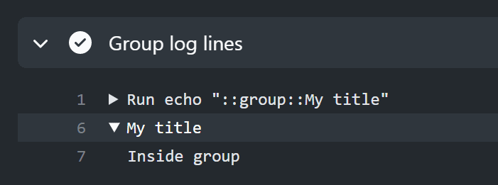
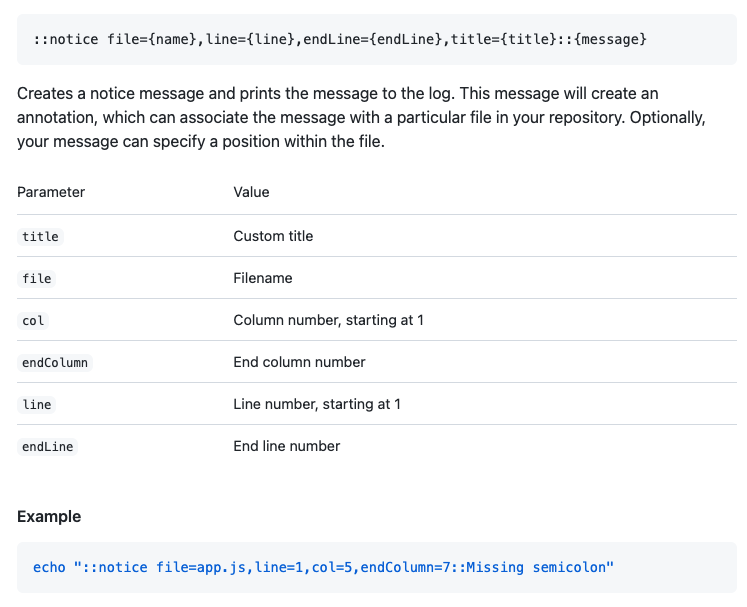
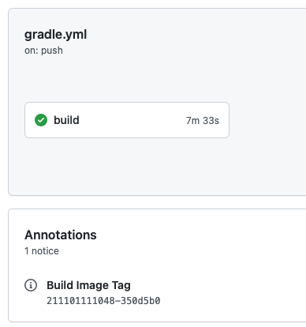

## workflow 的重用

分两部分，直接调用和模板。

### 直接调用

https://docs.github.com/en/actions/learn-github-actions/reusing-workflows

重点如下：

1. 允许被其他调用的 workflow 必须明确标注可触发事件 workflow_call
2. 不能套娃，这个 workflow 不能再掉用其他 workflow
3. 对调用有一定限制，具体看文档

使用场景我觉得是两个：

1. 多仓库协同的部署，比如 a 必须依赖 b，那么 a 跑完就跑 b
2. 有些 workflow 每个地方都用，可以重用，不过感觉这部分更适合模板？

### 模板

https://docs.github.com/en/actions/learn-github-actions/creating-workflow-templates

只有 org 下能用，必须放到 .github 这个仓库里。放进来的 workflow 在其他仓库创建 workflow 的时候会出现，方便复制。

## github action 控制日志和关键信息展示

https://docs.github.com/en/actions/learn-github-actions/workflow-commands-for-github-actions

### 分组日志

https://docs.github.com/en/actions/learn-github-actions/workflow-commands-for-github-actions#grouping-log-lines

### 重点展示

这个东西非常适合把构建过程中比较重要的东西展示出来，比如我就用它来展示构建生成的镜像的 tag：

