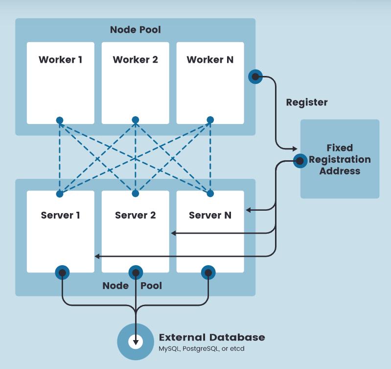
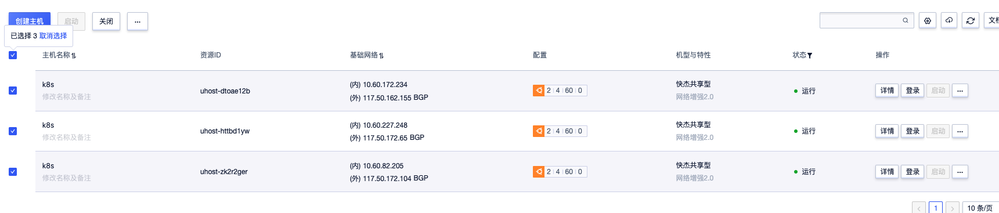

之所以要尝试 k3s 是因为它相对于标准的 k8s 所用的内存资源要减半，非常适合比较小型的设备，尤其是自己买来的小机器（树莓派？）。而对于标准的虚拟机环境，我们大可不必这么折腾了，毕竟越来越多的云厂商已经可以点点点就创建一个 k8s 集群了。

其实相关的主题已经非常多了，不过这里还会希望记录一下在国内环境部署高可用 k3s 一些不太一样的地方，也尝试了 k3s 的 config file 参数。

## 前提知识

首先，这里安装的是内嵌 etcd 的高可用版本，不是使用外部数据库的版本。不过为了让 worker 节点高可用，**需要在 worker 和 master 节点之间增加一层负载均衡**。虽然刚刚在说折腾 k3s 是针对非云环境的，不过考虑 bare-metal 的负载均衡还是需要一些稍微复杂的技术，这里就先不考虑了，后续会准备一个完全体。

那么整个架构就像 rancher [官方](https://rancher.com/docs/k3s/latest/en/architecture/) 提供的那样：



不过很显然，这里的 etcd 已经不是一个外部的东西了，而是内嵌在每一个 server（master）节点里了。

## 预备环境

这里的测试环境用的 ucloud 。这里主要测试 master 的高可用，我准备了三台 master 以及一个 worker 节点。然后准备了一个内网的 ulb。




这里另外一个值得一提的是 ucloud 的内网 ulb 是需要在每台 master 做额外的设置的，参见[官方文档](https://docs.ucloud.cn/ulb/guide/realserver/editrealserver)：

1. 需要在每台机器下增加文件 `/etc/netplan/lo-cloud-init.yaml`，其中 `$VIP` 为 ulb 的内网 IP

```yaml
network:
    ethernets:
        lo:
            addresses:
            - $VIP/32
```

2. 执行命令 `sudo netplan apply`

通过命令 `ip a` 可以看到 `lo` 的网卡已经增加了 `$VIP`。

由于我目前安装的 k3s 没用其内置的 `containerd` 而是用了 `docker` 所以需要为每台机器首先安装：

```sh
sudo apt update && sudo install docker.io -y
```

## 安装过程

<iframe src="//player.bilibili.com/player.html?aid=721551407&bvid=BV1WS4y1d775&cid=438565927&page=1" width="800" height="640" scrolling="no" border="0" frameborder="no" framespacing="0" allowfullscreen="true"> </iframe>

整个过程是这样的：

1. 创建第一个种子 master 节点 master0
2. 陆续将另外两个 masetr 加入到集群
3. 创建 worker 节点，不过在加入的时候采用的就是内网的 ulb 的 ip 了

首先在 master0 执行如下命令：

```sh
curl -sfL http://rancher-mirror.cnrancher.com/k3s/k3s-install.sh | \
    INSTALL_K3S_MIRROR=cn sh -s - server -c /home/ubuntu/master0-config.yaml
```

1. 这里采用了国内镜像，直接使用 k3s 的镜像在国内应该会各种下载失败的。
2. 采用了 `k3s server` 下一个 `-c` 的参数，这个参数可以将命令参数以 `yaml` 的形式传进来，这个就是看喜好了，传一系列 --xxx 形式的参数也应该没什么问题。

其中 `master0-config.yaml` 内容如下：

```yaml
write-kubeconfig-mode: "0644"
tls-san:
- 10.60.210.147     # ulb ip
- 10.60.172.234     # master0
- 10.60.227.248     # master1
- 10.60.82.205      # master 2
- 117.50.162.155    # master0 external ip
- 117.50.172.65     # master1 external ip
- 117.50.172.104    # master2 external ip
docker: true
cluster-init: true
token: VNVIyKGNPtSKTfhi
disable: servicelb
```

1. 把所有 master 的内网和外网 ip 都放进了 `tls-san` 同时把内网负载均衡节点 ip 也放了进来。
1. k3s 默认使用 containerd 作为容器运行环境，不过我还是用惯了 docker 所以添加了参数 `docker: true`。
1. 第一台 master 采用 `cluster-init` 的方式启动。
1. token 就是一个随机字符串，后面添加 master 节点和 worker 节点只要保持一致就好。
1. disable 参数关掉了 k3s 默认添加的 `servicelb` 如果想要同时关掉 `traefik` 就可以写成 `disable: servicelb,traefik`；**注意** 像配置 `tls-san` 那样用 `yaml` 的数组的语法是不行的，这也是让我多花了点时间的地方。


等 master0 的命令执行成功后输入命令 `k3s kubectl get nodes -w` 等待第一个节点准备完毕后在第二台 master 执行如下命令：

```sh
curl -sfL http://rancher-mirror.cnrancher.com/k3s/k3s-install.sh | \
    INSTALL_K3S_MIRROR=cn sh -s - server -c /home/ubuntu/master-others.config.yaml
```

其中 `master-others.config.yaml` 内容如下：

```yaml
write-kubeconfig-mode: "0644"
tls-san:
- 10.60.210.147     # ulb ip
- 10.60.172.234     # master0
- 10.60.227.248     # master1
- 10.60.82.205      # master 2
- 117.50.162.155    # master0 external ip
- 117.50.172.65     # master1 external ip
- 117.50.172.104    # master2 external ip
docker: true
server: https://10.60.172.234:6443 # master0 kubernetes api server address
token: VNVIyKGNPtSKTfhi
disable: servicelb
```

**注意** 两台 master 要陆续添加，必须等第一个结束了再去添加第二台。

三台 master 都加入集群后，集群的核心安装过程就结束了。

下面就尝试添加一台 worker：

```sh
curl -sfL http://rancher-mirror.cnrancher.com/k3s/k3s-install.sh | \
    INSTALL_K3S_MIRROR=cn K3S_TOKEN=VNVIyKGNPtSKTfhi  sh -s - agent --docker --server="https://10.60.210.147:6443"
```

等 worker 变为 `Ready` 后集群的构建就算是完成了。这时候去任意一台 master 将 `/etc/rancher/k3s/k3s.yaml` 拷贝到自己的电脑上并修改里面 server 的 ip 为任意一台 master 的外网 ip 就可以作为 kubeconfig 文件使用了。

## 其他补充

还有个安装工具 [k3sup](https://github.com/alexellis/k3sup) 可以帮助快速安装集群，不过看起来更新的频率不高了，以及国内环境显然也不能直接用。

rancher cn 的团队也做了个 [autok3s](https://docs.rancher.cn/docs/k3s/autok3s/_index) 在官网上就有介绍，不过看起来更新频率也不太高，并且 k3s 本身的安装成本真的很低了，所以就没去了解了。

除了安装之外，其实集群后续的维护工作也是挺重要的，毕竟你不希望集群慢慢老去不得不兼容各种奇怪问题，后面希望记录如何升级，如何集群数据备份和恢复两部分内容。

k3s 本身有一些局限性，比如它的 CNI 插件默认是 flannel 如果想要其他的就要自己去安装了，这个我并没有做更多的尝试了。

## 参考资料

1. [rancher k3s cn 的文档](https://docs.rancher.cn/docs/k3s/installation/install-options/_index)
2. [rancher k3s 官方文档](https://rancher.com/docs/k3s/latest/en/installation/)