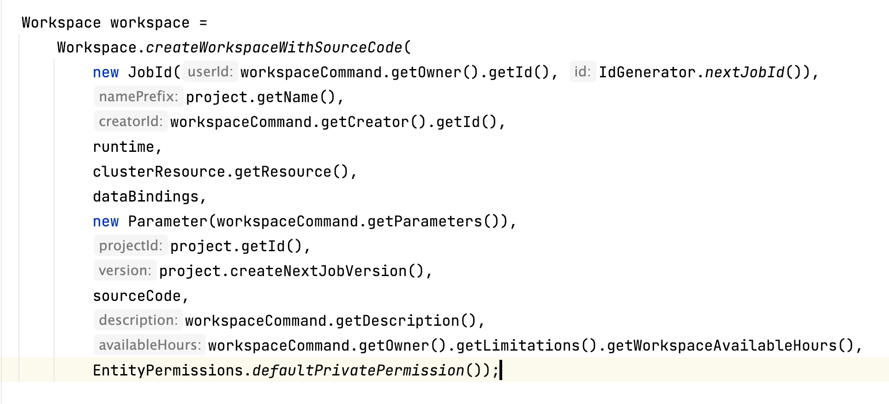
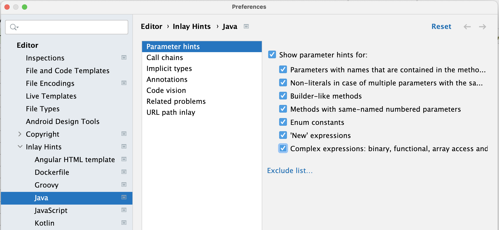
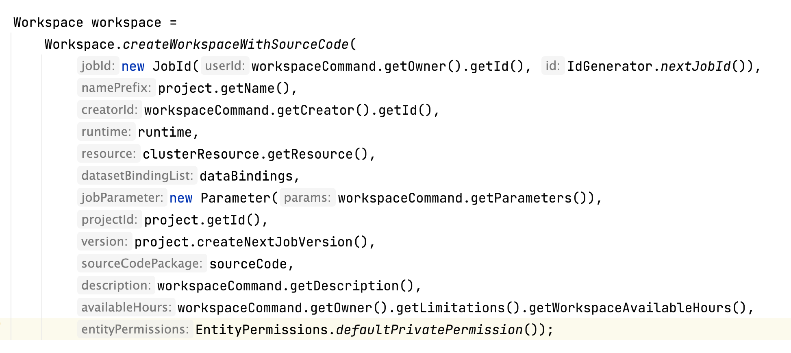

最近更换了新的 macbook pro 一方面由于架构发生了变化，原来电脑里的一些东西应该不能运行了；另一方面，原来的电脑有太多乱七八糟的东西了，我想要从新做一个干净的环境。所以决定一点点安装东西，后续会有一系列内容介绍这个过程中的查漏补缺。

众所周知，java 的方法不支持 name parameter 的，也没有默认值之说。在参数比较长的时候，按照顺序传递参数很容易忘记下一个参数到底是什么。

语言不行 IDE 来凑，Intellij 就在这方面做了加强，会在传递的参数前面显示这个参数的名字（如上图所示）。不过很遗憾，这里默认的配置并没有展示完整的信息，只在一些 Intellij 觉得你容易迷失的地方增加了提示。不过很显然它高估了我的水平，事实上我希望可以提供健全的参数信息。

幸好 Intellij 可以很容易的做这个修改：

1. 点开设置 Preference > Editor > Inlay Hint > Java > Parameter hints
2. 把这里的统统勾选，点击 OK

再回到刚才的方法，就可以看到提供了健全的参数信息了：

同时我发现视频录制可以更加有表现力，相较于繁琐的文字介绍视频可能会更清晰的展示一些工作流程。这里我就把刚才的设置录制了个视频：

`video: /videos/intellij-show-parameter-name.mp4`
