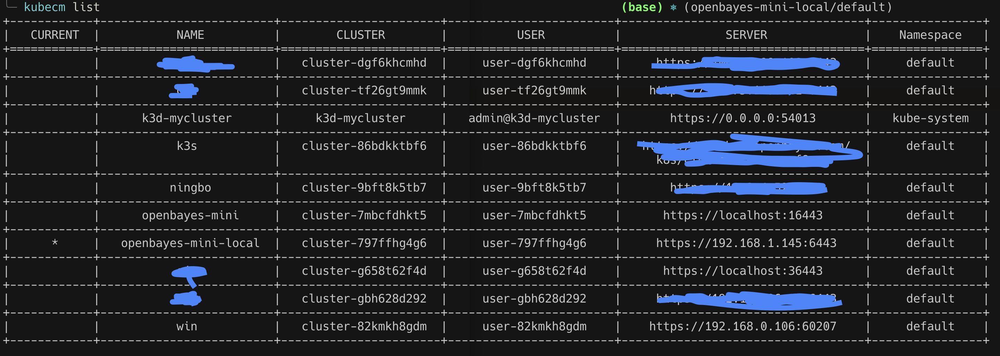
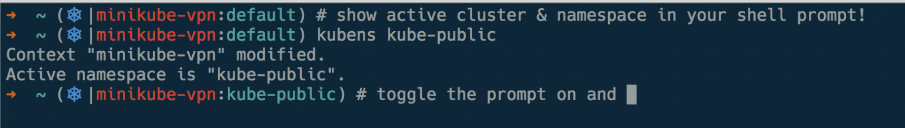
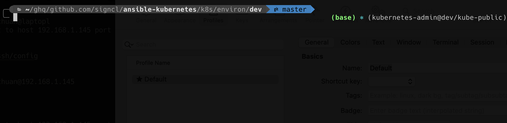

## 2021-12-20 更新

由于 `kubie` 是开一个子 shell 它会导致 `direnv` 失效，也就是说 `kubie` 和 `direnv` 无法共同使用。因此我就很自然的淘汰了它，虽然它有很多的有点。但是如果换回 `kubectx` 就依然有维护 kubeconfig 的烦恼，这里找到一个新的工具 [kubecm](https://github.com/sunny0826/kubecm) 可以帮助做 kubeconfig 的合并。



不过其实它也包含了 kubectx 的功能，但我的 kubectx 还提供了自动补全等东西，就这么一直用着了。

## 开始

如果需要维护很多 kubernetes 集群，每个集群都有一个 kubeconfig 的 yaml 那么在 `~/.kube` 目录下就会有一大堆的 yaml 。在频繁切换和修改不同的集群的内容的时候，一个不小心就可能把 A 集群的东西部署到 B 集群造成运维事故。这里介绍下到目前为止维护对多个集群环境的一些痛点和实践。

首先先总结下痛点吧：

1. 多个集群以及集群的 namespace 切换比较繁琐，通常需要 KUBECONFIG 环境变量的切换
2. 不晓得自己当前处于哪个集群下
3. 在使用 kustomize 或者 helm 对集群做更新的时候需要确保自己切换了 kubeconfig，除了小心之外没什么办法阻止错位的环境部署

下面记录下自己在试图解决这些痛点过程中找到的还不错的方案。

## [kubectx](https://github.com/ahmetb/kubectx) 快速切换上下文和 namespace

`kubectx` 可以切换 `~/.kube/config` 文件中的多个 `context`，然后可以通过 `kubens` 命令切换不同的 `namespace` 。但如果我有一堆 kubeconfig yaml 的话还需要额外的一步，将它们合并到 `~/.kube/config` 文件里。这个步骤用 kubectl 就能搞定：

```sh
KUBECONFIG=~/.kube/config:~/.kube/other.yaml kubectl config view \
    --merge --flatten > out.txt
```

不过依然是多了一步，而且既然有添加就有删除，如果其中一个集群的配置文件变化了或者废弃了就需要把这个集群剃掉：

```sh
kubectl config unset users.gke_project_zone_name
kubectl config unset contexts.aws_cluster1-kubernetes
kubectl config unset clusters.foobar-baz
```

## zsh / bash / fish 集成展示当前 context

既然 `kubectl config current-context` 可以获取当前的上下文，那么如果可以在 shell 里面展示这些信息基本就可以保证自己知道当前在什么上下文了。对不同的 shell 可以用不同的方式实现类似的效果。

### [kube-ps1](https://github.com/jonmosco/kube-ps1) for zsh / bash

安装成功后按照项目 README 提示就可以了。



### custom function for fish

很遗憾 fish 里不能用 `kube-ps1` 不过找一个 shell 函数做的类似的效果也可以的：

```sh
function kubectl_status
  [ -z "$KUBECTL_PROMPT_ICON" ]; and set -l KUBECTL_PROMPT_ICON "⎈"
  [ -z "$KUBECTL_PROMPT_SEPARATOR" ]; and set -l KUBECTL_PROMPT_SEPARATOR "/"
  set -l config $KUBECONFIG
  [ -z "$config" ]; and set -l config "$HOME/.kube/config"
  if [ ! -f $config ]
    echo (set_color red)$KUBECTL_PROMPT_ICON" "(set_color white)"no config"
    return
  end

  set -l ctx (kubectl config current-context 2>/dev/null)
  if [ $status -ne 0 ]
    echo (set_color red)$KUBECTL_PROMPT_ICON" "(set_color white)"no context"
    return
  end

  set -l ns (kubectl config view -o "jsonpath={.contexts[?(@.name==\"$ctx\")].context.namespace}")
  [ -z $ns ]; and set -l ns 'default'

  echo (set_color cyan)$KUBECTL_PROMPT_ICON" "(set_color white)"($ctx$KUBECTL_PROMPT_SEPARATOR$ns)"
end

function fish_right_prompt
    string unescape $$_tide_prompt_var[1][1]
    echo (kubectl_status)
end
```

这个代码不是我原创的，我只是做了魔改，很遗憾忘记了出处...具体的代码在 [fish_prompt](https://github.com/aisensiy/dotfiles/blob/master/fish/functions/fish_prompt.fish) 里，这里同时包含了我公开的 dotfiles 信息。效果如下：



**注意** 这个最终效果是建立在我的 fish 主题之上的，单独使用效果如何不得而知。

## ~kubie 一站式解决方案~

除了 kubectx 外我在最近装机的时候还发现了一个更完善的解决方案：[kubie](https://github.com/sbstp/kubie)。它有三个优势：

1. 包含了 kubectx 的功能
2. 不用合并 config 文件，可以通过配置读取文件列表，甚至支持 `~/.kube/*.yaml` 这样的通配符匹配
3. 自带 shell 的 prompt 提示，类似于上文 `kube-ps1` 的功能

当然，也有坏处:

1. 你不能自定义你的 prompt 样式了，不过它支持关掉自己的 prompt 提示。我目前就逐渐从 kubectx 切换到了 kubie 但依然保持我自己的 fish 的 prompt 。
2. 存在一个小问题（我觉得是 bug），它默认不把 `~/.kube/config` 下当前的上下文认为是默认的上下文，它的 prompt 不会在你新建一个 terminal 的时候假设是没有上下文的，然而事实上在这个时候 kubectl 的 context 已经指向了 `~/.kube/config` 的上下文了。你需要做一次切换后才会弹出。

## [direnv](https://direnv.net/) 当切换目录后自动注入环境变量

最后一个痛点以上的东西都没有解决。虽然增加了提示很大概率可以避免用错环境了，但还是挡不住有手比眼快的时候。这时候就需要 `direnv` 救场了。它可以在切换到某一个目录的之后触发一个 shell 执行，比如我可以强制在切换到维护 dev 集群的目录时将 `KUBECONFIG` 环境变量切换成对应集群的 kubeconfig 文件，这样就可以保证了上下文随着我操纵的 kustomize / helm charts 文件目录自动切换了。

最后上 demo，这里包含了上述介绍的一些演示，顺序通过内部的标题组织的，和上述顺序不一致。

`video: /videos/kube-context-management-practices.mp4`

## 参考资料

- [Mastering the KUBECONFIG file](https://medium.com/@ahmetb/mastering-kubeconfig-4e447aa32c75)
- [Kubernetes: How do I delete clusters and contexts from kubectl config?](https://stackoverflow.com/questions/37016546/kubernetes-how-do-i-delete-clusters-and-contexts-from-kubectl-config_
