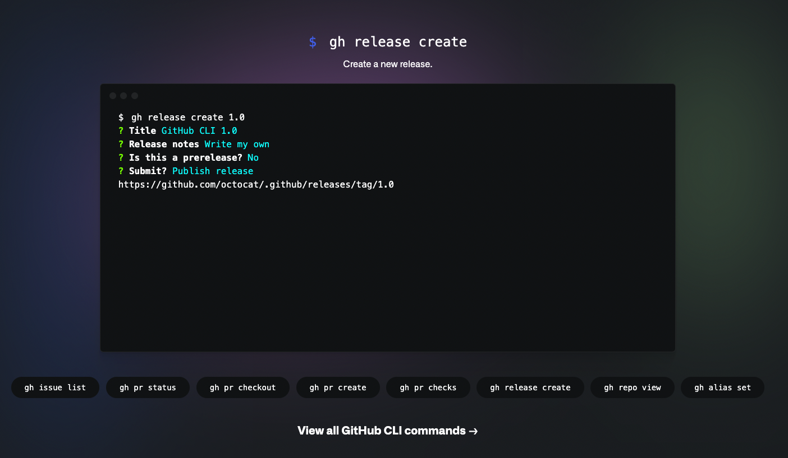
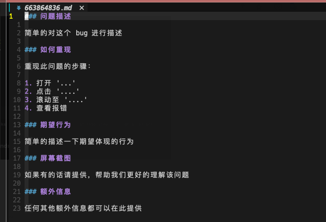

由于我目前的所有开发流程一方面和 github 有密切的关联，另一方面又大量的使用 `vim` `iTerm` 这样的工具，因此有很强烈的诉求希望可以更好的集成这些工具，最近刚刚尝试了下 [github 官方的 cli 工具](https://cli.github.com) 感觉确实可以满足我这方面的需求。这里记录下我自己常用的一些命令。



## 常用的工作流程

我目前高频使用 github 如下的一些功能：

1. 所有的仓库都在 github 里，会创建新的仓库，然后 clone 到本地，或者将本地新创建的仓库在 github 那边对应创建远程仓库
1. 在 github 创建 issue 并尽量让自己所提交的 commit 和 issue 绑定
1. 使用 github actions 去执行 ci 流程、构建镜像、打 tag、 做 release

针对这些场景，github cli 都有对应的功能点，下面一一罗列。

## 快速打开 github 仓库页面

```shell
gh browse
```

## 为当前目录的仓库创建 github repo

```shell
gh repo create <org>/<repo-name> --source . --private
```

## 快速创建 issue

个人认为 issue 就是软件开发行业 GTD 的最小单元，原则上超过 5 分钟才能做完的事情都应该有个 issue 与之对应，这样才能将实际的工作更好的反馈到整个项目里。当为了鼓励大家写 issue，issue 的编写是越快越好、越方便越好。`gh` 就很好的提升了 issue 编写的速度。

```shell
gh issue create --title "xxx"
```

这个工具做的非常细致，在创建 issue 时甚至会要求你去选择 issue template:


然后会问你是否需要编辑内容：


如果要编辑内容会自动的帮你引入模板：



这里我默认的编辑器是 `newovim` 在这里编辑可以用到 `autopilot` 在内的全套 vim 插件，也会大大提升我编辑 issue 的速度。

## github actions 的快捷流程

github actions 用到的命令比较多，但都很简单。

### 查看运行的 github workflow

```shell
gh run watch
```

`gh` 会让你选择当前正在运行的 workflow 。

### 查看运行的 workflow 的结果

这么做的场景一般有两个：

1. 查看列表，确认 action 是跑完了还是没跑完，成功了还是失败了

   ```shell
   gh run list
   ```

   

2. 一些 action 执行完会有一些输出，比如会打个镜像并且暴露镜像的 tag，我需要获取这个 tag

   ```shell
   gh run view <action-id>
   ```

   

### 触发 workflow 执行

有些 workflow 是需要主动触发的，可以去 github 网页上触发，但是更方便的方法就是通过命令行工具触发：

```shell
# 触发 graphql.yml 的 workflow 并提供参数 `environment=prod`
gh workflow run graphql.yml -f environment=prod

# 触发 bump_version.yml 的 workflow 并提供参数 `version=patch`
gh workflow run bump_version.yml -f version=patch
```

   
