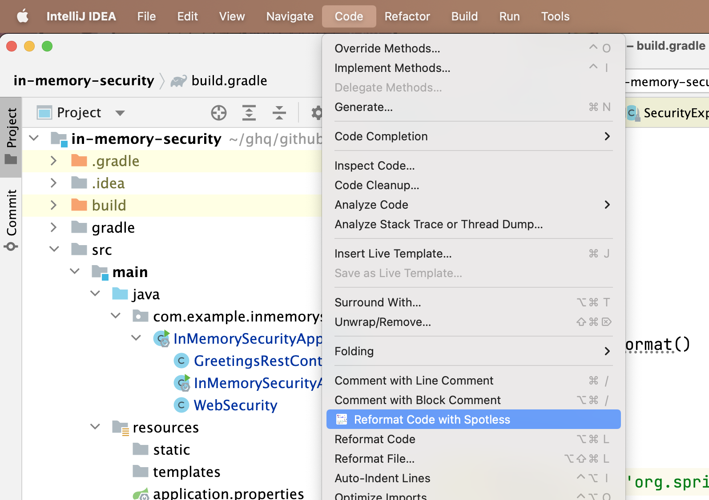

之前一直使用 [google-java-format intellij plugin](https://github.com/google/google-java-format#intellij-android-studio-and-other-jetbrains-ides) 与 git commit hook [google-java-format-git-pre-commit-hook](https://github.com/a1exsh/google-java-format-git-pre-commit-hook) 配合实现 java 代码的格式化。不过最近在处理 spring security 需要一些自定义格式的时候发现 intellij 的 google-java-format 插件**居然不支持 `@formatter:off` 这样的语法**，让我非常头痛。毕竟 web security 的那种「链式调用」如果没有自己的一些格式化会非常难看：

```java
// @formatter:off
http
    .authorizeRequests()
    .antMatchers(HttpMethod.OPTIONS).permitAll()
    .and()
    .httpBasic()
    .and()
    .authorizeRequests()
    .antMatchers("/graphiql", "/graphql").permitAll() // 如果不做自定义，这里的 permitAll 会强制换行
// @formatter:on
```

如下所示，这样的设置对 `google-java-format` 插件无效：


一方面由于这个问题，另一方面由于上述所说的 `git-pre-commit` 的工具对高版本 java 不兼容，于是决定更换格式化工具。

## spotless

经过调研决定使用 [spotless](https://github.com/diffplug/spotless) 有如下几个原因：

1. 和 gradle 有很好的集成，通过其所提供的 spotless 的 gradle 插件直接跑命令就能格式化代码，这样就可以通过在 ci 执行静态检查保证格式的一致性，起到了类似于 git-pre-commit 的效果，并且不用开发者自行设置，反而更省事了
2. 支持多种格式化标准，包括 google-java-format 并支持其自定义，这会让我之前的代码风格保持固定
3. 通过配置可以实现对 `@formatter:off` 语法的支持

## spotless 与 gradle 集成

增加 gradle 的插件：

```diff
  plugins {
+       id "com.diffplug.spotless" version "6.2.1"
  }

+ spotless {
+     java {
+         googleJavaFormat()
+     }
+ }
```

添加后就可以使用以下几个常用命令了：

1. `gradle spotlessJavaCheck`: 检查是否有不符合格式的内容，`gradle build` 也会执行该命令
2. `gradle spotlessJavaApply`: 执行格式化修改文件

### 设置忽略的文件

```diff
spotless {
    java {
+       target project.fileTree(project.rootDir) {
+           include '**/*.java'
+           exclude 'build/generated/**/*.*', 'build/generated-examples/**/*.*'
+       }
        googleJavaFormat()
    }
}
```

通过上面的 `include` `exclude` 保证那些生成的文件不必进行格式化。

### 支持 `@formatter` 语法

```diff
spotless {
    java {
        target project.fileTree(project.rootDir) {
            include '**/*.java'
            exclude 'build/generated/**/*.*', 'build/generated-examples/**/*.*'
        }
+       toggleOffOn('@formatter:off', '@formatter:on')
        googleJavaFormat()
    }
}
```

通过 `toogleOffOn` 来支持 `@formatter:off` 这样的语法，那么通过如下注释包裹的内容将被 `spotless` 忽略：

```java
// @formatter:off

code here will not be formatted any more

// @formatter:on
```

## spotless 与 intellij 集成

spotless 如果只和 gradle 集成而没有 IDE 的集成，那么在 Intellij 中执行「Reformat」还是会忽略上述的任何格式化设置。不过好在 spotless 也有 Intellij 的插件支持。

### 安装插件

在插件市场搜索 spotless:


### 修改快捷键映射

安装插件成功后会在「Code」下会多一个「Reformat Code with Spotless」:



但没有快捷键，用默认快捷键还是不能调用这个功能，需要修改下快捷键：


将默认的 reformat 快捷键给 spotless reformat:


提示是否将其他已经使用该快捷键的映射删除，选择「Remove」：


