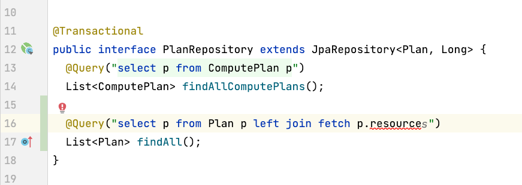

最近陷入了 JPA 的泥坑，在遇到今天提及的这个问题上折腾了很久，一度怀疑人生打算重新用 MyBatis 算了。不过幸好昨天有了一些还能接受的解决方案，这里做一个记录。

## 问题阐述

标题说就是让 JPA 处理子类的关联，这里我先贴一下示例代码：

```java
@Entity
@Inheritance
@DiscriminatorColumn(name = "type")
class Plan {
  long id;
  String name;
}

@Entity
@DiscriminatorValue("ComputationPlan")
class ComputationPlan extends Plan {
  @ManyToOne
  private Resource resource;
}

@Entity
@DiscriminatorValue("StoragePlan")
class StoragePlan extends Plan {
  private long size;
}

@Entity
class Resource {
  long id;
  String name;
}

interface PlanRepository extends JpaRepository<Plan, Long> {
}
```

有一个基类 `Plan` 它包含两个子类 `ComputationPlan` 和 `StoragePlan` 其中 `ComputationPlan` 会包含额外的关联 `Resource`，而 `StoragePlan` 则只包含一个 `size` 字段。`Plan` 采用单表继承，实现了子类的存储。而我希望通过 `PlanRepository.findAll()` 获取全部的 `Plan` 的时候可以同时获取 `ComputationPlan.resource` 字段而避免出现 sql n + 1 的问题。

## 解决方案

由于 `Plan` 没有 `resource` 属性，我似乎没办法直接使用 `select p from Plan p left join fetch p.resource` 这样子的 JPQL 语句。[JPA inheritance @EntityGraph include optional associations of subclasses](https://stackoverflow.com/questions/61254061/jpa-inheritance-entitygraph-include-optional-associations-of-subclasses/61272573) stackoverflow 这个问题也做了很详细的介绍，需求基本和我是一致的。它提供了两个方案：

第一个方案，用一个 hibernate 一级缓存的 trick: 只要已经获取了同样 id 的 Entity 就不会再次从 session 中覆盖。那么这里可以先用 JPQL `select p from ComputationPlan p left join fetch Resource r` 获取全部的 `ComputationPlan` 然后再执行 JPQL `select p from Plan p` 获取全部 Plan，这样子原来已经在 session 缓存里的 `ComputationPlan` 一定已经有 resource 字段了，这个问题就解决了。可这个方式就很 tricky 了，而且如果我有很多子类怎么办？请求多次？而且如果我有分页呢？是不是就不知道要获取那些内容了呢？

第二个方案，是用一个第三方的类库 [blaze persistence](https://persistence.blazebit.com/index.html)。这个方案也是其作者之一作答的，不过在做了简单的搜索后，且不说这个方案到底行不行，这个类库实在是有点小众，并且作为个人维护的项目，其后续的开发进展也有点堪忧，让人不太敢让公司的项目对它有什么依赖...不过其提供的答案里的 HQL 倒是给了我一些启示：

```
SELECT
  a.id, 
  v.id,
  TYPE(v), 
  CASE WHEN TYPE(v) = TextValue THEN v.text END,
  CASE WHEN TYPE(v) = RatingValue THEN v.rating END,
  CASE WHEN TYPE(v) = MCValue THEN s.id END
FROM Answer a
LEFT JOIN a.value v
LEFT JOIN v.selected s
```

其中 v 是一个 `Value` 类型，它也有多个子类，并且只有一个子类有 `selected` 属性，那么既然人家子类没有 `selected` 都能强行这么用，那么 `Plan.resource` 是不是也是可行的呢？做了个尝试：

```java
interface PlanRepository extends JpaRepository<Plan, Long> {
  @Query("select p from Plan p left join fetch p.resource")
  List<Plan> findAll();
}
```

执行一下发现是可行的...虽然在 intellij 中 `p.resource` 高亮着波浪线报错了，但是还是可以编译通过。



测试下生成的 SQL 以及返回的结果，都是正确的，也就是说，其实 **JPQL 也是支持这种父类 left join 子类属性的**。到此为止问题就解决了。

## 用 EntityGraph 进行额外的尝试

虽然看起来方案很简单，但出于对 intellij 的信任，也是花了好久的时间才顶着这个报错去尝试的。在此之前也尝试了 `EntityGraph` 中的 `subClassSubGraph` 但感觉这个东西应该是有 bug 并不能成功：

```java
@NamedEntityGraph(
    name = "all",
    attributeNodes = {
        @NamedAttributeNode("id"),
        @NamedAttributeNode("name")
    },
    subgraphs = {
        @NamedSubgraph(
            name = "resource",
            type = Resource.class,
            attributeNodes = {
                @NamedAttributeNode("id"),
                @NamedAttributeNode("name"),
            }
        )
    },
    subclassSubgraphs = {
        @NamedSubgraph(
            name = "computePlan",
            type = ComputePlan.class,
            attributeNodes = {
                @NamedAttributeNode(value = "resource", subgraph = "resource")
            }
        )
    }
)
class Plan {
  ...
}
```

使用上述的 `NamedEntityGraph` 依然会出现 `LazyInitializationException` 的问题，并且其生成的 `SQL` 语句也明显没有对 `Resource` 资源进行 `left join` 操作。


