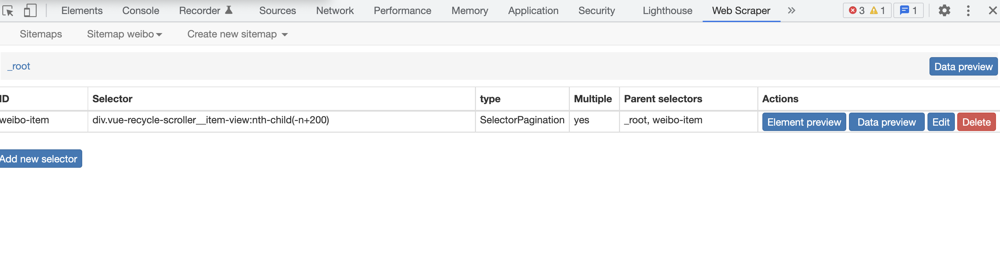
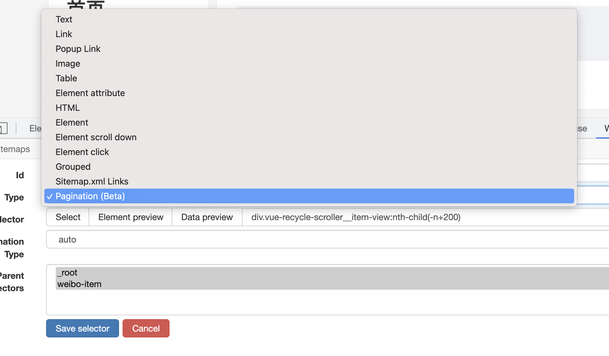
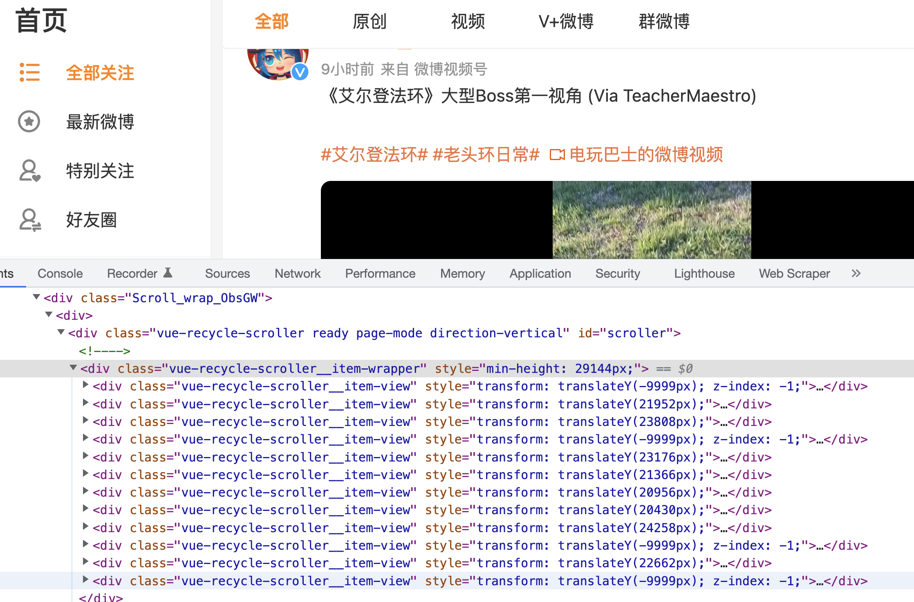
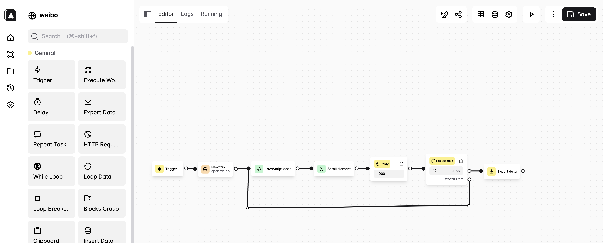

最近需要抓一点点微博的数据，于是又开始做爬虫的老行当了。不过这次抓的数据相对比较少，本来是觉得会很快，可惜还是因为种种原因多折腾了两个小时。这里对这部分工作做一个记录。

我个人一直觉得爬虫是个很重要的东西，尤其是目前这种机器学习的场景，好的数据、新的数据、源源不断的新的数据是好的模型的前提。甚至不用做什么模型，如果能很快速的获取和统计这些数据获取的一些规则都很有帮助。所以，可以快速的抓数据，快速的抓各种个样的数据是一个很重要的能力。这里就不展开讲了，还是控制篇幅，以这次任务为主。

## 任务

从自己的微博首页或者随便一个主题下面抓点纯文本的微博数据，用于测试命名实体识别模型。

## 以前的方案

很久以前（大约还在读研究生的时候）那个时候的微博有一个移动版本，这个版本里面各种静态 html 非常好爬，所以难度基本就是在于发现 `m.weibo.com` 的存在就好了。

不过很遗憾，现在不论是 `weibo.com` 还是 `m.weibo.com` 都不再是纯 html 了，都会动态获取数据了。

### Headless Chrome

对于动态获取数据的页面来说，可以采用 headless browwser 配合 puppeteer 来模拟页面的操作，并获取数据。不过我觉得这样做很明显有这么几个缺点：

1. puppeteer 需要用 nodejs 编写，本身难度会比较大
2. 这种 headless 的脚本相对来说都挺脆弱的，页面展示稍微慢一点，或者元素稍微做了点变化，整个脚本就凉凉了，这个问题不是在有 puppeteer 之后采用的，在以前用 selenium 或者 casperjs 的年代也同样发生

针对这个问题，我觉得有两个思路可以大大缓解：

1. 建立一个组件库，包含在浏览器实现各种行为的最佳实践，尽量规避自己写代码所引入的缺陷
2. 有一些类似于工作流的可视化界面，可以快速的建立一套爬取流程，虽然页面经常会发生变化，但由于我每次建立爬虫的成本大大降低了，所以我就不会那么在乎了

而 webscraper 则恰恰提供了以上两个东西。

## webscraper

[webscraper](https://webscraper.io/) 是一个 chrome 扩展，其实它的内部依然是类似与 puppeteer 的东西，不过它做成了一个扩展，并提供了一些非常强大的封装，可以让你通过点点点就能实现一个数据爬虫的流程。



封装程度高到如下的样子：

### 1. 提供丰富的组件，对应不同的抓取模式



包括：

1. 滚动到底部的瀑布加载
2. 各种类型的分页
3. 表格

### 2. 内置 element selector 可以在可视化界面完成页面元素的筛选


通过点点点，就能简历一个 css selector 来定位所要抓取的 html 元素路径。

### 3. 建立层级数据结构

在步骤 2 定位了想要抓取的具体数据后，可以在该数据上建立层级结构，标记具体想要抓取的数据结构，非常方便数据的结构化。


有关这个东西有一个 [卤蛋工作室](https://www.cnblogs.com/web-scraper/) 很详细的对它做了系列教程，感兴趣的话推荐一看，我这里就简单说说。不过很遗憾，这个东西在如今的微博也不太能用了。虽然现在的微博很符合它所提供的「滚动到底部」的抓取模式，但目前的微博出于性能的考虑，对自己的这个微博列表做了元素重用，导致不论怎么滚动，最多就只有这么多个元素了。那么套用 webscraper 的「滚动到底部」就只能获取这么多个微博而已了。



## Automa

Automa 也是一个 chrome 的扩展，相对于 webscraper 只用来做爬虫，automa 可以用来做各种流程自动化的东西，比 webscraper 灵活不少。除此之外，很多思路和 webscraper 一脉相承。简单看了看教程我就做出来如下一个流程：



其中的 `javascript code` 内容如下：

```javascript
function inViewport (element) {
  if (!element) return false;
  if (1 !== element.nodeType) return false;

  var html = document.documentElement;
  var rect = element.getBoundingClientRect();

  return !!rect &&
    rect.bottom >= 0 &&
    rect.right >= 0 && 
    rect.left <= html.clientWidth &&
    rect.top <= html.clientHeight;
}

setTimeout(() => {
  var elements = document.querySelectorAll("article");

  elements.forEach(e => {
    if (inViewport(e)) {
      const text = e.querySelector('.detail_wbtext_4CRf9').innerText;
      console.log(text);
      automaNextBlock({ text: text }, true);
    }
  });
}, 1000);
```

和 webscraper 一直滚动到满意的个数的元素后再开始解析数据不同，我做的 automa 的流程是每次滚动一点点页面，然后就获取当前视图中的微博元素并把其内容存下来。而获取当前视图的元素就是用的上面的 `javascript code` 了。


`video: /videos/automa-scrape-weibo.mp4`

## 小结

Automa 相对 webscraper 来说更加灵活，可以更加灵活的定制自己的抓取流程，后续可能还会有其他场景的使用吧。
