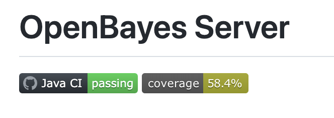
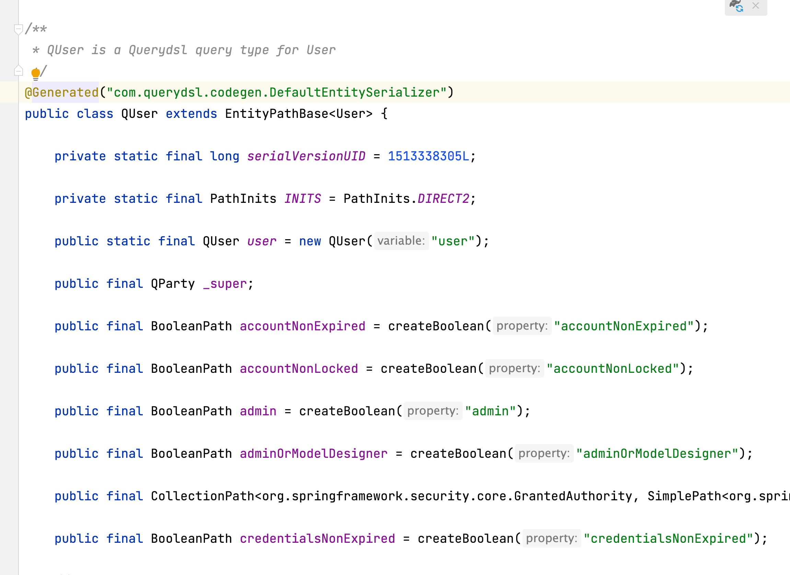
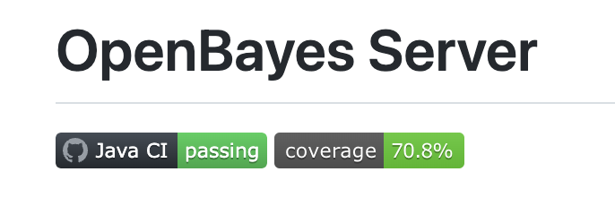

最近在做一些代码的重构和基础库的迁移，这样的工作绝大部分时候不产生新的功能点，每次更换了类库后也都会将原来对应的测试同步迁移过来，保证新的代码和原来的代码一样工作。不过在迁移的过程中我发现 jacoco 所提示的代码覆盖率越来越低，让我很慌。为了搞明白这是啥原因，做了一些调研，这里把一些结论记录在这里加深印象，也便于后续查看。



## 代码测试覆盖率是什么意思

在 [Intro to JaCoCo](https://www.baeldung.com/jacoco) 这里讲的非常明白了，代码测试覆盖率（或者说代码覆盖率）讲的是在跑测试的时候，到底有多少代码被执行了。按照粒度来分可以有以下几种：

1. `Line coverage` 按照字节码统计的多少 instruction 被执行了
2. `Branch converage` 按照 `if/else` `switch` 等分支统计多少分支被执行了

由于代码确实会有很多防御性的 `if/else` 导致其实每一个分支并不是很对等，所以我个人感觉 `Line coverage` 会稍微好一些。

不过要注意，测试覆盖率只反映你多少代码在测试的时候被执行了，执行了一次就算是执行了，但事实上不同的参数会导致不同的结果，很多边界条件是否被测试到也表现不出来。因此 100% 测试覆盖率不表示所有代码都是对的了。如何写测试本身是一件极其复杂的事情，有些编程思路如 TDD 都是围绕测试进行的，我也讲不明白。

## 是什么导致覆盖率越来越低

为了搞明白为什么我的测试覆盖率一降再降，我需要用 [JaCoCo](https://www.eclemma.org/jacoco/) 给我生成一下报告，我去看一下到底哪些地方的哪些代码测试出了问题。


我的项目是用 `gradle` 管理的，执行如下命令重新跑一下测试并生成报告：

```bash
./gradlew cleanTest test jacocoTestReport
```

然后去项目目录 `build/reports/jacoco/test/html` 打开 `index.html` 看看情况，发现核心为题在于**很多生成的代码**被纳入了代码测试覆盖中。具体来讲有两个方面的内容：

1. Lombok 生成的很多代码
2. 引入 QueryDSL 后其和对应的 `Entity` 生成的 `Q + Entity` 的名称的代码

那问题就显而易见了，尤其是后者，每次迁移一个 JPA 的 Entity 类型就会对应生成一段 `Q + Entity` 的代码，这部分代码统统成了测试覆盖率的分母，覆盖率能不低么。



## 如何改进

这部分的很多信息在 [Exclusions from Jacoco Report](https://www.baeldung.com/jacoco-report-exclude) 可以找到。

### 修改 JaCoCo 配置，保证代码覆盖率统计的合理性

我们只需要测试自己写的代码，生成的代码不应纳入统计范围。这里直接粘贴下 `gradle` 里面 `jacocoTestReport` 的配置：

```
jacocoTestReport {
    // rule from https://bottom-to-top.tistory.com/36
    // 过滤 QA-QZ 开头的所有类，对应了 querydsl 生成的 Q + Entity 的格式
    def Qdomains = []
    for(qPattern in "**/QA" .. "**/QZ"){
        Qdomains.add(qPattern + "*")
    }
    afterEvaluate {
        classDirectories.setFrom(files(classDirectories.files.collect {
            fileTree(dir: it, exclude: [
                    'com/openbayes/graphql/**',          // 所有 graphql 生成的代码
                    'com/openbayes/application/data/**', // 所有的 DTO 所在的包
                    'db/migration/**',                   // 所有的数据库 migration 代码
                    '**/*Exception*',                    // 所有包含 Exception 的异常类
                    '**/*Mixin*',                        // 所有 Jackson Mixin 
                    '**/*Command',                       // 所有带 Command 的类，也是 DTO
            ] + Qdomains)
        }))
    }
    reports {
        csv.required = true
    }
}
```

可以看到，我这里主要是按照 `classDirectory` 对类进行了过滤，包括了以下内容：

1. 各种生成的代码：graphql 生成代码、querydsl 生成代码
2. 各种 DTO 和 Exception：`*Command` `data/**` 等
3. 实在不太好测试的东西，比如 migration 脚本、比如 Jackson 的 Mixin

对 querydsl 这部分的过滤比较 tricky ，因为其默认生成的名字是 `Q + Entity`，本身过滤就有点难，如果采用 `**/Q*` 的形式会导致个别以 `Q` 开头但不是 querydsl 生成的类也被纳入过滤的范围，这里我采用的是 [https://bottom-to-top.tistory.com/36](https://bottom-to-top.tistory.com/36) 的方法，过滤掉由 `QA-QZ` 开头的所有的类。

> 这里过滤 querydsl 的方法其实官方还有其他方案，但目前 `gradle` 这边支持不是很好，我目前用的 `querydsl` 版本为 5.0 有一些 PR 还没有纳入进来，后续如果官方有了更好支持会考虑做相应的调整。

### 通过注解过滤 Lombok 的代码

JaCoCo 本身是考虑了要过滤掉生成的代码的，它提供了一个规则：

> Starting from JaCoCo 0.8.2, we can exclude classes and methods by annotating them with a custom annotation with the following properties:
> - The name of the annotation should include Generated.
> - The retention policy of annotation should be runtime or class.

简单的翻一下，就是在 JaCoCo 0.8.2 后，通过提供一个带有 `Generated` 名称的 `RetentionPolicy` 为 `CLASS` 或者 `RUNTIME` 的注解，JaCoCo 会帮你自动过滤这些类。

Lombok 也对这部分做了支持，只要提供一个配置 `lombok.config` 就能让 Lombok 给自己生成的代码添加上相应的注解了：

```
lombok.addLombokGeneratedAnnotation = true
```

## 最后

在做了上述两方面的修改后，测试覆盖率重回 70% 了。



