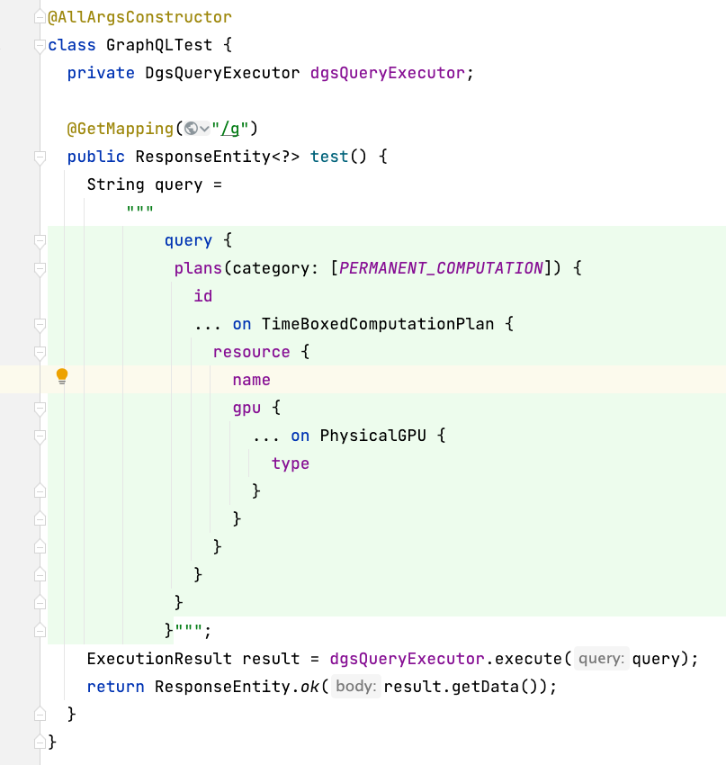

最近在实验一个用 GraphQL 支持 REST 接口的方案，需要在 Java 里写大量的 graphql 的内容，如下所示。

```java
@RestController
@AllArgsConstructor
class GraphQLTest {
  private DgsQueryExecutor dgsQueryExecutor;

  @GetMapping("/g")
  public ResponseEntity<?> test() {
    String query =
        "query {\n" +
        " plans(category: [PERMANENT_COMPUTATION]) {\n" +
        "   id\n" +
        "   ... on TimeBoxedComputationPlan {\n" +
        "     resource {\n" +
        "       name\n" +
        "       gpu {\n" +
        "         ... on PhysicalGPU {\n" +
        "           type\n" +
        "         }\n" +
        "       }\n" +
        "     }\n" +
        "   }\n" +
        " }\n" +
        "}";
    ExecutionResult result = dgsQueryExecutor.execute(query);
    return ResponseEntity.ok(result.getData());
  }
}
```

可以看到这种多行拼接的 string 非常丑陋，并且没办法使用 intellij 的 [`inject language`](https://www.jetbrains.com/help/idea/using-language-injections.html) 这样的功能。

不过在 java 15 就已经引入了 [text blocks](https://www.baeldung.com/java-text-blocks) 的语法了，并且在目前的情况下，引入这个语法确实会为后续开发提供不少便利。于是决定就直接从目前的 java 11 升级到最近的 LTS 版本 java 17 了。这里就记录下更新版本需要处理的问题。

## 安装 Azul Zulu Java 17

去 azul 官网安装[对应的操作系统的版本](https://www.azul.com/downloads/?version=java-17-lts&os=macos&architecture=arm-64-bit&package=jdk)。


安装后在命令行输入命令确认安装成功了：

```sh
$ java --version
openjdk 17.0.3 2022-04-19 LTS
OpenJDK Runtime Environment Zulu17.34+19-CA (build 17.0.3+7-LTS)
OpenJDK 64-Bit Server VM Zulu17.34+19-CA (build 17.0.3+7-LTS, mixed mode, sharing)
```

## 配置 intellij

打开 idea intellij 对配置做如下修改。

1. 修改 gradle 使用的 jvm


2. 修改 javac 字节码版本


3. 修改启动使用的 java 版本


## 修改 gradle 配置

java 17 相对比较新，有些 gradle 的插件没有做很好的适配，需要做一些修改。我这里遇到了两个插件的问题，这里也记录下。

### spotless 不兼容

spotless 是做代码格式化的，里面用了 googleJavaFormat 似乎有一些兼容性问题。这里没有花太多时间做调研，只是跟着 issue 做了调整。

1. [Add docs: Required export using GoogleJavaFormat on JDK 16+](https://github.com/diffplug/spotless/pull/998/files)

根据这个 PR 将 `gradle.properties` 修改如下：

```
org.gradle.jvmargs=--add-exports jdk.compiler/com.sun.tools.javac.api=ALL-UNNAMED \
  --add-exports jdk.compiler/com.sun.tools.javac.file=ALL-UNNAMED \
  --add-exports jdk.compiler/com.sun.tools.javac.parser=ALL-UNNAMED \
  --add-exports jdk.compiler/com.sun.tools.javac.tree=ALL-UNNAMED \
  --add-exports jdk.compiler/com.sun.tools.javac.util=ALL-UNNAMED
```

2. `build.gradle` 里更新 google java format 到最新版本

```diff
spotless {
    java {
        target project.fileTree(project.rootDir) {
            include '**/*.java'
            exclude 'build/generated/**/*.*', 'build/generated-examples/**/*.*'
        }
        toggleOffOn('@formatter:off', '@formatter:on')
+       googleJavaFormat('1.15.0')
    }
}
```

### gradle git properties 不兼容

按照 https://github.com/n0mer/gradle-git-properties/issues/171#issuecomment-817569604 对 `gradle.properties` 做修改：

```diff
org.gradle.jvmargs=--add-exports jdk.compiler/com.sun.tools.javac.api=ALL-UNNAMED \
  --add-exports jdk.compiler/com.sun.tools.javac.file=ALL-UNNAMED \
  --add-exports jdk.compiler/com.sun.tools.javac.parser=ALL-UNNAMED \
  --add-exports jdk.compiler/com.sun.tools.javac.tree=ALL-UNNAMED \
  --add-exports jdk.compiler/com.sun.tools.javac.util=ALL-UNNAMED \
+ --add-opens java.base/java.io=ALL-UNNAMED
```

## 使用 text blocks

做了如上更新后，本地跑 java 的项目就不报错了，不过还是有一些 warning 后续慢慢处理。

text blocks 就能用了，效果如下：


