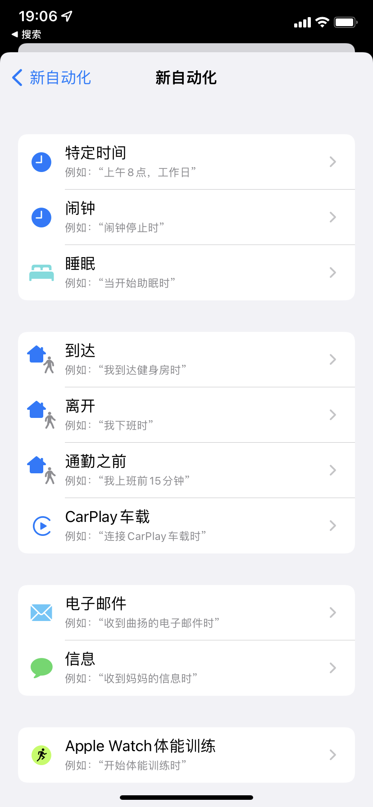
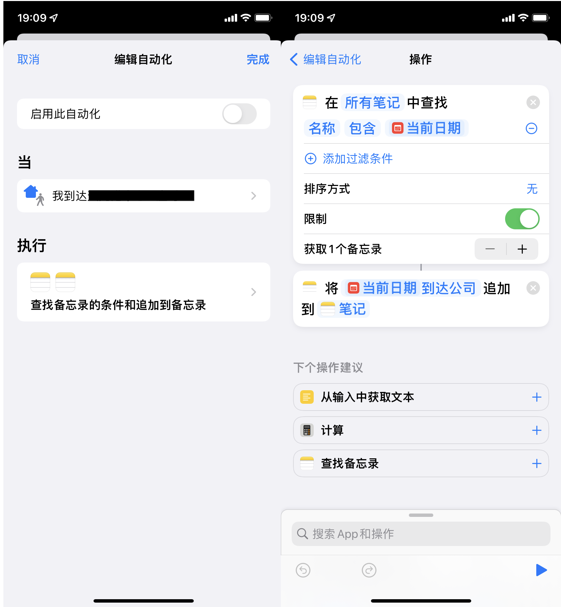
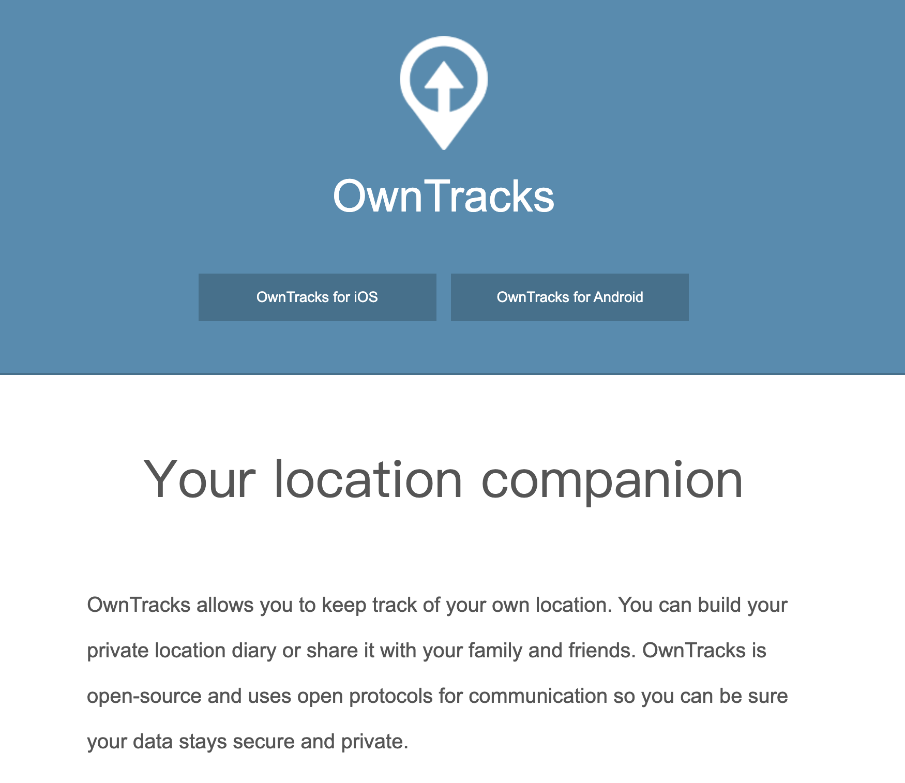
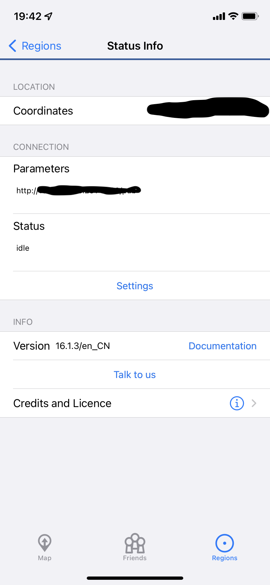

众所周知，手机是可以做定位的。我个人比较喜欢做一些 "自我量化" 来追溯具体的时间都去哪里了，那通勤时间和办公室停留时间这种信息自然也很想记录下来。所以在很久之前我就开始各种搜罗，想要找一个方案。但很遗憾，找了一大圈，也没找到一个让我满意的，非常失望，这里记录下之前踩的坑，然后记录下目前找到的一个还可以的方案。

## 使用 iOS 的关键指令（shortcuts）

shortcuts 这个东西有点像是一个手机版本的 [IFTTT](https://ifttt.com/)。它包含一些触发器，可以自动触发某些事件，然后去串联多个应用以实现一些很 fancy 的功能。常见的触发器包括：

1. 地理位置相关的：离开、到达某个区域
2. 时间相关：几点几分到了
3. wifi 相关：wifi 开启、关闭、自动连接了什么局域网
 
等等等，具体就不细说了。



不过很显然，我可以使用那个地理位置的触发器去记录我什么时候离开了哪里、什么时候到达了哪里。比如对于我通勤的记录，那我就设置两个关键地点：家和公司，然后记录离开到达时间就行了。具体就是这么个样子：



我是每天创建一个笔记本，然后把信息都追加到笔记本里了。

然后似乎大功告成了，可是很遗憾，实际上完全不生效，网上一搜很多相关问题，但就是没解决方案，我尝试了很多的方法都不成功。只有偶尔会成功那么一下下...我甚至咨询了在 Apple 工作的同学，最终也没有得到解决...

## owntracks

iOS 自带方案不行，就只好自己写 app 了，不过很遗憾我并没有移动端开发的经验，所以这个事情就搁置了...直到我一天发现了 owntracks 这个东西。



简单来说，owntracks 就是个不收集你个人信息，只负责将你的信息上报到你指定的服务器的一个工具。所以其实 owntracks 分为两个部分：

1. app 使用手机的定位功能获取经纬度
2. server 将 app 上报的信息存下来

### 安装配置 app

我最开始的需求很简单，就是周期性记录我的位置，然后周期性上报就好了，后续的数据处理交给服务端做好了。不过 OwnTracks 除了这个朴实的功能外，也有那种区域触发的功能。这样我就可以和 iOS 快捷指令一样关注几个地点就好了。

不过相比于 iOS 这边直接把数据记录到笔记本，我需要一个 track server 接受上报的信息。owntracks 支持两种协议：MQTT 和 HTTP，鉴于我只会 HTTP 就自己写了一个简单的 HTTP server 去接收这些信息了。然后在 app 这边配置下服务端信息就可以接收数据了。



注意这里要配置到具体的某一个路径的，比如 `http://112.118.221.2/pub` 而不是只给个域名或者 ip 地址就完事了。

### 编写 track server

> 为啥不用官方的？
> 
> OwnTracks 有官方的 track server ，但有这么几个问题：
> 
> 1. 代码是 c 的，自己部署有点晦涩难懂，只能用 docker 部署吧，但自己修改的可能性就很小了
> 2. 同时支持 MQTT 和 HTTP 而实际上我觉得对个人来说 HTTP 会更简单一些吧，那 MQTT 部分的代码就很没必要了
> 3. 有一些和 Google 地图集成的功能，这些东西在国内统统没得用

OwnTracks 会以 json 的格式把所有的信息都上报到服务器，提交的具体结构可以直接 print 出来看看。这里给出我的 server 的一个片段：

```python

import json

from flask import Flask, request


FILENAME = "data.jsonl"

app = Flask(__name__)


@app.route("/")
def hello():
    return "hello"


@app.route("/pub", methods=["POST"])
def pub():
    # print raw request data
    print(request.json)
    with open(FILENAME, "ab") as f:
        f.write(request.data)
        f.write(b"\n")
    return "done"

if __name__ == "__main__":
    print("Starting server...")
    app.run(host="0.0.0.0")
```

可以看到我就是把所有的数据到塞到了一个 `data.jsonl` 的文件里了，反正就是我自己的数据，没几条，这样就够了。

### 展示数据

有了这些数据，我就可以把每天的通勤给按照时间顺序展示出来了，代码如下：

```python
@app.route("/report")
def report():
    data = []
    with open(FILENAME, "r", encoding="utf-8") as f:
        data = f.readlines()
    data = [json.loads(item) for item in data]
    data = [item for item in data if item.get("event") in ["leave", "enter"]]
    chinaTz = pytz.timezone("Asia/Shanghai")
    # datetime from unix timestamp
    data = [
        {
            "desc": item["desc"],
            "event": item["event"],
            "date": datetime.fromtimestamp(item["tst"], chinaTz).strftime(
                "%m/%d"
            ),
            "time": datetime.fromtimestamp(item["tst"], chinaTz).strftime(
                "%H:%M"
            ),
            "datetime": datetime.fromtimestamp(item["tst"], chinaTz).strftime(
                "%m/%d %H:%M"
            ),
            "tst": item["tst"]
        }
        for item in data
    ]
    # remove item with same time
    masks = [False] * len(data)
    for i in range(1, len(data)):
        if abs(data[i]["tst"] - data[i - 1]["tst"]) < 120 and \
           data[i]["desc"] == data[i - 1]["desc"]:
            masks[i - 1] = True
            masks[i] = True if data[i]["event"] != data[i - 1]["event"] else False
    data = [item for i, item in enumerate(data) if not masks[i]]
    # group by time
    grouped = OrderedDict()
    for item in data:
        if item["date"] not in grouped:
            grouped[item["date"]] = []
        grouped[item["date"]].append(item)

    result = [
        [
            date,
            "\n".join(
                [
                    f"    {item['time']}\t{item['event']}\t{item['desc']}"
                    for item in items
                ]
            ),
        ]
        for date, items in reversed(grouped.items())
    ]

    return (
        "\n".join([y for x in result for y in x]),
        200,
        {"Content-Type": "text/plain; charset=utf-8"},
    )
```

最终展示效果大概就是这样子：

```
07/18
    09:11	leave	home
    12:22	enter	gym
    13:41	leave	gym
    15:00	enter	office
07/17
    09:11	leave	home
    12:22	enter	gym
    13:41	leave	gym
    15:00	enter	office
    17:00 leave office
```

这个 server 的代码也放到了 [owntracks-server](https://github.com/aisensiy/owntracks-server)。

## 遇到的坑

很久之前就处理过这种坐标数据，还是有不少坑的。趁这次再次接触到也做一个记录。

### ping-pang 问题

经纬度坐标貌似并不是非常稳定，会有误差，你在同一个位置可能会有不同的坐标，这就会导致你可能动都没动但是突然你就离开了一个地方然后又回到了这个地方。

对于这种情况就只能做个简单的过滤，把那些时间戳非常接近的事件直接忽略掉。当然，这种过滤也可以顺便把你路过的那种地点一并清理掉。

### 坐标系转换

出于一些特殊的考虑，不同的地图给的具体经纬度都是有区别的，就是说你所在的同一个位置对于不同的地图给你标记的经纬度是不同的。目前有三个主流的坐标系：

1. WGS84 坐标系	地球坐标系，国际通用坐标系
2. GCJ02 坐标系	火星坐标系，WGS84 坐标系加密后的坐标系；Google 国内地图、高德、QQ 地图 使用
3. BD09 坐标系	百度坐标系，GCJ02 坐标系加密后的坐标系

在我 iphone 上我的实际位置和地图标记的位置是有偏差的，我想这应该是苹果没有考虑到中国和国外使用的坐标系是不同的，也就是说 iOS 给我获取的经纬度应该是 WGS84 的，但实际展示却用了 GCJ02 的高德地图，所以展示的位置就不对了。我猜测这也很有可能是快捷指令无法触发的原因所在。

在目前的情况下，这个问题只是对 app 本身的展示有影响，对事件触发并没有影响。可以先不管。

## 后续的工作

1. 做一些基本的统计，比如通勤时间、比如办公时间
2. 除了区域事件外也试试其他的数据，比如去自动发现停留区域，比如集成地图 api 展示具体的停留区域等
3. 把数据直接塞进 `data.jsonl` 时间久了可能还是不太够，还是需要起码按照月份做个数据拆分
