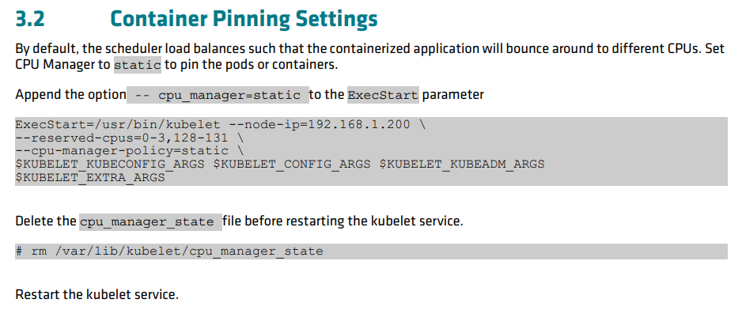

最近发现跑 pytorch gpu benchmark 的时候，AMD epyc cpu 下的 rtx 3090 明显要比 intel 下 3090 慢，而且差距挺大的，非常不能理解。折腾了挺长一段时间才最终定位到是因为 cpu 在容器里的调度问题导致的。过程兜兜转转花了不少时间，这里就不说太多了，记录下大体过程和最后调优的措施。

## 最开始的测试

### 测试脚本

- python gpu benchmark: https://github.com/ryujaehun/pytorch-gpu-benchmark
- model: `models.resnet.__all__[1:]` 只测试 resnet 模型
- batch size: 64
- cpu limit: 12
- memory limit: 30G
- gpu limit: 1
- shm: docker 给 30G 而 k8s 里由于无法直接设置，就给了机器内存的大小

### nvidia docker 脚本

```sh
docker run --rm -it --shm-size=30g --cpus=12 --memory=30G --
gpus '"device=1"' uhub.service.ucloud.cn/openbayesruntimes/pytorch:1.9.0-py36-cu111.70
```

### 两个差异很大的结果

#### Intel 平台

```
start
benchmark start : 2022/11/17 06:15:23
Number of GPUs on current device : 1
CUDA Version : 11.1
Cudnn Version : 8005
Device Name : NVIDIA GeForce RTX 3090
uname_result(system='Linux', node='d1d271bdf102', release='5.4.0-131-generic', version='#147-Ubuntu SMP Fri Oct 14 17:07:22 UTC 2022', machine='x86_64', processor='x86_64')
                     scpufreq(current=1184.1902125, min=800.0, max=3400.0)
                    cpu_count: 80
                    memory_available: 258789797888
Benchmarking Training half precision type resnet18
/usr/local/lib/python3.6/site-packages/torch/nn/functional.py:718: UserWarning: Named tensors and all their associated APIs are an experimental feature and subject to change. Please do not use them for anything important until they are released as stable. (Triggered internally at  /pytorch/c10/core/TensorImpl.h:1156.)
  return torch.max_pool2d(input, kernel_size, stride, padding, dilation, ceil_mode)
resnet18 model average train time : 41.39636039733887ms
Benchmarking Training half precision type resnet34
resnet34 model average train time : 55.32251834869385ms
Benchmarking Training half precision type resnet50
resnet50 model average train time : 92.97645568847656ms
Benchmarking Training half precision type resnet101
resnet101 model average train time : 147.91772842407227ms
Benchmarking Training half precision type resnet152
resnet152 model average train time : 209.90628242492676ms
Benchmarking Training half precision type resnext50_32x4d
resnext50_32x4d model average train time : 132.71542072296143ms
Benchmarking Training half precision type resnext101_32x8d
resnext101_32x8d model average train time : 336.4134645462036ms
Benchmarking Training half precision type wide_resnet50_2
wide_resnet50_2 model average train time : 156.14235401153564ms
Benchmarking Training half precision type wide_resnet101_2
wide_resnet101_2 model average train time : 259.703106880188ms
Benchmarking Inference half precision type resnet18
resnet18 model average inference time : 31.02853298187256ms
Benchmarking Inference half precision type resnet34
resnet34 model average inference time : 39.35199737548828ms
Benchmarking Inference half precision type resnet50
resnet50 model average inference time : 41.26767635345459ms
Benchmarking Inference half precision type resnet101
resnet101 model average inference time : 48.41951370239258ms
Benchmarking Inference half precision type resnet152
resnet152 model average inference time : 67.41719722747803ms
Benchmarking Inference half precision type resnext50_32x4d
resnext50_32x4d model average inference time : 44.739885330200195ms
Benchmarking Inference half precision type resnext101_32x8d
resnext101_32x8d model average inference time : 103.05868148803711ms
Benchmarking Inference half precision type wide_resnet50_2
wide_resnet50_2 model average inference time : 49.078497886657715ms
Benchmarking Inference half precision type wide_resnet101_2
wide_resnet101_2 model average inference time : 83.67201805114746ms
benchmark end : 2022/11/17 06:21:41
end
```

#### AMD 平台

```
start
benchmark start : 2022/11/17 06:14:11
Number of GPUs on current device : 1
CUDA Version : 11.1
Cudnn Version : 8005
Device Name : NVIDIA GeForce RTX 3090
uname_result(system='Linux', node='925b73b78805', release='5.15.0-43-generic', version='#46-Ubuntu SMP Tue Jul 12 10:30:17 UTC 2022', machine='x86_64', processor='x86_64')
                     scpufreq(current=2784.047382812501, min=1500.0, max=2200.0)
                    cpu_count: 256
                    memory_available: 485026041856
Benchmarking Training half precision type resnet18
/usr/local/lib/python3.6/site-packages/torch/nn/functional.py:718: UserWarning: Named tensors and all their associated APIs are an experimental feature and subject to change. Please do not use them for anything important until they are released as stable. (Triggered internally at  /pytorch/c10/core/TensorImpl.h:1156.)
  return torch.max_pool2d(input, kernel_size, stride, padding, dilation, ceil_mode)
resnet18 model average train time : 75.70790767669678ms
Benchmarking Training half precision type resnet34
resnet34 model average train time : 82.6269006729126ms
Benchmarking Training half precision type resnet50
resnet50 model average train time : 111.1276912689209ms
Benchmarking Training half precision type resnet101
resnet101 model average train time : 161.16506576538086ms
Benchmarking Training half precision type resnet152
resnet152 model average train time : 228.9912509918213ms
Benchmarking Training half precision type resnext50_32x4d
resnext50_32x4d model average train time : 143.40569496154785ms
Benchmarking Training half precision type resnext101_32x8d
resnext101_32x8d model average train time : 354.08830165863037ms
Benchmarking Training half precision type wide_resnet50_2
wide_resnet50_2 model average train time : 164.76832389831543ms
Benchmarking Training half precision type wide_resnet101_2
wide_resnet101_2 model average train time : 271.076135635376ms
Benchmarking Inference half precision type resnet18
resnet18 model average inference time : 63.87866973876953ms
Benchmarking Inference half precision type resnet34
resnet34 model average inference time : 68.00977230072021ms
Benchmarking Inference half precision type resnet50
resnet50 model average inference time : 73.05157661437988ms
Benchmarking Inference half precision type resnet101
resnet101 model average inference time : 81.68745994567871ms
Benchmarking Inference half precision type resnet152
resnet152 model average inference time : 87.46984004974365ms
Benchmarking Inference half precision type resnext50_32x4d
resnext50_32x4d model average inference time : 83.56608867645264ms
Benchmarking Inference half precision type resnext101_32x8d
resnext101_32x8d model average inference time : 108.2996940612793ms
Benchmarking Inference half precision type wide_resnet50_2
wide_resnet50_2 model average inference time : 78.30146789550781ms
Benchmarking Inference half precision type wide_resnet101_2
wide_resnet101_2 model average inference time : 90.06356239318848ms
benchmark end : 2022/11/17 06:23:29
end
```

可以看到，越小的模型性能差异越大，这里就让我非常怀疑是 cpu 的问题。

## 关注主频

这里 AMD 的 cpu 是 [7773x](https://www.amd.com/en/products/cpu/amd-epyc-7773x) ，64 核心，128 线程，看起来是个 monster 可是这种超多核心的服务器 cpu 的主频相对都低一些，比如这个 Base Clock 是 2.2GHz，Boost Clock 是 3.5GHz。和 Intel 平台的比，差了一点点（那边是 3.8GHz）但这不足以引起如此大的性能差异，同时在通过 `cat /proc/cpuinfo` 命令查看运行时的主频后也确认很多核心的主频都可以跑到 3.4GHz 的水平，说明没有什么诡异的 BIOS 配置限制了性能的发挥。所以主频不是导致性能差的罪魁祸首。

## 继续翻阅 AMD 的 CPU 调优手册

虽然主频没问题，但还是觉得 cpu 哪里不太对，于是开始在 bios 里翻各种配置项目，越翻越懵逼，看不懂那些项目什么意思，就只能通过搜索引擎找到 AMD EPYC CPU 的配置手册，不经意间看到一个 [Kubernetes Container Tuning Guide for AMD EPYC 7003 Series Processors](https://www.amd.com/system/files/documents/container-tuning-guide-kubernetes-amd-epyc7003-series-processors.pdf) 这不就是我目前所需要的？在 3.2 Container Pinning Settings 这部分提到默认的调度规则是在所有的 cpu 上做调度：



那对于这个双路一共 256 线程的机器来说，调度频繁切换应该会是一个很大的开销吧？这里提到的 `static` 则是说只在特定的 cpu 里做调度。按照这个关键信息，我翻阅了 [](https://kubernetes.io/docs/tasks/administer-cluster/cpu-management-policies/) 知道了 `static` 规则用的就是 `cgroup` 的 `cpuset` 系统。那我是不是可以先用 `docker` 试试看？

## 使用 cpuset 命令测试

```
docker run --rm -it --shm-size=30g --cpuset-cpus 4-15 --cpus=12 --memory=30G --
gpus '"device=1"' uhub.service.ucloud.cn/openbayesruntimes/pytorch:1.9.0-py36-cu111.70
```

这里就是增加了 `--cpuset-cpus 4-15` 告知 `docker` 这个容器的可用 cpu 的区间。结果发现性能有了很大的提升，实际速度也超过了 Intel 平台。那么这里就大体确定了是默认调度规则的问题了。

## 解决 nvidia-docker 与 cpu 调度策略冲突的问题

按照 [Changing the CPU Manager Policy](https://kubernetes.io/docs/tasks/administer-cluster/cpu-management-policies/) 我很快对一台机器进行了调整，并准备在 k8s 平台上再做一次 benchmark 结果发现使用 `nvidia-smi` 命令查看显卡信息的时候报错了：

```
Failed to initialize NVML: Unknown Error
```

又是一番查询，发现是刚刚使用的 `cpu-manager-polcy=static` 会和 nvidia-docker 有冲突：容器因为 `static` 的调度规则必须修改容器的运行时，而这种行为是 nvidia docker 所不支持的。目前的解决方式是**让所有调度 gpu 的 Pod 都必须具备 [Guaranteed 级别的 QoS](https://kubernetes.io/docs/tasks/configure-pod-container/quality-service-pod/)，同时所有的容器都必须有整数个的 cpu limitation**。对于这种 Pod kubelet 会特殊对待，跳过对其 cpuset 进行更新（因为它锁定了 cpuset 所以按理说也不用更新）。同时这个支持也是在 k8s 1.22 版本之后才支持的。为此我们的集群也不得不升级到了 1.22 版本。

