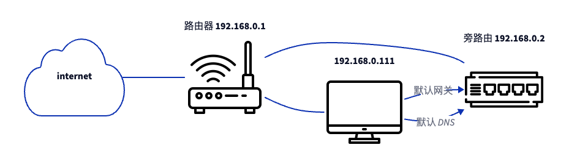
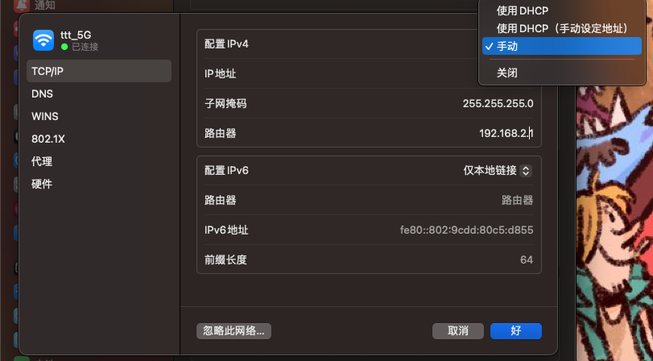
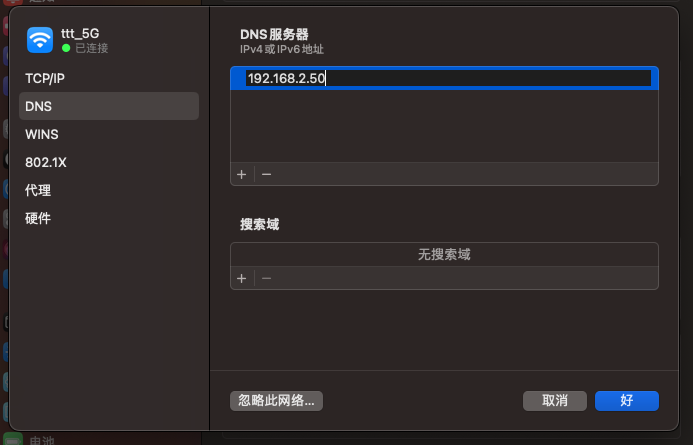

最近折腾了下那个一直放在家里的 [EasePi ARS2](https://easepi.linkease.com/) ，把它做成了家里的一个旁路由，这里记录一下。

首先这个东西就是一个非常正统的「软路由」了，搞这个东西的基本用法应该就是把它当个路由器直接接管家里网络的三个方面：

1. 接入 ISP 的光猫，拨号上网
2. 作为默认网关，成为家里所有设备的默认网络出口
3. 支持 dhcp 和 dns 服务，可以为家里的其他设备分配 ip 设置默认 dns

当然，用这个东西而不用自己买的路由器有如下两个好处：

1. 通常这个东西的性能会更好，在设备很多的时候也不至于出现性能问题，成为网络瓶颈
2. 大部分人用这个东西都是为了在这台设备上安装一些代理，然后所有的内网的设备就可以访问各种网站了，这样就省的每个设备都设置代理了，毕竟每个设备各种操作系统设置代理也很麻烦的，尤其是有些设备在安装阶段都需要链接外网，根本没有机会在本机设置代理

不过这并不代表原来的路由器可以扔了，毕竟 ARS2 不是个无线路由器，无法支持 wifi 的，原来的路由器还是要当 AP 继续发挥作用的。

## 为什么作为旁路由

不过直接把这种软路由做成主路由器有三个问题：

1. 原来的路由器要修改成 AP 模式，还要额外的设置...麻烦
2. 这台机器其实还有其他的功能，比如可以安装点乱七八糟的插件把它做成个小 NAS，那如果稍有不慎把它搞坏了，那全屋子的网就没了
3. 这个东西主要是作为代理用的，但众所周知现在的代理由于种种原因都没有那么稳定，且配置那种规则也有一定风险，让所有的设备都翻墙其实也夹带着让所有设备都断网的风险，尤其是如果家里的网络使用者很多，且不是所有人都有使用代理的需求，全屋过代理出力不讨好

所以做成旁路由，不开通 DHCP 只是支持流量转发和 DNS 服务即可，这样子全屋设备默认依然连接主路由器，即使软路由玩坏了也不耽误其他设备正常使用，需要翻墙的设备主动修改默认网关到软路由就可以了。

## 怎么设置

官方有文档和视频教程 https://doc.linkease.com/zh/guide/easepi/common.html#%E6%97%81%E8%B7%AF%E7%94%B1%E6%A8%A1%E5%BC%8F 按照这个设置就可以了。

## 怎么修改默认网关

这里就以 mac 为例做个记录：

「配置 IPV4」选择为「手动」，然后「路由器」更改为软路由的 IP。

点击左侧的「DNS」把这里的 DNS 服务器也修改成软路由的 IP。

目前我的 truenas scale 就修改了默认网关指向了软路由，这样可以让 truenas scale 里的 k3s 无需额外的设置就能拉到各种镜像了，非常的省心。但如果是笔记本之类的便携设备，这么做会导致你在更换设备使用的地方后无法上网（别问我怎么知道的），一定要记得切换回来。
