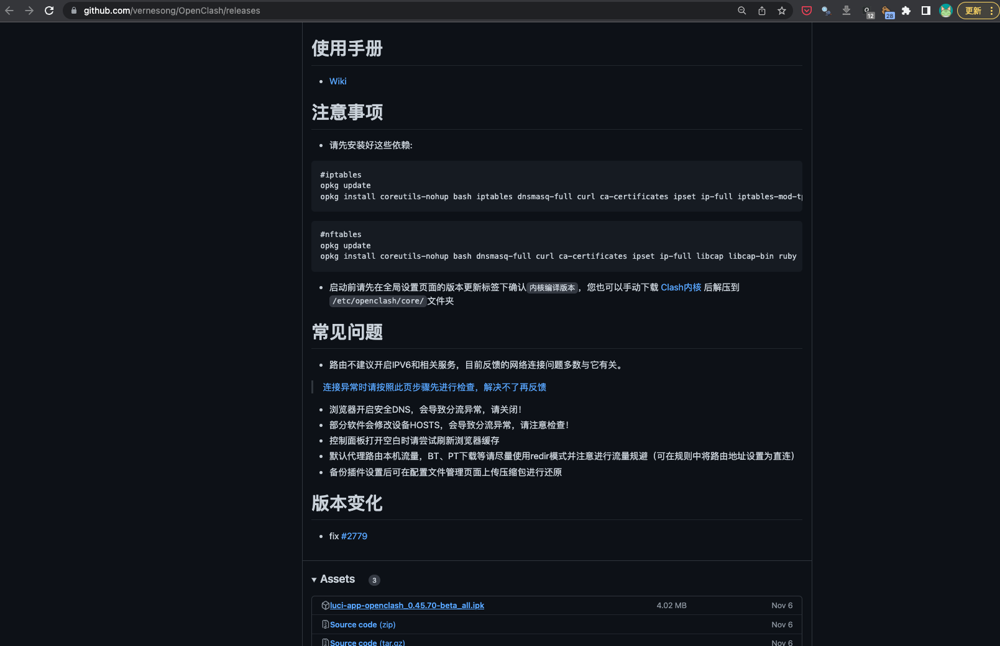
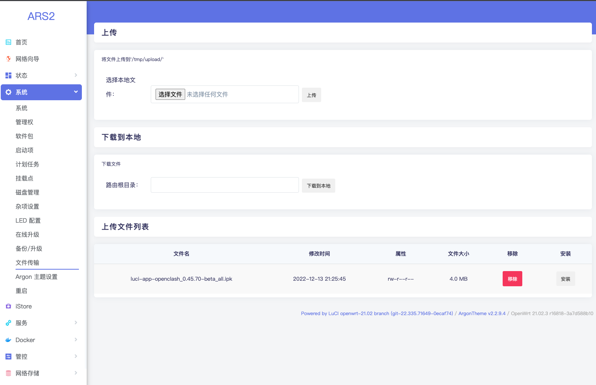
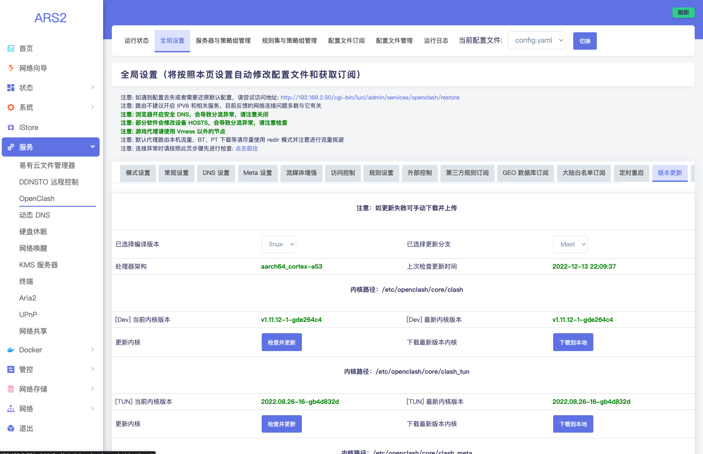

<iframe src="//player.bilibili.com/player.html?aid=818673622&bvid=BV1FG4y1G7PB&cid=922888758&page=1" width="100%" height="640" scrolling="no" border="0" frameborder="no" framespacing="0" allowfullscreen="true"> </iframe>

最近家里的 [EasePi ARS2](https://easepi.linkease.com/) 系统盘满了，想了想没什么重要的东西直接做了系统重制，作为旁路由第一步就是重装代理，这里简单记录下。

## 下载 openclash

去 [OpenClash](https://github.com/vernesong/OpenClash) 下载 OpenWrt 的客户端，在 Release 也面也包含了安装的依赖。

下载之后本来打算用 `scp` 拷贝过去，但感觉 openwrt 里的这个 ssh 有点不太一样，scp 会失败，最终还是要从页面的「系统」-「文件传输」把下载的安装包传过去。

## 安装 openclash

首先安装相应的依赖，然后执行命令 `opkg xxx.ipk` 就可以了。安装成功之后重新登录 ARS2 的管理页面在左侧导航栏的「服务」下面就会多了「OpenClash」了。下一步按照 [OpenClash 版本更新](https://github.com/vernesong/OpenClash/wiki/%E7%89%88%E6%9C%AC%E6%9B%B4%E6%96%B0) 介绍的更新流程，去「OpenClash」-「全局设置」-「版本更新」这个页面（有点难找），点击下面的「更新内核」，自动下载 clash 内核。

## 添加配置并启动

下一步就要去「配置文件订阅」更新订阅的代理源了，这里我没办法说的更多了，懂得都懂。最后在「运行状态」标签页滑到最下面点击「启动 OPENCLASH」。

## 测试

ssh 进去，`curl google.com` 感受下效果。

后面就可以按照 [使用 EasePi ARS2 做旁路由](/homelab-side-router/) 的流程把这个设备设置成旁路由使用了。

