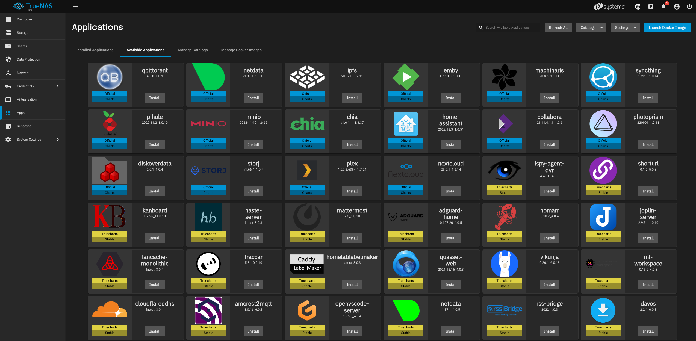
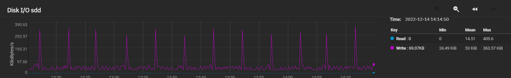
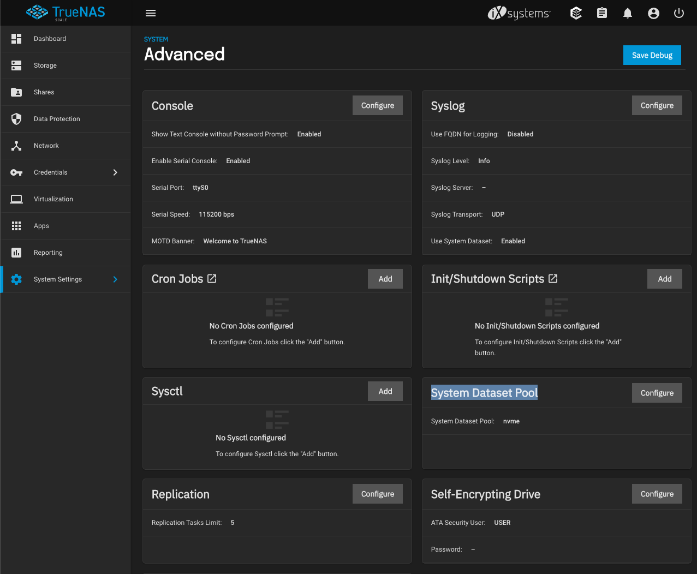

最近攒了一台机器作为家里的 NAS，操作系统选择了 [TrueNAS Scale](https://www.truenas.com/truenas-scale/) ，之所以用这个系统原因有两个：

1. 它是基于 Debian 的，对我来说比较熟悉，FreeBSD 什么的实在是有点陌生，并且据说那边的驱动跟进也不是很好（当然是据说，我没实操过）
2. TrueNAS Scale 里面的 App Store 是基于 [helm charts](https://helm.sh/docs/topics/charts/) 的，TrueNAS Scale 在开启 Apps 这个功能后会跑了一个 [k3s](https://k3s.io/) 来管理这些 apps 这个操作着实有点激进，不过我还是愿意尝试一下的，也是因为我对这些东西比较熟悉

基本环境准备好了之后把由 5 块 HDD 组成的 RaidZ1 作为了主存储池就开始使用了。用了一段时间发现系统有一个小小的问题：这些 HDD 差不多每几秒就会卡卡响两下，不是什么异常的声音，就是正常的读写的声音，可我当时并没有使用它做什么事情，而且这种有节奏的噪音让我也有点难受。看了下监控，io 模式就是这个样子：

首先我就去 google 了，搜来搜去，用关键词「truenas scale idle read write」找到了 [TrueNas Scale constant writes while idle](https://www.reddit.com/r/truenas/comments/u3zxpn/truenas_scale_constant_writes_while_idle/) 这个问题，下面的回复基本就就是清楚了原因，我这里简单复述下：

TrueNAS 会默认把你建立的第一个 data pool 设定为 System Dataset 然后会在这里塞日志等乱七八糟的东西，尤其是系统日志这种东西它就会持续的对系统进行写入。

既然 HDD 读写声音很讨厌，那我就还是再加一个 nvme 的盘做成存储池来用吧，幸好我的主板 m.2 的插槽管够。插上 nvme 硬盘并设置一个新的存储池后，通过「System Settings」-「Advanced」-「System Dataset Pool」把它修改成心态添加的 nvme 存储即可。

如果要使用上文提到的 Apps 的话，TrueNAS Scale 也会要求你指定存储的位置，考虑到性能和噪声也要把它指向 nvme 的存储。

所以对于 TrueNAS Scale 来说，最好要准备三个部分的存储：

1. 系统盘，16 GB 就够了（此处应该有傲腾 M10）：TrueNAS 就是把系统放这里，其他乱七八糟的东西统统要放到额外的存储池里
2. 主存储，就是放数据的地方，要做好冗余方案：我这里依然选择了老土 HDD，当然还是考虑到价格比较便宜
3. 应用存储，可以认为是工作空间：把系统日志，Apps 的一些配置什么的都扔这里，对我来说这些数据不是那么重要，我直接就放了一个 m.2 的 nvme。由于这个空间会因为 Apps 的各种操作和系统日志而频繁读写，使用 ssd 很有必要

