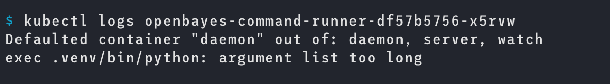

## 事故原因

前天晚上 k8s 集群出现了问题，一开始是有一台 master 的内存不够了，然后导致了一些 k8s 系统的 pod 跪了，在对 master 节点升级之后开始去重启那些受影响的 crd controller，结果发现这个 crd controller 报错：



看到这个报错我很懵逼：我代码都没改，怎么突然就会报错呢，我启动的 `argument list` 也不长。连续重启两次发现没有什么效果就又去尝试重启其他的 pod 然后发现其他的 pod 也会报同样的错误...导致了问题的扩大。而且这个 crd controller 还是很重要的组件，它启动不起来由它管理的 crd 就都不能更新了，非常头大。

然后就去网上查资料，发现了一个几乎和我们集群一模一样的问题的帖子：[事后分析:Kubernetes Pod 无法启动,因为服务太多](https://devpress.csdn.net/k8s/62ee60517e6682346618232e.html) ，总结来说就是因为 k8s 默认会把一个 namespace 的 service 创建一组环境变量，然后把这些环境变量注入到 namespace 所有的 pod 里。service 越多，在 pod 里注入的环境变量就越多。

我们的 `bayesjob` crd 里恰好有几个 service 那么所有启动的 pod 里就会默认多非常多的环境变量，然后恰好那天有个用户跑了非常多的 `bayesjob` 刚好冲破了这个程序启动注入环境变量的上限就引发了这个问题。


```
SVC_XXXA_TXWGIWBFC37V_PORT_80_TCP_PORT=80
SVC_BAADF_OE3QGDRQF7OX_PORT_6637_TCP_ADDR=10.97.0.126
SVC_ADMIN_VI6RZ95HMNVY_PORT_7088_TCP_ADDR=10.97.8.254
SVC_ADMIN_VI6RZ95HMNVY_SERVICE_PORT=80
SVC_ADMIN_VI6RZ95HMNVY_PORT=tcp://10.97.8.254:80
...
```

## 解决方案

解决的办法就是在 pod 里增加额外的配置：`enableServiceLinks: false` 告诉 pod 不要主动去注入这些环境变量即可。

## 总结

之前 `bayesjob` 的生命周期比较短，并没有遇到这个问题，直到最近调整了它的生命周期（从 72h -> 14d）带来大量存活的 service ，最后在这天又恰好来了一个创建 300+ 任务的用户。这种问题真的是要到一定规模你才能发现的，实现考虑到的难度有点大了。

crd controller 也应该有更好的容错性，不能因为一台 master 出问题就跪了才对，后续要对其进行调整。