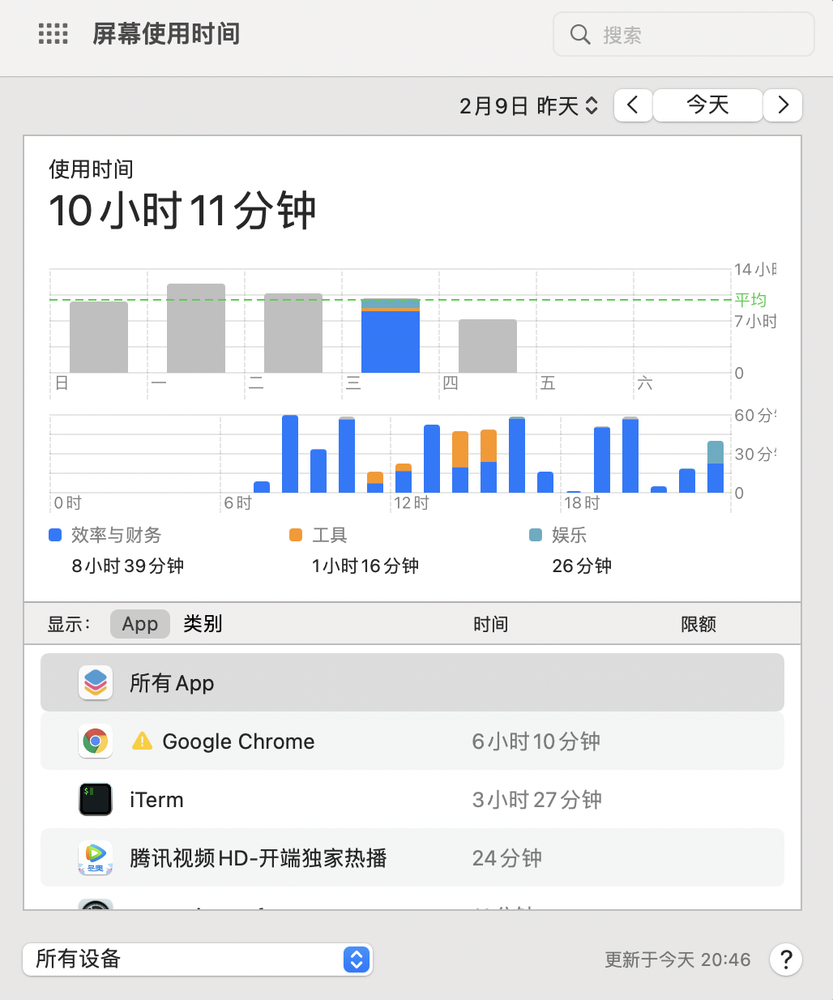
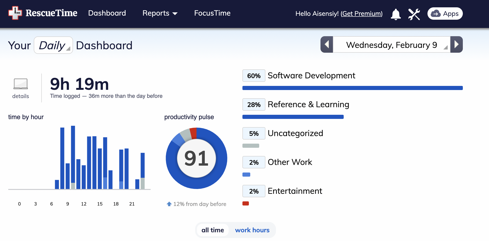
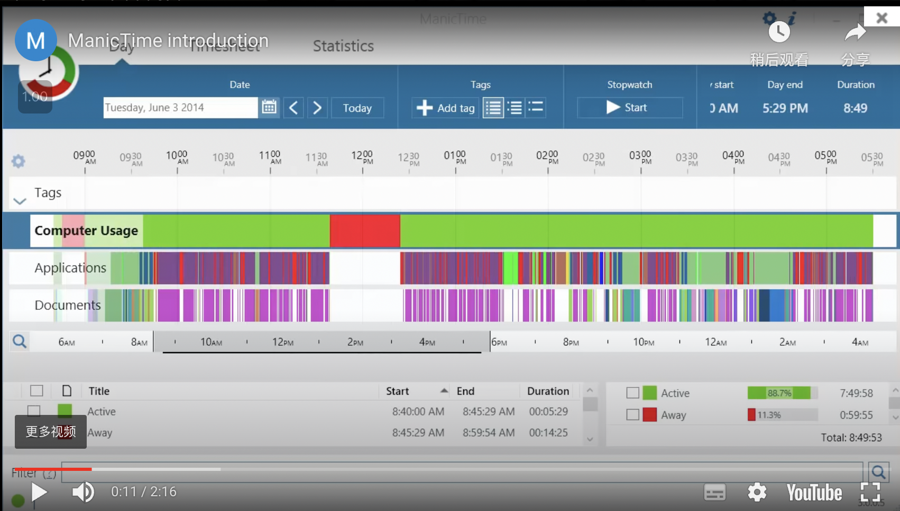
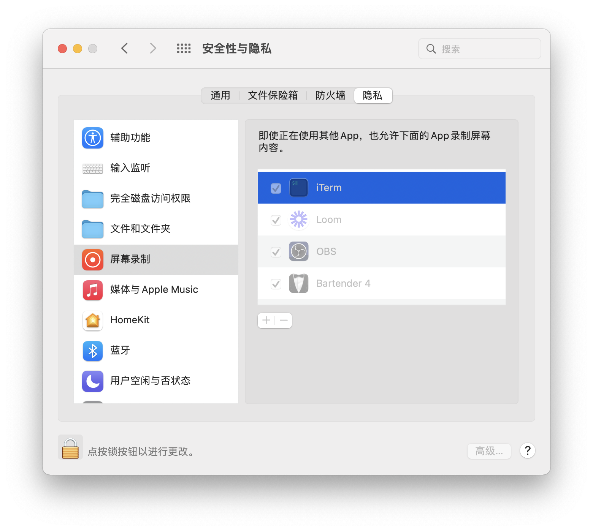
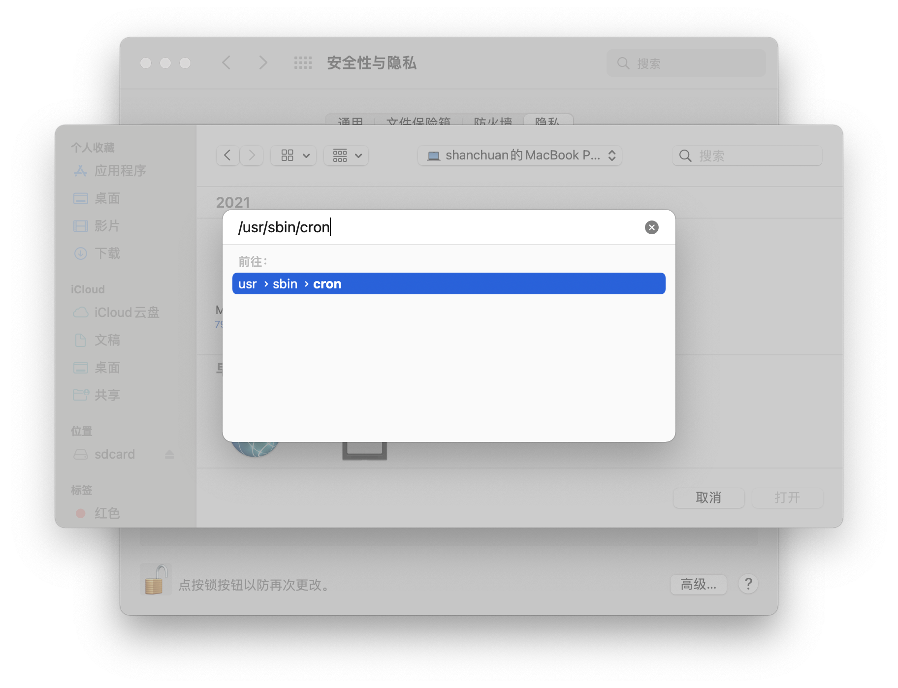
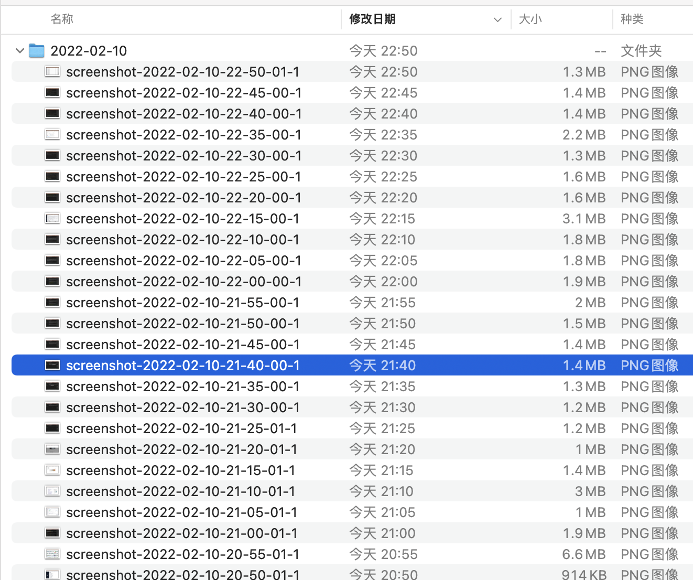
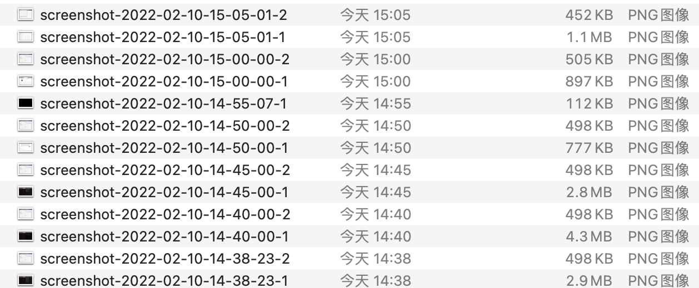

我自己一直很在意「自我量化」，希望自己的各个方面的行为可以以一种尽量方便尽量被动的方式被记录下来方便后来的追溯。之所以这么想有以下几天原因：

1. 我认为很多最终结果的产生是每天日积月累的结果，比如有些人每天主动活动的时间很少，几乎没有走动，一上班就可以坐一上午直到去吃饭。但是有一天 TA 发现自己身边同事吃的和自己一样多，但自己越来越胖，人家没什么变化。TA 不晓得什么原因，但如果她了解到同事每天会主动起来活动（摸鱼）就可能意识到是自己就没有注意平时多运动，或许像同事那样每个小时起身活动一下，吃完饭多爬几层楼每天的代谢量就会有不少的提升。
1. 我认为基于事实的反省和回顾有助于个人成长，而这里「基于事实」很重要，有的时候主观意识并不太客观，有的时候自己觉得自己工作很努力，但如果翻翻自己的时间追溯软件发现自己真正工作的时间可能并不多。因此，有事实留下来供自己回看还是有点重要。
1. 时间飞逝，很多时候自己都忘记自己前几天在干什么了，没留下点什么真的就这么过去了。作为程序员，有的时候因为某个问题会去做乱七八糟的检索，可能很快就跑偏了，结果一天下来啥也没干成，还觉得自己好累，但回顾时间到底都去哪里了也很模糊。
1. 不知道你有没有用过 Apple 相册里的「回忆」它会时不时把你以前某一段时间拍下来的照片做成小视频让你看看，有些记忆就这么被一个小小的 app 翻出来了，不禁让人感叹生活的美好。
1. 从更大的统计学角度来看，每个人客观的量化数据如果能通过某种方式被脱敏后收集可比什么乱七八糟的调查问卷要可靠一些吧，这些数据就是每个人的人生，用它来分析和推断可靠性应该会有一个质的改观吧？不过「过敏」和「全面」应该是个很难做的事情呢。


这个话题太大了，这里就此止住，单讲自己屏幕使用（具体到电脑使用）的记录。

## 目前的屏幕记录应用的问题

之前尝试过一些时间记录的软件，或多或少有如下一些问题：

1. 只有统计数据，会统计你一天用屏幕多久，用什么 app 多久，看视频多久，然后汇总你一周时间、一个月时间、一年时间，这些数据不是没用，但就是很笼统，甚至你不知道自己每天做这些事情的时间线是如何的，苹果自带的屏幕统计是这样的，[rescue time](https://www.rescuetime.com/) 也是这样的。
1. 就算是统计也统计的非常不精确，没办法直到你在某一个 app 里干啥了，比如现在 bilibili 或者 youtube 这样的视频网站其内容包罗万象的，你直到在用 bilibili 但是不知道是在看学习视频还是在看游戏直播，绝大部分 app 都做不到获取内容。
1. 假如真有应用有本事把你每时每秒都在干嘛全上传到服务器，一方面是隐私问题你没法接受，一方面是负载问题，人家服务器也没法接受，这种东西就不存在的。





**注意** 在 windows 平台下有个时间记录的软件叫做 [manictime](https://manictime.com) 可以做到时间流记录，不过依然存在具体的信息获取不到以及跨平台的问题，同时这个公司似乎非常低调，低调到我感觉它都要倒闭了。



## 通过截图的简单方案

考虑到如上的一些问题，再仔细想象自己的需求，我最迫切的需求是可以快速回顾某一天都在干嘛，然后才是什么分析统计。那么我可能还是需要保留很具体的信息，那我觉得就只有截图了。

所以，如果可以每几分钟截个图存下来，然后每天一个文件夹是不是就差不多够了？同时，截图信息非常敏感，可能有公司涉密信息，可能有自己涉密信息。那么直接存在本地自己看看也不用担心隐私问题了。

通过简单的调研，我写出来了如下的脚本：

```shell
#!/bin/bash

PATH=/usr/local/bin:/usr/local/sbin:~/bin:/usr/bin:/bin:/usr/sbin:/sbin:/opt/homebrew/bin

# 使用 jq 获取目前有几个屏幕
screencount=`system_profiler SPDisplaysDataType -json | jq '.SPDisplaysDataType[0].spdisplays_ndrvs | length'`

# 获取当前日期
date=$(date +%Y-%m-%d)
# 用日期创建文件见
mkdir -p $date

# 获取当前时分秒，作为文件的名字
NOW=$(date +"%Y-%m-%d-%H-%M-%S")

# 截屏
for (( i=1; i<=$screencount; i++ )) do
    # 每个参数都什么意思可以通过 screencapture -h 查看
    screencapture -C -x -D $i $date/screenshot-$NOW-$i.png
done
```

介绍下功能：

1. 可以控制截屏的周期，这里我是用 `crontab` 跑起来这个脚本，具体多久跑一次可以自己控制，我自己是 5 分钟一次，感觉差不多够了
1. 支持多个屏幕，通过 `system_profiler SPDisplaysDataType -json` 可以获取当前屏幕个数，我为每一个屏幕都做了截图

这里额外用到的工具只有 [`jq`](https://stedolan.github.io/jq/) 可以通过 `brew install jq` 直接安装。

## 用 crontab 安装

1. 打开 `terminal` 输入 `crontab -e` 进入编辑模式
1. 添加一行信息如下，把其中的 `<your-sh-file-location>` 替换成上面的 `sh` 的路径


  ```shell
  */5 * * * * cd <your-sh-file-location> && ./screencapture.sh >> ./screencapture.log 2>&1
  ```

3. 为 `cron` 提供「屏幕录制」的权限。如果不设置权限，你的截图只能截取到背景而已，[Screencapture over cron shown background instead window content](https://stackoverflow.com/questions/59239485/screencapture-over-cron-shown-background-instead-window-content) 阐述了这个问题。你需要在「系统偏好设置设置」-「安全性与隐私」-「隐私」下为 `/usr/sbin/cron` 提供「屏幕录制」的权限。

  

  1. 点击上述对话框右侧下方的 + 号就可以添加应用程序了。
  1. 使用快捷键 `cmd + shift + g` 打开路径输入对话框，输入 `/usr/sbin/cron` 然后回车就可以进入 `cron` 的目录并选中它，点击确认就可以把 `cron` 授予权限了

  

## 效果

然后就会出现这样的目录了：



如果有两个屏幕就会出现两个截屏：



按照排序把截屏扫一遍就大概知道自己一天什么时候都在干嘛了。

