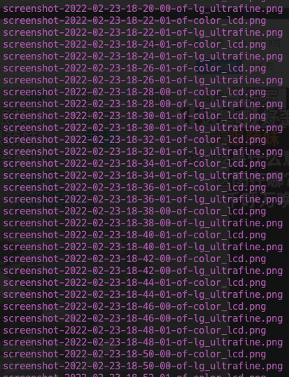

在上一篇文章 [Mac 下通过自动周期截图来追溯每天的屏幕使用](/macos-auto-capture-screen-for-time-tracking) 介绍了下一个简单的录屏脚本。这里做一个跟进，主要是以下两方面的内容：

1. 对原来脚本的修改，支持切换设备屏幕的情况
1. 提供 ffmpeg 命令可以把截图转换为 mp4 格式的视频

## 支持切换屏幕

我的工作电脑是一台 macbook pro ，在不同的场景下会使用不同的屏幕：在办公室会连接一台 LG 外接显示器，开会的时候会直接使用 macbook 的屏幕；而回到家可能会使用一台 Dell 的外接显示器。如果仅仅按照屏幕的序号截屏在图像的连续性上会差一些。不过幸好 mac os api 可以获取目前屏幕的更详细信息，我可以依据显示器型号记录信息。

```bash
#!/bin/bash

PATH=/usr/local/bin:/usr/local/sbin:~/bin:/usr/bin:/bin:/usr/sbin:/sbin:/opt/homebrew/bin

# use jq to get array length
result=`system_profiler SPDisplaysDataType -json`
screencount=`echo $result | jq '.SPDisplaysDataType[0].spdisplays_ndrvs | length'`

# get current date
date=$(date +%Y-%m-%d)
# create folder if not exists
mkdir -p $date

# get current date time with well format
NOW=$(date +"%Y-%m-%d-%H-%M-%S")

# make screenshot
for (( i=0; i<$screencount; i++ )) do
    # get screen name
    screenname=`echo $result | jq --raw-output ".SPDisplaysDataType[0].spdisplays_ndrvs[$i]._name"`
    # replace space with _
    screenname=${screenname// /_}
    # to lower case
    screenname=`echo -n $screenname | tr "[:upper:]" "[:lower:]"`
    # use screen name to create file name
    screencapture -C -x -D $((i+1)) $date/screenshot-$NOW-of-$screenname.png
done

```

如上所示，采用 screenname 作为文件名后缀可以保证截图的连续性。生成的文件就像如下这个样子：



## 使用 ffmpeg 生成视频

截图一张张翻有两个坏处：

1. 需要自己一张张翻
1. 会占据更多存储空间，我这里一天最大的目录大小是 3G ，这里面很多截图是重复的，而众所周知，将这些图片如果以视频来存储可以充分利用视频的压缩算法，极大的降低所使用的存储空间

既然只是为了 review 自己的工作，本来就是想要一个跑马灯的效果。这里我就简单搜索了下，可以用 `ffmpeg` 把截图按照时间顺序做成视频就好了。

```bash
ffmpeg \
    -framerate 15 \                               # 每秒 15 帧    
    -pattern_type glob -i '*dell_u2417h.png' \    # 指定截图文件的路径，dell_u2417h 是截图的屏幕名称
    -c:v libx264 \                                # 指定视频编码器
    -pix_fmt yuv420p \                            # 指定视频的像素格式，没事不用修改
    dell_u2417h.mp4                               # 输出视频文件名，和截图的屏幕名称一直
```

用以上的命令，可以每个屏幕生成一个视频。

## 后续工作

1. 截屏目前做到了自动化，但是拼接视频没有做到自动化，需要手动拼接，可以考虑怎么做
1. 视频拼接目前是每个屏幕一个视频，如果能把屏幕按照时间线拼接起来会更好

